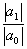

<b>§</b><b>2&nbsp; </b><b>代数方程的性质</b>

一、多项式与代数方程的一般性质

[代数基本定理]&nbsp; 每个复数域上<i>n</i>次代数方程 

<i>f</i>(<i>x</i>)=<i>a</i>0<i>xn</i>+<i>a</i>1<i>xn</i>-1+L+<i>an</i>－1<i>x</i>+<i>an</i>=0&nbsp;&nbsp;&nbsp;&nbsp;&nbsp;&nbsp;&nbsp;&nbsp;&nbsp;&nbsp; (<i>n</i>1)

在复数域中至少有一个根.

代数基本定理的推论：每个<i>n</i>次代数方程在复数域中有<i>n</i>个根，而且只有<i>n</i>个根.

[多项式的导数]&nbsp; 多项式<i>f</i>(<i>x</i>)的导数为

(<i>x</i>)=<i>na</i>0<i>xn</i>－1+(<i>n</i>－1)<i>a</i>1<i>xn</i>－2+L+<i>an</i>－1

微分学中仅考虑实变数函数的导数，而代数学中必须考虑复系数的复变数多项式的导数，但是它们的定义与计算公式仍然一样.

[单根与重根]

1° 多项式的单根不是它的导数的根.

2° 多项式的<i>m</i>重根（即有<i>m</i>个根相同）是它的导数的<i>m</i>－1重根（<i>m</i>&gt;1）.

3° 若<i>x</i>1,<i>x</i>2,L,<i>xk</i>分别为<i>f</i><i> </i>(<i>x</i>)的<i>α</i>1,<i>α</i>2,L,<i>α</i><i>k</i>(<i>α</i>1+<i>α</i>2+L+<i>α</i><i>k</i>=<i>n</i>)重根，则

<i>f </i>(<i>x</i>)=<i>a</i>0(<i>x</i>－<i>x</i>1)(<i>x</i>－<i>x</i>2)L(<i>x</i>－<i>xk</i>)

[洛尔定理及其推论]&nbsp; 由微分学中的洛尔定理可知，在实系数方程<i>f</i><i> </i>(<i>x</i>)=0的两个实根之间总有(<i>x</i>)=0的一个实根.

从这个定理可推出下列两个推论：

1° 若<i>f</i>(<i>x</i>)的一切根都是实的，则(<i>x</i>)的一切根也是实的.在<i>f</i>(<i>x</i>)的相邻两根之间有(<i>x</i>)的一个根并且是一个单根.

2° 若<i>f</i>(<i>x</i>)的一切根都是实的，且其中有<i>p</i>个（计算重根）是正的，则(<i>x</i>)有<i>p</i>个或

<i>p</i>－1个正根.

&nbsp;&nbsp;&nbsp;&nbsp;&nbsp;&nbsp; [多项式的相关]

1° 若多项式<i>f</i><i> </i>(<i>x</i>),<i></i>(<i>x</i>)的次数都不超过<i>n</i>，而它们对<i>n</i>+1个不同的数<i>α</i>1,L,<i></i>有相等的值，即<i>f</i>(<i>αi</i>)=(<i>αi</i>) (<i>i</i>=1,L,<i>n</i>+1),则<i>f</i><i> </i>(<i>x</i>)=<i> </i>(<i>x</i>).

&nbsp;&nbsp;&nbsp;&nbsp;&nbsp;&nbsp; 2° 多项式<i>f</i><i> </i>(<i>x</i>)和<i></i>(<i>x</i>)的根完全相同的充分必要条件是<i>f</i><i> </i>(<i>x</i>)和<i></i>(<i>x</i>)只差一个不等于零的常数因子.

&nbsp;&nbsp;&nbsp;&nbsp;&nbsp;&nbsp; [整根与有理根] 任意整系数方程<i>f</i><i> </i>(<i>x</i>)=0，若有一个有理根（为既约分数），则<i>p</i>是<i>αn</i>的约数，<i>q</i>是<i>α</i>0的约数.

&nbsp;&nbsp;&nbsp;&nbsp;&nbsp;&nbsp; 由此可推出：任意整系数方程的整根必为常数项的约数，若整系数方程的首项系数为1，则它的有理根必为整数.

&nbsp;&nbsp;&nbsp;&nbsp;&nbsp;&nbsp; [实根与复根，共轭实根与共轭复根]

&nbsp;&nbsp;&nbsp;&nbsp;&nbsp;&nbsp; 1°&nbsp; 任意有理系数方程<i>f</i><i> </i>(<i>x</i>)=0，若有一个根<i>a</i>+(<i>a,b</i>是有理数，是无理数)，则必有另一个根<i>a</i>－.这时<i>a</i>+与<i>a</i>－称为一对共轭实根.

&nbsp;&nbsp;&nbsp;&nbsp;&nbsp;&nbsp; 2° 任意实系数方程<i>f</i><i> </i>(<i>x</i>)=0的复根只可能是成对的共轭复根，并且根的重数相同.从而，复根的个数是偶数.

&nbsp;&nbsp;&nbsp;&nbsp;&nbsp;&nbsp; 3° 任意实系数奇数次方程<i>f</i><i> </i>(<i>x</i>)=0至少有一个实根.

&nbsp;&nbsp;&nbsp;&nbsp;&nbsp;&nbsp; 4° 任意实系数偶数次方程<i>f</i><i> </i>(<i>x</i>)=0,<i>a</i>0<i>an</i>&lt;0,则至少有两个实根（一个正根和一个负根）.

&nbsp;&nbsp;&nbsp;&nbsp;&nbsp;&nbsp; [根与系数的关系]&nbsp;
设

<i>f</i><i> </i>(<i>x</i>)=<i>xn</i>+<i>a</i>1<i>xn</i>－1+L+<i>an</i>

为复数域<i>S</i>上的一元多项式，<i>x</i>1,<i>x</i>2,L,<i>xn</i>为<i>f</i><i> </i>(<i>x</i>)在<i>S</i>中的<i>n</i>个根，则根与系数的关系为

<i>x</i>1+<i>x</i>2+L+<i>xn</i>==－<i>a</i>1

<i>x</i>1<i>x</i>2+<i>x</i>1<i>x</i>3+L+<i>xn</i>-1<i>xn</i>==<i>a</i>2

<i>x</i>1<i>x</i>2<i>x</i>3+<i>x</i>1<i>x</i>2<i>x</i>4+L+<i>xn</i>-2<i>xn</i>-1<i>xn</i>==－<i>a</i>3

LLLLLL

<i>x</i>1<i>x</i>2L<i>xn</i>=(－1)<i>nan</i>

这就是说，<i>f</i><i> </i>(<i>x</i>)的<i>xn</i>-<i>k</i>的系数<i>ak</i>等于从它的根<i>x</i>1,<i>x</i>2,L,<i>xn</i>中每次取<i>k</i>个（不同的）一切可能乘积之和,若<i>k</i>是偶数,则取正号，若<i>k</i>为奇数，则取负号.

&nbsp;&nbsp;&nbsp;&nbsp;&nbsp;&nbsp; [根的范围] &nbsp;设<i>ξ</i>为复系数代数方程

<i>f</i><i> </i>(<i>x</i>)=<i>a</i>0<i>xn</i>+<i>a</i>1<i>xn</i>-1+L+<i>an</i>-1<i>x</i>+<i>an</i>=0&nbsp;&nbsp;&nbsp;&nbsp;&nbsp;&nbsp;&nbsp;&nbsp;&nbsp;&nbsp;&nbsp;&nbsp;&nbsp;&nbsp;&nbsp;&nbsp;&nbsp;&nbsp; &nbsp;&nbsp;&nbsp;&nbsp;&nbsp;&nbsp;&nbsp;&nbsp;&nbsp;&nbsp;&nbsp;&nbsp;&nbsp;&nbsp;&nbsp;&nbsp;&nbsp;&nbsp;&nbsp;
(1)

的根.

&nbsp;&nbsp;&nbsp;&nbsp;&nbsp;&nbsp; 1° 若所有系数<i>ai</i>0 (<i>i</i>=0,1,L,<i>n</i>),则,其中<i></i>为实系数代数方程

<i>F</i>(<i>x</i>)=<i>xn</i>－<i>xn</i>－1-L-=0

的一个正实根.

&nbsp;&nbsp;&nbsp;&nbsp;&nbsp;&nbsp; 2° 设<i>γ</i>1,<i>γ</i>2,L,<i>γ</i><i>n</i>-1为任意正数，则<i>τ</i>,其中<i>τ</i>为下列<i>n</i>个数中最大的一个:

+,&nbsp; +,&nbsp; L,&nbsp; L+,

特别,取<i>γ</i>i=1(<i>i</i>=1,2,L,<i>n</i>－1)时,有

max&nbsp;&nbsp;&nbsp;&nbsp;&nbsp; &nbsp;&nbsp;&nbsp;&nbsp;&nbsp;&nbsp;&nbsp;&nbsp;&nbsp;&nbsp;&nbsp;&nbsp;&nbsp;&nbsp;&nbsp;&nbsp;&nbsp;
&nbsp;&nbsp; &nbsp;(2)

方程(1)中作变换<i>x</i>=,可求出的上界，因而得到

&nbsp;&nbsp;&nbsp;&nbsp;&nbsp;&nbsp;&nbsp;&nbsp;&nbsp;&nbsp;&nbsp; &nbsp;&nbsp;&nbsp;&nbsp;&nbsp;&nbsp;&nbsp;&nbsp;&nbsp;&nbsp;&nbsp;&nbsp;&nbsp;&nbsp;&nbsp;
(3)

更进一步，记(2)式右边为<i>M</i>，记(3)式右边为<i>m</i>，如果取<i>ρ</i>&lt;<i>M</i>,使得

L

取&gt;<i>m</i>，使得

L

那末有.

&nbsp;&nbsp;&nbsp;&nbsp;&nbsp;&nbsp; 3° 设<i>γ</i>为任意正数，则，其中

<i>τ</i>1=max

特别，取<i>γ</i>=1，有

&nbsp;&nbsp;&nbsp;&nbsp;&nbsp;&nbsp; 4° 若所有系数都为正实数，则

min

&nbsp;&nbsp;&nbsp;&nbsp;&nbsp;&nbsp; 5° 若方程（1）的系数满足不等式

则方程（1）至多有一个绝对值≥1的根<i>ξ</i>1，而且

&nbsp;&nbsp;&nbsp;&nbsp;&nbsp;&nbsp; [多项式的分解]

&nbsp;&nbsp;&nbsp;&nbsp;&nbsp;&nbsp; 1° 设<i>f</i><i> </i>(<i>x</i>)为实数域上的多项式，若有非常数的实系数多项式<i>g</i>(<i>x</i>)和<i>h</i>(<i>x</i>),使得

<i>f</i><i> </i>(<i>x</i>)=<i>g</i>(<i>x</i>)<i>h</i>(<i>x</i>)

则称<i>f</i><i> </i>(<i>x</i>)为实数域上可约（或可化），否则称<i>f</i>(<i>x</i>)为实数域上的不可约多项式.

&nbsp;&nbsp;&nbsp;&nbsp;&nbsp;&nbsp; 2° 实数域上不可约多项式，除一次多项式外，只有含（共轭）复根的二次多项式.

&nbsp;&nbsp;&nbsp;&nbsp;&nbsp;&nbsp; 3° 每个实系数多项式都可分解为实系数的一次因式与二次因式之积.

&nbsp;&nbsp;&nbsp;&nbsp;&nbsp;&nbsp; 有理数域上的多项式的分解见第二十章，§5，2.

&nbsp;&nbsp;&nbsp;&nbsp;&nbsp;&nbsp; [余数定理与综合除法]&nbsp;
若<i>c</i>为一常数，则多项式<i>f</i><i> </i>(<i>x</i>)除以<i>x</i>－<i>c</i>所得的余数等于<i>f</i>(<i>c</i>).

设&nbsp;&nbsp;&nbsp;&nbsp;&nbsp;&nbsp;&nbsp;&nbsp;&nbsp;&nbsp;&nbsp;&nbsp;&nbsp;&nbsp;&nbsp;&nbsp;&nbsp;&nbsp;&nbsp;&nbsp;&nbsp;&nbsp;&nbsp;&nbsp;&nbsp;&nbsp;&nbsp;&nbsp;&nbsp;&nbsp; <i>f</i><i> </i>(<i>x</i>)=<i>a</i>0<i>xn</i>+<i>a</i>1<i>xn</i>-1+L+<i>an</i>－1<i>x</i>+<i>an</i>

求<i>f</i><i> </i>(<i>x</i>)除以<i>x</i>－<i>c</i>的商式与余数其计算格式如下：

&nbsp;&nbsp;&nbsp;&nbsp;&nbsp;&nbsp;&nbsp;&nbsp;&nbsp;&nbsp;&nbsp;&nbsp;&nbsp;&nbsp;&nbsp;&nbsp;&nbsp;&nbsp;&nbsp;&nbsp; 

<table class=MsoNormalTable border=0 cellpadding=0 width="75%"
 style='width:75.0%'>
 <tr>
  <td style='padding:.75pt .75pt .75pt .75pt'>
  

  </td>
 </tr>
</table>

式中<i>b</i>0=<i>a</i>0,<i>bi</i>=<i>ai</i>+<i>bi</i>-1<i>c</i>(<i>i</i>=1,2,L,<i>n</i>).于是得到

商式&nbsp;&nbsp;&nbsp;&nbsp;&nbsp;&nbsp;&nbsp;&nbsp;&nbsp;&nbsp;&nbsp;&nbsp; <i>q</i>(<i>x</i>)=<i>b</i>0<i>xn</i>-1+<i>b</i>1<i>xn</i>-2+L+<i>bn</i>-1

余数&nbsp;&nbsp;&nbsp;&nbsp;&nbsp;&nbsp;&nbsp;&nbsp;&nbsp;&nbsp;&nbsp;&nbsp; <i>r</i>=<i>bn</i>=<i>f</i>(<i>c</i>)

例&nbsp;&nbsp;&nbsp;&nbsp;&nbsp;&nbsp;&nbsp; <i>f</i><i> </i>(<i>x</i>)＝&nbsp; 除以 <i>x</i>－2. 列出算式

<table class=MsoNormalTable border=0 cellpadding=0 width="75%"
 style='width:75.0%'>
 <tr>
  <td style='padding:.75pt .75pt .75pt .75pt'>
  

  </td>
 </tr>
</table>

&nbsp;&nbsp;&nbsp; &nbsp;&nbsp;&nbsp;

所以&nbsp;&nbsp;&nbsp;&nbsp;&nbsp;&nbsp;&nbsp;&nbsp;&nbsp; 

&nbsp;&nbsp;&nbsp;&nbsp;&nbsp;&nbsp; [多项式的泰勒公式（秦九韶法）]&nbsp;
<i>n</i>次多项式

<i>f</i><i> </i>(<i>x</i>)=<i>a</i>0<i>xn</i>+<i>a</i>1<i>xn</i>-1+L+<i>an</i>-1<i>x</i>+<i>an&nbsp;&nbsp;&nbsp;&nbsp;&nbsp;&nbsp;&nbsp;&nbsp; </i>(<i>a</i>0<i></i>0)

在任意点<i>c</i>的泰勒展开式为

<i>f</i><i> </i>(<i>x</i>)=<i>b</i>0(<i>x</i>－<i>c</i>)<i>n</i>+<i>b</i>1(<i>x</i>－<i>c</i>)<i>n</i>-1+L+<i>bn</i>-1(<i>x</i>－<i>c</i>)+<i>bn</i>

式中系数<i>bi</i> (0≤<i>i</i>≤<i>n</i>)按下面的方法计算.

首先在(<i>n</i>+2)(<i>n</i>+2)方阵的对角线上列出<i>a</i>0,<i>a</i>1,L,<i>an</i>,<i>d</i>（<i>d</i>为符号），在第1列上列出<i>a</i>0(即<i>ai,i</i>=<i>ai</i>-1,<i>i</i>=1,2,L,<i>n</i>+1;<i>an</i>+2,<i>n</i>+2=<i>d</i>;<i>ai</i>,1=<i>a</i>0,<i>i</i>=1,2,L,<i>n</i>+2).

<table class=MsoNormalTable border=0 cellpadding=0 width="75%"
 style='width:75.0%'>
 <tr>
  <td style='padding:.75pt .75pt .75pt .75pt'>
  

  </td>
 </tr>
</table>

&nbsp;

然后再按递推公式

<i>ai,jc</i>+<i>ai,j</i>+1=<i>ai</i>+1,<i>j</i>+1&nbsp;
(<i>i</i>=2,L,<i>n</i>+1; <i>j</i>=1,L,<i>i</i>－1)

自上而下，自左而右依次计算出对角线下其余各元素，那末第<i>n</i>+2行各元素即为所求系数，即

<i>b</i>0=<i>a</i>0,&nbsp; <i>bi</i>=<i>an</i>+2,<i>i</i>+1&nbsp;&nbsp;&nbsp;
(<i>i</i>=1,2,L,<i>n</i>)

&nbsp;&nbsp; 例&nbsp;&nbsp; 求<i>f</i><i> </i>(<i>x</i>)＝ 在<i>x</i>=2处的泰勒展开式.

&nbsp;&nbsp; 解

&nbsp;&nbsp;&nbsp;&nbsp;&nbsp;&nbsp;&nbsp;&nbsp;&nbsp;&nbsp;&nbsp;&nbsp;&nbsp;&nbsp;&nbsp;&nbsp;&nbsp;&nbsp;&nbsp;&nbsp;

&nbsp;&nbsp; 则&nbsp;&nbsp;&nbsp;&nbsp;&nbsp;&nbsp;&nbsp;&nbsp;&nbsp;&nbsp;

&nbsp;&nbsp;&nbsp;&nbsp;&nbsp;&nbsp;&nbsp;&nbsp;&nbsp;&nbsp;
&nbsp;&nbsp;&nbsp;<i>f</i><i> </i>(<i>x</i>)＝

