

　

<h3>二、多元多项式·对称多项式·结式 </h3>

&nbsp;&nbsp;&nbsp;&nbsp;&nbsp;&nbsp; [多元多项式] 设常数<i>c</i>1,<i>c</i>2,L,<i>ck</i>属于一个数域<i>S</i>,<i>αi</i>,<i>βi</i>,L,<i>νi</i>(<i>i</i>=1,2,L,<i>k</i>)是正整数或零，则称形如

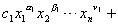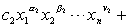L +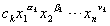

的表达式为数域<i>S</i>上元素<i>x</i>1,<i>x</i>2,L ,<i>xn</i>的<i>n</i>元多项式.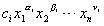称为它的项，<i>ci</i>为它的系数，<i>α</i><i>i</i>为项中关于<i>x</i>1的次数，<i>β</i><i>i</i>为项中关于<i>x</i>2的次数,等等.<i>αi</i>+<i>βi</i>+L+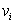为项的次数.在多项式中系数不为零的任一项关于<i>xi</i>的最高次数称为多项式关于<i>xi</i>的次数，系数不为零的任一项的最高次数叫做多项式的次数.各项次数都相等的多项式称为齐次多项式.

&nbsp;&nbsp;&nbsp;&nbsp;&nbsp;&nbsp; 每个<i>m</i>次多项式<i>f</i>(<i>x</i>1,<i>x</i>2,L,<i>xn</i>)都可唯一地表示成

<i>f</i>(<i>x</i>1,<i>x</i>2,L,<i>xn</i>)=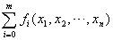

式中<i>fi</i>(<i>x</i>1,<i>x</i>2,L,<i>xn</i>)为<i>i</i>次齐次多项式.

&nbsp;&nbsp;&nbsp;&nbsp;&nbsp;&nbsp; 为了方便，经常把一个多元多项式按某一个变数，例如<i>x</i>1的降幂排列如下：

<i>a</i>0(<i>x</i>2,L,<i>xn</i>)<i>x</i>1<i>m</i>+<i>a</i>1(<i>x</i>2,L,<i>xn</i>)<i>x</i>1<i>m</i>-1+L+<i>am</i>(<i>x</i>2,L,<i>xn</i>)

式中<i>a</i>0(<i>x</i>2,L,<i>xn</i>),<i>a</i>1(<i>x</i>2,L,<i>xn</i>),L,<i>am</i>(<i>x</i>2,L,<i>xn</i>)为<i>x</i>2,L,<i>xn</i>的<i>n</i>－1元多项式.

&nbsp;&nbsp;&nbsp;&nbsp;&nbsp;&nbsp; 若<i>f</i>1,<i>f</i>2,L,<i>fk</i>分别为<i>m</i>1,<i>m</i>2,L,<i>mk</i>次的多元多项式，则乘积<i>f</i>1<i>f</i>2L<i>fk</i>为<i>m</i>1+<i>m</i>2+L+<i>mk</i>次.

&nbsp;&nbsp;&nbsp;&nbsp;&nbsp;&nbsp; [对称多项式] 如果在一个<i>n</i>元多项式<i>f</i>(<i>x</i>1,<i>x</i>2,L,<i>xn</i>)中，对调任一对<i>xi</i>和<i>xj</i>后，<i>f</i>(<i>x</i>1,<i>x</i>2,L,<i>xn</i>)不变，那末称它为<i>x</i>1,<i>x</i>2,L,<i>xn</i>的对称多项式.

&nbsp;&nbsp;&nbsp;&nbsp;&nbsp;&nbsp; [初等对称多项式] 设

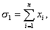　 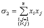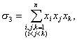

&nbsp;&nbsp;&nbsp;&nbsp;&nbsp;&nbsp;&nbsp;&nbsp;&nbsp;&nbsp;&nbsp;&nbsp;&nbsp;&nbsp;&nbsp;&nbsp;&nbsp;&nbsp;&nbsp;&nbsp; L L L L L L &nbsp;&nbsp;&nbsp;&nbsp;&nbsp;&nbsp;&nbsp;&nbsp;&nbsp; <i>σ</i><i>n</i>=<i>x</i>1<i>x</i>2L <i>xn</i>

则称<i>σ</i>1,<i>σ</i>2,L ,<i>σ</i><i>n</i>为初等对称多项式.例如，由多项式的根与系数的关系（本节，一）可知，多项式的系数除符号外都是根的初等对称多项式.

&nbsp;&nbsp;&nbsp;&nbsp;&nbsp;&nbsp; [对称多项式基本定理] 在数域<i>S</i>上，每个<i>n</i>元对称多项式<i>f</i>(<i>x</i>1,L,<i>xn</i>)都可唯一地表成<i>x</i>1,L,<i>xn</i>的初等对称多项式（系数在<i>S</i>中）的多项式.

&nbsp;&nbsp;&nbsp;&nbsp;&nbsp;&nbsp; [牛顿公式]&nbsp;&nbsp;&nbsp; 设

<i>f</i>(<i>x</i>)=(<i>x</i>－<i>x</i>1) (<i>x</i>－<i>x</i>2)L (<i>x</i>－<i>xn</i>)=<i>xn</i>－<i>σ</i>1<i>xn</i>－1+L +(－1)<i>n</i><i>σn</i>

<i>sk</i>=<i>x</i>1<i>k</i>+<i>x</i>2<i>k</i>+L+<i>xnk</i>&nbsp;&nbsp;&nbsp;&nbsp;&nbsp;&nbsp;&nbsp; (<i>k</i>=0,1,2,L)

则下面牛顿公式成立：

&nbsp;&nbsp;&nbsp;&nbsp;&nbsp;&nbsp; <i>k</i>≤<i>n</i>时,<i>sk</i>－<i>σ</i>1<i>sk</i>-1+<i>σ</i>2<i>sk</i>-2+L+(－1)<i>k</i>-1<i>σk</i>-1<i>s</i>1+(－1)<i>kk</i><i>σk</i> =0

&nbsp;&nbsp;&nbsp;&nbsp;&nbsp;&nbsp; <i>k</i>&gt;<i>n</i>时，<i>sk</i>－<i>σ</i>1<i>sk</i>-1+<i>σ</i>2<i>sk</i>-2+L+(－1)<i>n</i><i>σnsk</i>-<i>n</i>=0

&nbsp;&nbsp;&nbsp;&nbsp;&nbsp;&nbsp; [结式] 设

<i>f</i>(<i>x</i>)=<i>a</i>0<i>xm</i>+<i>a</i>1<i>xm</i>－1+L+<i>am</i>=<i>a</i>0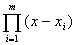&nbsp;&nbsp;&nbsp;  (<i>m</i>&gt;0)

<i>j</i><i> </i>(<i>x</i>)=<i>b</i>0<i>xn</i>+<i>b</i>1<i>xn</i>－1+L+<i>bn</i>=<i>b</i>0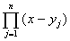&nbsp;&nbsp; 
(<i>n</i>&gt;0)

　

则

<i>R</i>(<i>f</i>,j )= 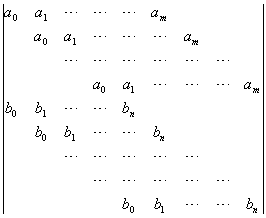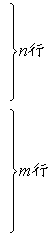

这个<i>m</i>+<i>n</i>阶行列式<i>R</i>(<i>f</i>,j)称为多项式<i>f</i>(<i>x</i>)和j(<i>x</i>)的结式，式中空白处的元素都是零.结式具有性质：

&nbsp;&nbsp;&nbsp;&nbsp;&nbsp;&nbsp; <i>R</i>(<i>f</i>,j)=(－1)<i>mn</i> <i>R</i>(j,<i>f</i>)

&nbsp;&nbsp;&nbsp;&nbsp;&nbsp;&nbsp; <i>R</i>(<i>f</i>,j)=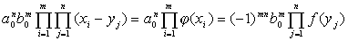

设<i>a</i>0,<i>b</i>0不全为零，则<i>f</i>(<i>x</i>),j(<i>x</i>)在复数域上有公共根的充分必要条件是它们的结式<i>R</i>(<i>f</i>,j)=0.

&nbsp;&nbsp;&nbsp;&nbsp;&nbsp;&nbsp; 行列式<i>R</i>(<i>f</i>,j)是<i>f</i>(<i>x</i>)与j(<i>x</i>)的系数的一个<i>m</i>+<i>n</i>次齐次多项式，关于<i>a</i>0,<i>a</i>1,L,<i>am</i>是<i>n</i>次齐次多项式，关于<i>b</i>0,<i>b</i>1,L ,<i>bn</i>是<i>m</i>次齐次多项式.

