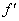
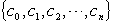
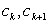
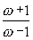

<h3>三、代数方程的根的隔离 </h3>

&nbsp;&nbsp;&nbsp;&nbsp;&nbsp;&nbsp; [傅立叶-布当判别法] 设<i>f</i>(<i>x</i>)=0为实系数<i>n</i>次代数方程，<i>a</i>,<i>b</i>为二实数，适合<i>a</i>&lt;<i>b</i>，<i>f</i>(<i>a</i>)≠0,<i>f</i>(<i>b</i>)≠0,<i>f</i>(<i>x</i>)的各阶导数为

<i>f</i>(<i>x</i>),(<i>x</i>),L ,<i>f </i>(<i>n</i>)(<i>x</i>)

若序列&nbsp;&nbsp;&nbsp;&nbsp;&nbsp;&nbsp;&nbsp;&nbsp;&nbsp;&nbsp;&nbsp;&nbsp;&nbsp;&nbsp;&nbsp;&nbsp;&nbsp;&nbsp;&nbsp;&nbsp;&nbsp;&nbsp;&nbsp;&nbsp;&nbsp;&nbsp;&nbsp;&nbsp;&nbsp;&nbsp;&nbsp;&nbsp;&nbsp;&nbsp;&nbsp;  {<i> f</i>(<i>a</i>),(<i>a</i>),L ,<i>f </i>(<i>n</i>)(<i>a</i>)}

的变号次数*为<i>p</i>，序列

{<i> f</i>(<i>b</i>),(<i>b</i>),L ,<i>f </i>(<i>n</i>)(<i>b</i>)}

的变号次数为<i>q</i>，则<i>p</i>≥<i>q</i>，且<i>a</i>与<i>b</i>之间的<i>f</i>(<i>x</i>)=0的实根个数（一个<i>k</i>重根按<i>k</i>个根计算）等于<i>p</i>－<i>q</i>，或者比<i>p</i>－<i>q</i>少一个正偶数.

&nbsp;&nbsp;&nbsp;&nbsp;&nbsp;&nbsp; 特别，当<i>p</i>-<i>q</i>=0时，(<i>a</i>,<i>b</i>)内无实根，当<i>p</i>－<i>q</i>=1时，(<i>a</i>,<i>b</i>)内只有一个实根.

&nbsp;&nbsp;&nbsp;&nbsp;&nbsp;&nbsp; [笛卡儿符号法则] 设

&nbsp;&nbsp;&nbsp;&nbsp;&nbsp;&nbsp;&nbsp;&nbsp;&nbsp;&nbsp;&nbsp;&nbsp;&nbsp;&nbsp;&nbsp;&nbsp;&nbsp;&nbsp;&nbsp;&nbsp; <i>f</i>(<i>x</i>)=<i>a</i>0<i>xn</i>+<i>a</i>1<i>xn</i>-1+L +<i>an</i>=0&nbsp;&nbsp;&nbsp;&nbsp;&nbsp;&nbsp;&nbsp;&nbsp;&nbsp;&nbsp;&nbsp;&nbsp;&nbsp;&nbsp;&nbsp;&nbsp;&nbsp;&nbsp;&nbsp;&nbsp; (<i>a</i>0≠0,<i>an</i>≠0)

为实系数<i>n</i>次代数方程，若系数序列

&nbsp;&nbsp;&nbsp;&nbsp;&nbsp;&nbsp;&nbsp;&nbsp;&nbsp;&nbsp;&nbsp;&nbsp;&nbsp;&nbsp;&nbsp;&nbsp;&nbsp;&nbsp;&nbsp;&nbsp;&nbsp;&nbsp;&nbsp;&nbsp;&nbsp;&nbsp;&nbsp;&nbsp;&nbsp;&nbsp;&nbsp;&nbsp;&nbsp;&nbsp;&nbsp;&nbsp;&nbsp;&nbsp;&nbsp;&nbsp;&nbsp;&nbsp;&nbsp;&nbsp;&nbsp;&nbsp;&nbsp;&nbsp;&nbsp;&nbsp;&nbsp;&nbsp;&nbsp;&nbsp;&nbsp; {<i>a</i>0,<i>a</i>1,L ,<i>an</i>}

的变号次数为<i>p</i>，则方程<i>f</i>(<i>x</i>)=0的正根个数（一个<i>k</i>重根按<i>k</i>个根计算）等于<i>p</i>，或者比<i>p</i>少一个正偶数.

&nbsp;&nbsp;&nbsp;&nbsp;&nbsp;&nbsp; 特别，当<i>p</i>=0时，无正根，当<i>p</i>=1时，有且仅有一个单正根.

&nbsp;&nbsp;&nbsp;&nbsp;&nbsp;&nbsp; 上面两个定理没有解答这样的问题：一个给定的实系数方程是否有实根，有几个实根，并且在给定的区间(<i>a</i>,<i>b</i>)内有几个实根.斯图姆解决了这些问题.

&nbsp;&nbsp;&nbsp;&nbsp;&nbsp;&nbsp; [斯图姆判别法] 设<i>f</i>(<i>x</i>)为区间(<i>a</i>,<i>b</i>)内的无重根的实系数多项式，<i>a</i>,<i>b</i>为二实数，适合<i>a</i>&lt;<i>b</i>,<i>f</i>(<i>a</i>)≠0,<i>f</i>(<i>b</i>)≠0,以<i>f</i>0(<i>x</i>)表示<i>f</i>(<i>x</i>)，以<i>f</i>1(<i>x</i>)表示<i>f</i>(<i>x</i>)的导数(<i>x</i>).用<i>f</i>1(<i>x</i>)除<i>f</i>(<i>x</i>)，并以<i>f</i>2(<i>x</i>)表示由这个除法所得到的余式反号后的多项式，然后用<i>f</i>2(<i>x</i>)除<i>f</i>1(<i>x</i>)，并以<i>f</i>3(<i>x</i>)表示余式反号后的多项式，

(*序列的变号次数定义如下：设两个相邻数都不为零，它们的符号相反，则称两数之间有一次变号，否则变号次数为零.如果遇到零时则应考虑该数后面第一个非零数是否变号.也就是说把序列中的一切零去掉再考虑变号次数. ) 

这样继续下去，最后一个记作<i>fs</i>(<i>x</i>) (等于非零常数).这样得到的函数序列

&nbsp;&nbsp;&nbsp;&nbsp;&nbsp;&nbsp;&nbsp;&nbsp;&nbsp;&nbsp;&nbsp;&nbsp;&nbsp;&nbsp;&nbsp;&nbsp;&nbsp;&nbsp;&nbsp;&nbsp;&nbsp;&nbsp;&nbsp;&nbsp;&nbsp;&nbsp;&nbsp; {<i>f</i>0(<i>x</i>),<i>f</i>1(<i>x</i>),<i>f</i>2(<i>x</i>),L ,<i>fs</i>(<i>x</i>)}&nbsp;&nbsp;&nbsp;&nbsp;&nbsp;&nbsp;&nbsp;&nbsp;&nbsp;&nbsp;&nbsp;&nbsp;&nbsp;&nbsp;&nbsp;&nbsp;&nbsp;&nbsp;&nbsp;&nbsp;&nbsp;&nbsp;&nbsp;&nbsp;&nbsp;&nbsp;&nbsp;&nbsp;&nbsp;&nbsp;&nbsp;&nbsp;&nbsp;&nbsp;&nbsp; &nbsp;&nbsp;&nbsp;&nbsp;&nbsp;&nbsp; (1)

称为在区间(<i>a</i>,<i>b</i>)内以<i>f</i>(<i>x</i>), (<i>x</i>)为基的一个斯图姆组.

&nbsp;&nbsp;&nbsp;&nbsp;&nbsp;&nbsp; 若序列

&nbsp;&nbsp;&nbsp;&nbsp;&nbsp;&nbsp;&nbsp;&nbsp;&nbsp;&nbsp;&nbsp;&nbsp;&nbsp;&nbsp;&nbsp;&nbsp;&nbsp;&nbsp;&nbsp;&nbsp;&nbsp;&nbsp;&nbsp;&nbsp;&nbsp;&nbsp;&nbsp; {<i>f</i>0(<i>a</i>),<i>f</i>1(<i>a</i>),<i>f</i>2(<i>a</i>),L ,<i>fs</i>(<i>a</i>)}

的变号次数为<i>p</i>，序列

&nbsp;&nbsp;&nbsp;&nbsp;&nbsp;&nbsp;&nbsp;&nbsp;&nbsp;&nbsp;&nbsp;&nbsp;&nbsp;&nbsp;&nbsp;&nbsp;&nbsp;&nbsp;&nbsp;&nbsp;&nbsp;&nbsp;&nbsp;&nbsp;&nbsp;&nbsp;&nbsp; {<i>f</i>0(<i>b</i>),<i>f</i>1(<i>b</i>),<i>f</i>2(<i>b</i>),L ,<i>fs</i>(<i>b</i>)}

的变号次数为<i>q</i>，则<i>f</i>(<i>x</i>)=0在区间(<i>a</i>,<i>b</i>)内的实根个数等于<i>p</i>-<i>q</i>.

&nbsp;&nbsp;&nbsp;&nbsp;&nbsp;&nbsp; 应用斯图姆判别法可以查清实系数代数方程的根在实轴上的分布情况.特别，可以求出一组区间，使得每个区间内只含有方程的一个根.

&nbsp;&nbsp;&nbsp;&nbsp;&nbsp;&nbsp; 关于代数方程<i>f</i>(<i>z</i>)=0的复根个数可参看第十章，§4，二的辐角原理.

&nbsp;&nbsp;&nbsp;&nbsp;&nbsp;&nbsp; [卢斯判别法] 假设实系数多项式

&nbsp;&nbsp;&nbsp;&nbsp;&nbsp;&nbsp;&nbsp;&nbsp;&nbsp;&nbsp;&nbsp;&nbsp;&nbsp;&nbsp;&nbsp;&nbsp;&nbsp;&nbsp;&nbsp;&nbsp;&nbsp;&nbsp;&nbsp;&nbsp;&nbsp;&nbsp;&nbsp;&nbsp;&nbsp;&nbsp;&nbsp;&nbsp;&nbsp;&nbsp; <i>f</i>(<i>z</i>)=<i>zn</i>+<i>a</i>1<i>zn</i>－1+L +<i>an</i>－1<i>z</i>+<i>an</i>

以&nbsp;&nbsp;&nbsp;&nbsp;&nbsp;&nbsp;&nbsp;&nbsp;&nbsp;&nbsp;&nbsp;&nbsp;&nbsp;&nbsp;&nbsp;&nbsp;&nbsp;&nbsp;&nbsp;&nbsp;&nbsp;&nbsp;&nbsp;&nbsp;&nbsp;&nbsp;&nbsp;&nbsp;&nbsp;&nbsp;&nbsp;&nbsp; <i>f</i>0(<i>t</i>)=<i>t</i>
<i>n</i>－<i>a</i>2<i>tn</i>－2+<i>a</i>4<i>tn</i>－4-<i>a</i>6<i>tn</i>－6+L 

&nbsp;&nbsp;&nbsp;&nbsp;&nbsp;&nbsp;&nbsp;&nbsp;&nbsp;&nbsp;&nbsp;&nbsp;&nbsp;&nbsp;&nbsp;&nbsp;&nbsp;&nbsp;&nbsp;&nbsp;&nbsp;&nbsp;&nbsp;&nbsp;&nbsp;&nbsp;&nbsp;&nbsp;&nbsp;&nbsp;&nbsp;&nbsp;&nbsp;&nbsp; <i>f</i>1(<i>t</i>)=<i>a</i>1<i>tn</i>－1－<i>a</i>3<i>tn</i>－3+<i>a</i>5<i>tn</i>－5－L 

为基的斯图姆组为

{<i>f</i>0(<i>t</i>),<i>f</i>1(<i>t</i>),<i>f</i>2(<i>t</i>),L ,<i>fs</i>(<i>t</i>)}&nbsp;&nbsp;&nbsp;&nbsp;&nbsp;&nbsp;&nbsp;&nbsp;&nbsp;&nbsp;&nbsp;&nbsp;&nbsp;&nbsp;&nbsp;&nbsp;&nbsp;&nbsp;&nbsp;&nbsp;&nbsp;&nbsp;&nbsp;&nbsp;&nbsp;&nbsp;&nbsp;&nbsp;&nbsp;&nbsp;&nbsp;&nbsp;&nbsp;&nbsp;&nbsp; (2)

&nbsp;&nbsp;&nbsp;&nbsp;&nbsp;&nbsp; 1° <i>f</i>(<i>z</i>)=0在虚轴及右半平面上没有根的充分必要条件是：斯图姆组（2）内<i>s</i>=<i>n</i>，且每个多项式的次数比前一个低一次，首项系数都是正数.

&nbsp;&nbsp;&nbsp;&nbsp;&nbsp;&nbsp; 2° 若斯图姆组（2）内<i>s</i>=<i>n</i>，则组内每个多项式的次数比前一个低一次，<i>f</i>(<i>z</i>)=0在虚轴上没有根，在右半平面的根的个数等于首项系数组成的序列的变号次数.

&nbsp;&nbsp;&nbsp;&nbsp;&nbsp;&nbsp; 3° <i>f</i>(<i>z</i>)=0在右半平面上没有根而在虚轴上有<i>p</i>个根的充分必要条件是：斯图姆组（2）内<i>s</i>=<i>n</i>-<i>p</i>，且每个多项式的次数比前一个低一次，首项系数都是正数，且最后的<i>p</i>次方程

<i>fn</i>－<i>p</i>(<i>z</i>)=0有<i>p</i>个实根.这些实根就是<i>f</i>(<i>z</i>)=0在虚轴上的<i>p</i>个根的虚部.

&nbsp;&nbsp;&nbsp;&nbsp;&nbsp;&nbsp; 如果考虑<i>f</i>(<i>z</i>)=0在单位圆上和单位圆外的根数问题，只要作线性变换

<i>z</i>=

化为对<i>g</i>()=0在虚轴上和右半平面上根数的讨论.对此用卢斯判别法可以解决.

&nbsp;&nbsp;&nbsp;&nbsp;&nbsp;&nbsp; [胡尔威茨判别法] 实系数多项式

<i>f</i>(<i>z</i>)=<i>zn</i>+<i>a</i>1<i>zn</i>－1+L +<i>an</i>

的一切根都位于左半平面上的充分必要条件是系数<i>a</i>1&gt;0，并且多项式

<i>f</i>0(<i>t</i>)=<i>tn</i>－<i>a</i>2<i>tn</i>－2+<i>a</i>4<i>tn</i>－4+L 

和

<i>f</i>1(<i>t</i>)=<i>a</i>1<i>tn</i>－1－<i>a</i>3<i>tn</i>－3+<i>a</i>5<i>tn</i>－5－L 

的根都是互相间隔的实根.

