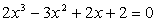
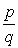
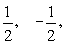
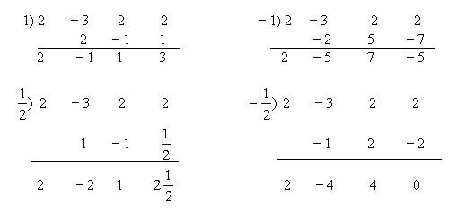
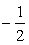
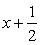
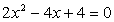
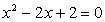

<h2>§3 代数方程的特殊解法 </h2>

阿贝耳证明了五次及更高次的一般方程没有代数解法.可是阿贝耳定理并没有回答这个问题：每个给定的具体方程有没有代数解法.伽罗瓦证明了：存在用代数方法不能解的具体整系数代数方程.例如

<i>x</i>5－<i>x</i>+1=0

伽罗瓦还找出方程能用根式求解的充分必要条件.

1.求有理根

根据上一节中“整根与有理根”的性质，可以求某些具体方程的有理根.

例 求方程的有理根.

　

解 因为该方程的有理根的<i>p</i>和<i>q</i>都是2的约数，所以它们是1，－1，2和－2.因此的可能值为1，－1，2和－2.用综合除法(见§2，一)

检验：

所以为已知方程的一个有理根.

原式除以,得商式

即 

塔顶判别式4－8&lt;0，它的两个根是一对共轭复根.因此原方程只有一个有理根.

