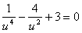
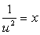
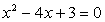
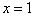
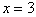
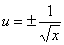
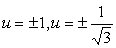

2.解三项方程

形如

<i>au</i>2<i>n</i>+<i>bun+c</i>=0

的方程称为三项方程，其中<i>a,b,c,n</i>都不等于零,<i>n</i>为整数.它可用根式解.令<i>un</i>=<i>x</i>，得二次方程<i>ax</i>2+<i>bx+c</i>=0.

&nbsp;&nbsp; 例&nbsp; 解方程

&nbsp;&nbsp;&nbsp;&nbsp;&nbsp;&nbsp;&nbsp;&nbsp;&nbsp;&nbsp;&nbsp;&nbsp;

&nbsp;&nbsp; 解&nbsp;&nbsp; 令,则得，它的根是和.从得.所以.代入原方程检验，可知这四个数是方程的根.

