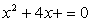

3.解倒数方程

形如

<i>axn</i>+<i>bxn</i>－1+<i>cxn</i>－2+L +<i>cx</i>2+<i>bx</i>+<i>a</i>=0

（其中<i>xn-k</i>和<i>xk</i>项的系数相同）的方程称为倒数方程.倒数方程的任一根不等于零.

1° 偶数次(<i>n</i>=2<i>k</i>)倒数方程两边除以<i>xk</i>，再令<i>z</i>=<i>x</i>+，则原方程可化为<i>z</i>的<i>k</i>次方程，解此方程，得<i>z</i>的值，然后对应的<i>x</i>值可由二次方程

<i>x</i>2－<i>zx</i>+1=0

求出.

&nbsp;&nbsp;&nbsp;&nbsp;&nbsp;&nbsp; 2° 解奇数次(<i>n</i>=2<i>k</i>+1)倒数方程归结为解偶数次倒数方程.

例 解方程

解 为原方程的一个根，把方程除以,得4次倒数方程：

把它除以,然后并项，得

令,则,从而上式变为

由此得.因而有确定的两个方程：

和 

由此得

