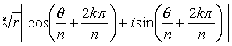
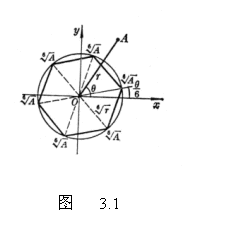
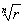
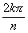

4.解二项方程

形如&nbsp;&nbsp;&nbsp;&nbsp;&nbsp;&nbsp;&nbsp;&nbsp;&nbsp;&nbsp;&nbsp;&nbsp;&nbsp;&nbsp;&nbsp;&nbsp;&nbsp;&nbsp;&nbsp;&nbsp;&nbsp;&nbsp;&nbsp;&nbsp;&nbsp;&nbsp;&nbsp;&nbsp;&nbsp;&nbsp;&nbsp;&nbsp;&nbsp;&nbsp;&nbsp;&nbsp;&nbsp;&nbsp;&nbsp;&nbsp;&nbsp;&nbsp;&nbsp;&nbsp;&nbsp;&nbsp;&nbsp; <i>xn</i>－<i>A</i>=0

的方程称为二项方程.它的<i>n</i>个根就是复数<i>A</i>的<i>n</i>次方根.

&nbsp;&nbsp;&nbsp;&nbsp;&nbsp;&nbsp; 如果把<i>A</i>写为

<i>A</i>=<i>r</i>(cos<i>θ</i>+<i>i</i>sin<i>θ</i>)

则方程<i>xn</i>－<i>A</i>=0的<i>n</i>个根是

&nbsp;&nbsp;&nbsp;&nbsp;&nbsp;&nbsp;&nbsp; &nbsp;&nbsp;&nbsp;&nbsp;&nbsp;&nbsp;&nbsp;&nbsp;&nbsp;(<i>k</i>=0,1,2,L,<i>n</i>－1)

&nbsp;&nbsp;&nbsp;&nbsp;&nbsp;&nbsp; 几何说明：复平面上与数<i>r</i>(cos<i>θ</i>+<i>i</i>sin<i>θ</i>)的<i>n</i>次方根对应的点是一个正<i>n</i>边形的顶点，这些顶点在以原点为中心，以为半径的圆上.而这个<i>n</i>边形的顶点之一有辐角.图3.1表示<i>n</i>=6的情形.

&nbsp;&nbsp;&nbsp;&nbsp;&nbsp;&nbsp; 若<i>A</i>=1，则<i>xn</i>=1的解<i>ξ</i>称为<i>n</i>次单位根.<i>n</i>个<i>n</i>次单位根为&nbsp;&nbsp;&nbsp;&nbsp;&nbsp;&nbsp;&nbsp;&nbsp;&nbsp;&nbsp;&nbsp;&nbsp;&nbsp;&nbsp;&nbsp;&nbsp;&nbsp;&nbsp;&nbsp;&nbsp;&nbsp;&nbsp;&nbsp;&nbsp;&nbsp;&nbsp;&nbsp;&nbsp;&nbsp;&nbsp;&nbsp;&nbsp;&nbsp;&nbsp;&nbsp;&nbsp;&nbsp;&nbsp;&nbsp;&nbsp;&nbsp;&nbsp;&nbsp;&nbsp;&nbsp;&nbsp;&nbsp;&nbsp;&nbsp;&nbsp;&nbsp;&nbsp;&nbsp;&nbsp;

cos<i></i>+<i>i</i>sin<i>&nbsp;&nbsp;&nbsp;&nbsp; </i>(<i>k</i>=0,1,2,L,<i>n</i>－1)&nbsp;&nbsp;&nbsp;&nbsp;&nbsp;&nbsp;&nbsp;&nbsp;&nbsp;&nbsp;&nbsp;&nbsp;

如果<i>ξ</i>是其中一个<i>n</i>次单位根，那末<i>n</i>个<i>n</i>次单位根是1,<i> </i><i>ξ</i><i>,</i><i>ξ</i>2<i>,</i><i>L</i><i>,</i><i>ξn</i>－1，它们在几何上表示为单位圆的一个内接正<i>n</i>边形的顶点.

