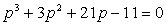

<h1 align=center style='text-align:center'>§4&nbsp; 实根的近似计算</h1>

&nbsp;&nbsp;&nbsp;&nbsp;&nbsp;&nbsp; 设<i>f</i>(<i>x</i>)为已知连续函数，<i>ξ</i>是方程

<i>f</i>(<i>x</i>)<i>=</i>0

的根，这里方程可以是一般方程（代数方程或超越方程）.在实际问题中都给出了根的范围，例如代数方程

<i>f</i>(<i>x</i>)=<i>a</i>0<i>xn</i>+<i>a</i>1<i>xn</i><i>－</i>1+L+<i>an</i><i>－</i>1<i>x</i>+<i>an</i>=0

的根<i>ξ</i>的范围是

|<i>ξ</i>|&pound;1+max{|<i>a</i>1|,|<i>a</i>2|,L,|<i>an</i>|}

因此可以假定方程在区间(<i>a</i>,<i>b</i>)内只有一个根（若有两个根，则将区间的一个端点换为使(<i>x</i>)=0的点）.并由函数的连续性可知，一般来说，在根的附近<i>f</i>(<i>x</i>)是异号的（当(<i>ξ</i>)=0或除外），所以在下面介绍的各种近似计算中，都假定<i>f</i>(<i>a</i>)和<i>f</i>(<i>b</i>)异号.

一、秦九韶法*

秦九韶法基本上是通过逐次试验求根的近似值的方法，试验次数愈多，所得近似值愈接近根的真值.系统地继续这一过程，直至达到预定的有效数字的位数.现举例具体说明这个方法.

例&nbsp;&nbsp; 求方程 

&nbsp;&nbsp;&nbsp;&nbsp;&nbsp;&nbsp;&nbsp;&nbsp;&nbsp;&nbsp;&nbsp;&nbsp;&nbsp;&nbsp;&nbsp;&nbsp;&nbsp;&nbsp;&nbsp;&nbsp;
<i>f</i>(<i>x</i>)=&nbsp;&nbsp;&nbsp;&nbsp;&nbsp;&nbsp;&nbsp;&nbsp;&nbsp;&nbsp;&nbsp;&nbsp;&nbsp;&nbsp;&nbsp;&nbsp;&nbsp;&nbsp;&nbsp;&nbsp;&nbsp;&nbsp;&nbsp;&nbsp;&nbsp;&nbsp;&nbsp;&nbsp;&nbsp;
(1)

的根到五位有效数字.

应用笛卡尔符号法则可知这个方程有一个正根.由于<i>f</i>(1)＝－11，<i>f</i>(2)＝14，这个正根在(1,2)之间.

现在应用秦九韶法求这个方程的近似根.先设，这里表示1到所求根的距离.应用多项式的泰勒公式(秦九韶法,见§2,一)，得到关于的方程

&nbsp;&nbsp;&nbsp;&nbsp;&nbsp;&nbsp;&nbsp;&nbsp;&nbsp;&nbsp;&nbsp;&nbsp;&nbsp;&nbsp;&nbsp;&nbsp;&nbsp;&nbsp;&nbsp;&nbsp;&nbsp;&nbsp;&nbsp;
&nbsp;&nbsp;&nbsp;&nbsp;&nbsp;&nbsp;&nbsp;&nbsp;&nbsp;&nbsp;&nbsp;&nbsp;&nbsp;&nbsp;&nbsp;&nbsp;&nbsp;&nbsp;&nbsp;&nbsp;&nbsp;&nbsp;&nbsp;&nbsp;(2)

其算式为

&nbsp;&nbsp;&nbsp;&nbsp;&nbsp;&nbsp;&nbsp;&nbsp;&nbsp;&nbsp;&nbsp;&nbsp;&nbsp;&nbsp;&nbsp;&nbsp;&nbsp;&nbsp;&nbsp;&nbsp;

&nbsp;&nbsp; 现在求纯小数的近似值，由于纯小数的三次方或二次方的值更小，可暂舍去方程(2)的头两项而来计算21－11＝0，即＝0.5238….但舍去的两项是正的，这个值显得太大.当＝0.500时，方程(2)的左边各项的和是仍是正数(0.375)，而当＝0.400时，方程(2) 的左边各项的和是负数(－2.056).因此，设,即，再应用多项式的泰勒公式，得到关于<i>h</i>的方程

&nbsp;&nbsp;&nbsp;&nbsp;&nbsp;&nbsp;&nbsp;&nbsp;&nbsp;&nbsp;&nbsp;&nbsp;
&nbsp;&nbsp;&nbsp;&nbsp;&nbsp;&nbsp;&nbsp;&nbsp;&nbsp;&nbsp;&nbsp;&nbsp;&nbsp;&nbsp;&nbsp;&nbsp;&nbsp;&nbsp;&nbsp;&nbsp;&nbsp;&nbsp;&nbsp;&nbsp;&nbsp;&nbsp;&nbsp;&nbsp;&nbsp;&nbsp;&nbsp;&nbsp;&nbsp;&nbsp;(3)

其算式为

&nbsp;&nbsp;&nbsp;&nbsp;&nbsp;&nbsp;&nbsp;&nbsp;&nbsp;&nbsp;&nbsp;&nbsp;&nbsp;&nbsp;&nbsp;&nbsp;&nbsp;&nbsp;&nbsp;&nbsp;

现在求小数<i>h</i>的近似值，舍去头两项，求得<i>h</i>＝0.08609….因舍去两个正量，所得的<i>h</i>太大，所以设<i>h</i>＝0.08,即.应用上述方法得到关于的方程

&nbsp;&nbsp;&nbsp;&nbsp;&nbsp;&nbsp;&nbsp;&nbsp;&nbsp;&nbsp;&nbsp;&nbsp;
&nbsp;&nbsp;&nbsp;&nbsp;&nbsp;&nbsp;&nbsp;&nbsp;&nbsp;&nbsp;&nbsp;&nbsp;&nbsp;&nbsp;&nbsp;&nbsp;&nbsp;&nbsp;&nbsp;&nbsp;&nbsp;&nbsp;&nbsp;&nbsp;&nbsp;&nbsp;&nbsp;(4)

同上面一样，从方程(4)的后两项求得设,即

* 我国古代数学家秦九韶在他所著的&lt;&lt;数书九章&gt;&gt;(1247)，给出一个求代数方程的根近似值

&nbsp; 的方法，这个方法一般书上都称为和纳法.实际上和纳在1819年才提出这个方法，比秦九

&nbsp; 韶晚五百多年.

得到关于的方程

&nbsp;&nbsp;&nbsp;&nbsp;&nbsp;&nbsp;&nbsp;&nbsp;&nbsp;&nbsp;&nbsp;
&nbsp;&nbsp;&nbsp;&nbsp;&nbsp;&nbsp;&nbsp;&nbsp;&nbsp;&nbsp;&nbsp;&nbsp;&nbsp;&nbsp;&nbsp;&nbsp;&nbsp;&nbsp;&nbsp;&nbsp;&nbsp;&nbsp;(5)

从后两项求出的近似值=0.0008…,因舍去的都是正量，所以方程(5)的根在0.0008和0.00081之间.

现在把(2),(3),(4),(5),的各个近似值0.4,0.08,0.004,0.0008相加得总和0.4848,然后加到第一次近似值1上，所以方程(1)的根在1.4848与1.48481之间，取五位有效数字为1.4848.

用秦九韶法还能求负的近似值.想求<i>f</i>(<i>x</i>)＝0的一切负实根，可先求 <i>f</i>(－<i>x</i>)的正实根，然后改变符号，即得负实根.

