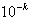

二、二分法

假定<i>f</i>(<i>x</i>)在[<i>a,b</i>]上连续，且<i>f</i>(<i>a</i>)<i>f</i>(<i>b</i>)&lt;0（这里假定<i>f</i>(<i>a</i>)&lt;0,<i>f</i>(<i>b</i>)&gt;0）,取区间[<i>a,b</i>]的中点，若<i></i>=0，则<i>f</i>(<i>x</i>)=0的根是<i>ξ</i>=.不然，若<i></i>&gt;0，则令<i>a</i>1=<i>a</i>,<i>b</i>1=；若<i></i>&lt;0，则令<i>a</i>1=,<i>b</i>1=<i>b</i>.于是形成新区间[<i>a</i>1,<i>b</i>1]，它包含<i>f</i>(<i>x</i>)<i>=</i>0的根<i>ξ</i>（图3.2）.

再取[<i>a</i>1,<i>b</i>1]的中点，若<i></i>=0，则<i>ξ</i>=.若<i></i>&gt;0，则令<i>a</i>2=<i>a</i>1,<i>b</i>2=；若<i></i>&lt;0，则令<i>a</i>2=,<i>b</i>2=<i>b</i>1.于是又形成新区间[<i>a</i>2,<i>b</i>2]，其长度等于，它包含方程<i>f</i>(<i>x</i>)<i>=</i>0的根<i>ξ</i>.…若允许误差<i>ε</i>=，则按这个过程作出区间[<i>a</i>1,<i>b</i>1], [<i>a</i>2,<i>b</i>2],
[<i>a</i>3,<i>b</i>3],L, [<i>an</i>,<i>bn</i>],<i>n</i>=（[<i>x</i>]表示<i>x</i>的整数部分），于是

<i>ξ</i>*=

是方程<i>f</i>(<i>x</i>)<i>=</i>0的近似根，误差不超过

|<i>ξ</i>-<i>ξ</i>*|&pound;&pound;

&nbsp;&nbsp;&nbsp;&nbsp;&nbsp;&nbsp; 二分法是求实根的近似计算中行之有效的最简单的方法，它只要求函数是连续的，因此它的使用范围很广，并便于在电子计算机上实现.但是它不能求重根，也不能求虚根.

