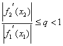
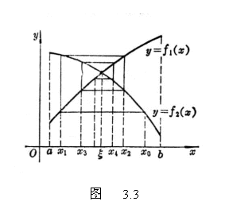
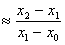
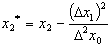
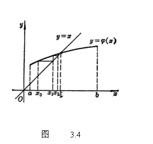
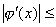

三、迭代法

把方程<i>f</i>(<i>x</i>)<i>=</i>0表成它的等价形式

<i>x</i>=<i>j </i>(<i>x</i>)

或一般地

<i>f</i>1(<i>x</i>)=<i>f</i>2(<i>x</i>)

式中<i>f</i>1(<i>x</i>)是这样一个函数：对任意实数<i>c</i>，能容易算出方程<i>f</i>1(<i>x</i>)=<i>c</i>的精确度很高的实根.如果对任意，下式成立：

则下面迭代过程是收敛的.

&nbsp;&nbsp;&nbsp;&nbsp;&nbsp;&nbsp; 首先从一个近似根<i>x</i>0出发（<i>x</i>0可由图解法粗略估计出），代入方程右边，解方程

<i>f</i>1(<i>x</i>)=<i>f</i>2(<i>x</i>0)

得到第一个近似根<i>x</i>=<i>x</i>1，再解方程

<i>f</i>1(<i>x</i>)=<i>f</i>2(<i>x</i>1)

得到第二个近似根<i>x</i>=<i>x</i>2，L,类似地由第<i>n</i>个近似根<i>xn</i>，解方程

<i>f</i>1(<i>x</i>)=<i>f</i>2(<i>xn</i>)

得到第<i>n</i>+1个近似根<i>x</i>=<i>xn</i>+1，于是得到一系列不同精确度的近似根

<i>x</i>0,<i>&nbsp; x</i>1,&nbsp; <i>x</i>2,L,<i> xn</i>,L

它收敛于方程的根<i>ξ</i>（图3.3）.

&nbsp;&nbsp;&nbsp;&nbsp;&nbsp;&nbsp; 收敛速度（即误差消失速度）与<i>an</i>相当，而

<i>a</i><i></i>

&nbsp;&nbsp;&nbsp;&nbsp;&nbsp;&nbsp; 用

代替<i>x</i>2可加速收敛.式中D<i>x</i>1=<i>x</i>2－<i>x</i>1为<i>x</i>1的一阶差分，D2<i>x</i>0=D<i>x</i>1－D<i>x</i>0为<i>x</i>0的二阶差分.

&nbsp;&nbsp;&nbsp;&nbsp;&nbsp;&nbsp; 对于方程<i>x</i>=<i>j</i> (<i>x</i>)，只要<i>j</i>(<i>x</i>)在[<i>a</i>,<i>b</i>]上连续，且<i>q</i>&lt;1，那末，它的根可由

<i>x</i>1=<i>j</i> (<i>x</i>0)

<i>x</i>2=<i>j</i> (<i>x</i>1)

LLLL

<i>xn</i>+1=<i>j</i> (<i>xn</i>)

来接近（图3.4）.

