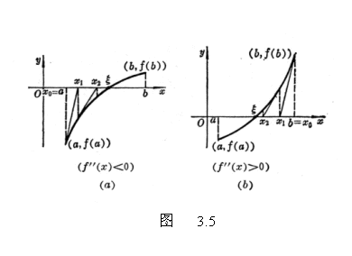

四、牛顿法

1．一般牛顿法

设<i>f</i>(<i>x</i>)在[<i>a</i>,<i>b</i>]上连续，也连续，且&sup1;0,&sup1;0，<i>f</i>(<i>a</i>)<i>f</i>(<i>b</i>)&lt;0（设<i>f</i>(<i>a</i>)&lt;0,<i>f</i>(<i>b</i>)&gt;0），过点(<i>a</i>,<i>f</i>(<i>a</i>))（或点(<i>b</i>,<i>f</i>(<i>b</i>)）)作曲线的切线：

（或）

它和<i>x</i>轴的交点为<i>x</i>=<i>a</i>－（或<i>x</i>=<i>b</i>－）

&nbsp;&nbsp;&nbsp;&nbsp;&nbsp;&nbsp; 用迭代公式

<i>xn</i>+1=<i>xn</i>－

并取初始值

<i>x</i>0=

可计算出方程<i>f</i>(<i>x</i>)=0的根的近似值（图3.5）.误差&iuml;<i>x</i>－<i>xn</i>&iuml;不超过 

一般选取的初始值<i>x</i>0，要满足不等式

