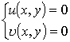
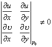
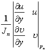
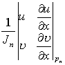
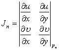

4．牛顿法解非线性方程组

假设非线性方程组

存在一组近似解<i>P</i>0=(<i>x</i>0,<i>y</i>0)，且

可用迭代公式：

<i>xn</i>+1=<i>xn</i>+

<i>yn</i>+1=<i>yn</i>+

式中<i>Pn</i>为点(<i>xn</i>,<i>yn</i>)，<i>Jn</i>为雅可比式<i>J</i>在<i>Pn</i>的值：

