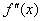

五、弦截法（线性插值法）

&nbsp;&nbsp;&nbsp;&nbsp;&nbsp;&nbsp; 假设<i>f</i>(<i>x</i>)在[<i>a</i>,<i>b</i>]上连续，,都不变号，且<i>f</i>(<i>a</i>)<i>f</i>(<i>b</i>)&lt;0（这里假定<i>f</i>(<i>a</i>)&lt;0,<i>f</i>(<i>b</i>)&gt;0）.过点(<i>a</i>,<i>f</i>(<i>a</i>))和(<i>b</i>,<i>f</i>(<i>b</i>))的直线是：

&nbsp;&nbsp;&nbsp;&nbsp;&nbsp;&nbsp; (或)

它和<i>x</i>轴的交点是<i>x</i>=<i>a</i>－（或<i>x</i>=<i>b</i>－）.

&nbsp;&nbsp;&nbsp;&nbsp;&nbsp;&nbsp; （<i>a</i>）当&gt;0时，用迭代公式

可求出方程的近似根（图3.6(<i>a</i>)）.

&nbsp;&nbsp;&nbsp;&nbsp;&nbsp;&nbsp; （<i>b</i>）当&lt;0时，用迭代公式

可求出方程<i>f</i>(<i>x</i>)=0的近似根（图3.6(<i>b</i>)）.

