

六、联合法（牛顿法与弦截法联合使用）

假设<i>f</i>(<i>x</i>)在[<i>a</i>,<i>b</i>]上连续，,都不变号，且<i>f</i>(<i>a</i>)<i>f</i>(<i>b</i>)&lt;0（这里假定<i>f</i>(<i>a</i>)&lt;0,<i>f</i>(<i>b</i>)&gt;0）.

（<i>a</i>）当<i>f</i>(<i>a</i>)与同号时（图3.7(<i>a</i>)），用迭代公式

<i>x</i>1=<i>a</i>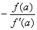

=<i>b</i>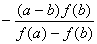

<i>x</i>2=<i>x</i>1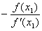

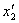=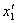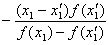

LLLLLLL

<i>xn</i>=<i>xn</i>-1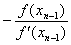

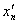=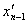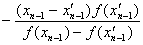

可求出方程<i>f</i>(<i>x</i>)=0的近似根.

&nbsp;&nbsp;&nbsp;&nbsp;&nbsp;&nbsp; （<i>b</i>）当<i>f</i>(<i>a</i>)与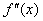异号时（图3.7(<i>b</i>)），用迭代公式

<i>x</i>1=<i>a</i>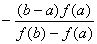

=<i>b</i>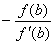

<i>x</i>2=<i>x</i>1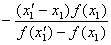

=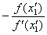

LLLLLLLL

<i>xn</i>=<i>xn</i>-1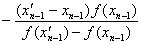

=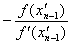

可求出方程<i>f</i>(<i>x</i>)=0的近似根.

&nbsp;&nbsp;&nbsp;&nbsp;&nbsp;&nbsp; 误差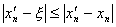或.

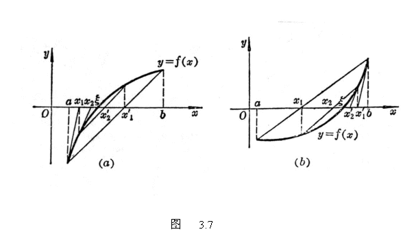

