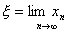

七、抛物线法（穆勒法）

求实系数<i>n</i>次方程

<i>f</i>(<i>x</i>)=<i>xn</i>+<i>a</i>1<i>xn</i>-1+L+<i>an</i>=0&nbsp;&nbsp;&nbsp;&nbsp;&nbsp;&nbsp;&nbsp;&nbsp;&nbsp;&nbsp;&nbsp;&nbsp;&nbsp;&nbsp;
(1)

的近似根.

&nbsp;&nbsp;&nbsp;&nbsp;&nbsp;&nbsp; 可先求出<i>f</i>(<i>x</i>)=0的一个根<i>x</i>=<i>r</i>，则

<i>&nbsp;&nbsp;&nbsp;&nbsp;&nbsp;&nbsp;&nbsp;&nbsp;&nbsp;&nbsp;&nbsp;&nbsp;&nbsp;&nbsp;&nbsp;&nbsp;&nbsp;&nbsp;&nbsp;&nbsp;&nbsp;
f</i>(<i>x</i>)=(<i>x</i>-<i>r</i>)<i>g</i>(<i>x</i>)

&nbsp;&nbsp;&nbsp;&nbsp;&nbsp;&nbsp;&nbsp;&nbsp;&nbsp;&nbsp;&nbsp;&nbsp;&nbsp;&nbsp;&nbsp;&nbsp;&nbsp;&nbsp;&nbsp;&nbsp;&nbsp;&nbsp;&nbsp;&nbsp;
=(<i>x</i>－<i>r</i>)(<i>xn</i>－1+<i>b</i>1<i>xn</i>－2+L+<i>bn</i>－1)

式中<i>g</i>(<i>x</i>)是<i>n</i>－1次多项式，然后再求出<i>g</i>(<i>x</i>)的根，依此类推，可以求出<i>f</i>(<i>x</i>)=0的全部实根来.

&nbsp;&nbsp;&nbsp;&nbsp;&nbsp;&nbsp; 首先选取<i>x</i>轴上三点：<i>x</i>0,<i>x</i>1,<i>x</i>2,通过曲线<i>y</i>=<i>f</i>(<i>x</i>)上的三点：(<i>x</i>0,<i>f</i>(<i>x</i>0)), (<i>x</i>1,<i>f</i>(<i>x</i>1)),(<i>x</i>2,<i>f</i>(<i>x</i>2))作一抛物线<i>y</i>=<i>P</i>(<i>x</i>)（即拉格朗日插值多项式，见第十七章，§2，三），抛物线与<i>x</i>轴有两个交点，取离<i>x</i>2较近的一点作为<i>x</i>3；再过三点(<i>x</i>1,<i>f</i>(<i>x</i>1)),
(<i>x</i>2,<i>f</i>(<i>x</i>2)), (<i>x</i>3,<i>f</i>(<i>x</i>3))作一抛物线（图3.8中的虚线），它与<i>x</i>轴有两个交点，取离<i>x</i>3较近的一点作为<i>x</i>4L，依此法作出点<i>xi</i>-2, <i>xi</i>-1,
<i>xi</i>，再过三点(<i>xi</i>-2,<i>f</i>(<i>xi</i>-2)),
(<i>xi</i>-1,<i>f</i>(<i>xi</i>-1)),
(<i>xi</i>,<i>f</i>(<i>xi</i>))作一抛物线与<i>x</i>轴有两个交点，取离<i>xi</i>较近的一点作为<i>xi</i>+1，等等.

&nbsp;&nbsp;&nbsp;&nbsp;&nbsp;&nbsp; 对于预先给定的允许误差<i>e</i>，当迭代过程进行到

&iuml;<i>xi</i>+1-<i>xi</i>&iuml;&lt;<i>e</i>

时，就取<i>xi</i>+1作为<i>f</i>(<i>x</i>)=0的一个近似根.

&nbsp;&nbsp;&nbsp;&nbsp;&nbsp;&nbsp; 由此得到的序列是收敛的.极限值，就是方程<i>f</i>(<i>x</i>)=0的根.

&nbsp;&nbsp;&nbsp;&nbsp;&nbsp;&nbsp; 迭代步骤如下：

（1）根据经验对上式（1）可取

<i>x</i>0=－1,&nbsp; <i>x</i>1=1,&nbsp;&nbsp;&nbsp;&nbsp;&nbsp; <i>x</i>2=0

作为初始值，于是

<i>f</i>(<i>x</i>0)=(－1)<i>n</i>+(－1)<i>n</i>－1<i>a</i>1+L－<i>an</i>－1+<i>an</i>

<i>f</i>(<i>x</i>1)=1+<i>a</i>1+L+<i>an</i>

<i>f</i>(<i>x</i>2)=<i>an</i>

或用<i>x</i>=0附近的近似值

<i>f</i>(<i>x</i>0)&raquo;<i>an</i>－2－<i>an</i>－1+<i>an</i>

<i>f</i>(<i>x</i>1)
&raquo;<i>an</i>－2+<i>an</i>－1+<i>an</i>

<i>f</i>(<i>x</i>2)=<i>an</i>

（2）设

&nbsp;&nbsp;&nbsp;&nbsp;&nbsp;&nbsp;&nbsp;&nbsp;&nbsp;&nbsp;&nbsp;&nbsp;&nbsp;&nbsp;&nbsp;&nbsp;&nbsp;&nbsp;&nbsp;&nbsp;&nbsp;&nbsp;&nbsp;&nbsp;&nbsp;&nbsp;&nbsp;&nbsp;&nbsp;&nbsp;&nbsp;&nbsp;&nbsp;&nbsp;&nbsp;&nbsp;&nbsp;&nbsp;&nbsp;&nbsp;&nbsp;&nbsp;&nbsp;&nbsp;&nbsp;&nbsp;&nbsp;&nbsp;&nbsp;&nbsp;&nbsp;&nbsp;&nbsp;&nbsp;&nbsp; l<i>i</i>=,&nbsp;&nbsp;&nbsp;&nbsp; d<i>i</i>=1+l<i>i</i>=

&nbsp;&nbsp;&nbsp;&nbsp;&nbsp;&nbsp;&nbsp;&nbsp;&nbsp;&nbsp;&nbsp;&nbsp;&nbsp;&nbsp;&nbsp;&nbsp;&nbsp;&nbsp;&nbsp;&nbsp;&nbsp;&nbsp;&nbsp;&nbsp;&nbsp;&nbsp;&nbsp;&nbsp;&nbsp;&nbsp;&nbsp;&nbsp;&nbsp;&nbsp;&nbsp;&nbsp;&nbsp;&nbsp;&nbsp;&nbsp;&nbsp;&nbsp;&nbsp;&nbsp;&nbsp;&nbsp;&nbsp;&nbsp;&nbsp;&nbsp;&nbsp;&nbsp;&nbsp;&nbsp;&nbsp; <i>gi</i>=<i>f</i>(<i>xi</i>－2)l<i>i</i>2 －<i>f</i>(<i>xi</i>-1)l<i>i</i>d<i>i</i> +<i>f</i>(<i>xi</i>)l<i>i</i>

&nbsp;&nbsp;&nbsp;&nbsp;&nbsp;&nbsp;&nbsp;&nbsp;&nbsp;&nbsp;&nbsp;&nbsp;&nbsp;&nbsp;&nbsp;&nbsp;&nbsp;&nbsp;&nbsp;&nbsp;&nbsp;&nbsp;&nbsp;&nbsp;&nbsp;&nbsp;&nbsp;&nbsp;&nbsp;&nbsp;&nbsp;&nbsp;&nbsp;&nbsp;&nbsp;&nbsp;&nbsp;&nbsp;&nbsp;&nbsp;&nbsp;&nbsp;&nbsp;&nbsp;&nbsp;&nbsp;&nbsp;&nbsp;&nbsp;&nbsp;&nbsp;&nbsp;&nbsp;&nbsp;&nbsp; <i>hi</i>=<i>f</i>(<i>xi</i>-2)l<i>i</i>2 -<i>f</i>(<i>xi</i>-1)d<i>i</i>2 +<i>f</i>(<i>xi</i>)(l<i>i</i>+d<i>i</i>)&nbsp;&nbsp;&nbsp;&nbsp;&nbsp;&nbsp;&nbsp;&nbsp;&nbsp;&nbsp;&nbsp;&nbsp;&nbsp;&nbsp;&nbsp;&nbsp;&nbsp;&nbsp;&nbsp;&nbsp;&nbsp;&nbsp;&nbsp; 

由此根据<i>xi</i>-2, <i>xi</i>-1, <i>xi</i> 计算出l<i>i</i>, d<i>i</i>, <i>gi</i>, <i>hi</i>，并根据下列公式计算出l<i>i</i>+1

l<i>i</i>+1=

&nbsp;&nbsp;&nbsp;&nbsp;&nbsp;&nbsp; （<i>hi</i>&gt;0，根式取正号；<i>hi</i>&lt;0，根式取负号）

&nbsp;&nbsp;&nbsp;&nbsp;&nbsp;&nbsp; 当<i>f</i>(<i>xi</i>-2)=<i>f</i>(<i>xi</i>-1)=<i>f</i>(<i>xi</i>)时，取l<i>i</i>+1=1.

（3）根据公式

<i>xi</i>+1=l<i>i</i>+1(<i>xi</i>－<i>xi</i>-1)+<i>xi</i>

计算出<i>xi</i>+1

