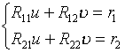

八、林士谔—赵访熊法（劈因子法）

由于解二次方程是容易的，因此在求实系数代数方程

<i>f</i>(<i>x</i>)=<i>xn</i>+<i>a</i>1<i>xn</i>－1+L +<i>an</i>－1<i>x</i>+<i>an</i>=0

的复根时，如果找出<i>f</i>(<i>x</i>)的一个二次因子，就等于找到方程的一对复根.

<pre ALIGN=JUSTIFY>&nbsp;&nbsp;&nbsp;&nbsp;&nbsp;&nbsp;&nbsp; 设<i>f</i>(<i>x</i>)的一个近似二次因子（任意选取）为</pre>

w(<i>x</i>)=<i>x</i>2+<i>px</i>+<i>q</i>

可用下述方法使它精确化：

（1）用w(<i>x</i>)去除<i>f</i>(<i>x</i>)，得到商式<i>Q</i>(<i>x</i>)和余式<i>R</i>(<i>x</i>)，即

<pre align=center><i>&nbsp;&nbsp;&nbsp;&nbsp;&nbsp;&nbsp;&nbsp;&nbsp;&nbsp;&nbsp;&nbsp;&nbsp;&nbsp;&nbsp;&nbsp;&nbsp;&nbsp;&nbsp;&nbsp;&nbsp;&nbsp;&nbsp;&nbsp;&nbsp;&nbsp;&nbsp;&nbsp;&nbsp;&nbsp;&nbsp; f</i>(<i>x</i>)= w(<i>x</i>)<i>Q</i>(<i>x</i>)+<i>R</i>(<i>x</i>)</pre>

=(<i>x</i>2+<i>px</i>+<i>q</i>)(<i>xn</i>－2+<i>b</i>1<i>xn</i>－3+L +<i>bn</i>－3<i>x</i>+<i>bn</i>－2)+(<i>r</i>1t +<i>r</i>2)

式中商式与余式的系数可用下面的递推公式算出：

<i>bk</i>=<i>ak</i>-<i>pbk</i>-1-<i>qbk</i>-2, <i>k</i>=1,2,L ,<i>n</i>

<i>b</i>-1=0,&nbsp;&nbsp; <i>b</i>0=1

<i>r</i>1=<i>bn</i>-1=<i>an</i>-1-<i>pbn</i>-2-<i>qbn</i>-3

<i>r</i>2=<i>bn</i>+<i>pbn</i>-1=<i>an</i>-<i>qbn</i>-2

（2）用w(<i>x</i>)去除<i>xQ</i>(<i>x</i>)得到余式

<i>R</i>[1](<i>x</i>)=<i>R</i>11<i>x</i>＋<i>R</i>21

式中<i>R</i>11,<i>R</i>21，由下面的递推公式算出：

<i>ck</i>=<i>bn</i>-<i>pck</i>-1-<i>qck</i>-2, <i>k</i>=1,2,L ,<i>n</i>-3

<i>c</i>-1=0,&nbsp;&nbsp; <i>c</i>0=1

<i>R</i>11=<i>bn</i>-2-<i>pcn</i>-3-<i>qcn</i>-4

<i>R</i>21=-<i>qcn</i>-3

（3）用w(<i>x</i>)去除<i>Q</i>(<i>x</i>)得到余式

<i>R</i>[2](<i>x</i>)=<i>R</i>12<i>x</i>＋<i>R</i>22

式中<i>R</i>12,<i>R</i>22，由下面的公式算出：

<i>R</i>12=<i>bn</i>-3-<i>pcn</i>-4-<i>qcn</i>-5

<i>R</i>21=<i>bn</i>-2-<i>qcn</i>-4

（4）解二元一次线性方程组

得到<i>u</i>,.

（5）修正后的二次式为

<i>w</i><i> </i>[1](<i>x</i>)=<i>x</i>2+(<i>p</i>+<i>u</i>)<i>x</i>+(<i>q</i>+)

如果它还不够精确，再重复（1）至（5）的步骤进行修正，直到足够精确为止.

&nbsp;&nbsp;&nbsp;&nbsp;&nbsp;&nbsp; 林士谔—赵访熊法求实系数代数方程的复根，其优点是避免了复数运算，缺点是程序比较复杂.

