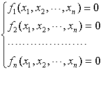
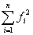
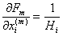
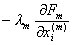
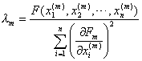

九、下降法

对任意实系数超越方程组

(1)

定义目标函数

<i>F</i>(<i>x</i>1,<i>x</i>2,L ,<i>xn</i>)=

如果<i>F</i>(x1,x2,L,x<i>n</i>)&lt;e （e为在一定精确度下给定的适当小的正数），则认为x1,x2,L ,x<i>n</i>为方程组（1）的解.

&nbsp;&nbsp;&nbsp;&nbsp;&nbsp;&nbsp; 具体计算步骤如下：

（1）任取一组初始值<i>x</i>1(0),<i>x</i>2(0),L,<i>xn</i>(0)（全不为零），设已按照下述过程计算到第<i>m</i>步得到一组值：<i>x</i>1(<i>m</i>),<i>x</i>2(<i>m</i>),L ,<i>xn</i>(<i>m</i>)

（2）计算

<i>Fm</i>=<i>F</i>(<i>x</i>1(<i>m</i>),<i>x</i>2(<i>m</i>),L ,<i>xn</i>(<i>m</i>))

（3）若<i>Fm</i>&lt;e ，则<i>x</i>1(<i>m</i>),<i>x</i>2(<i>m</i>),L ,<i>xn</i>(<i>m</i>)是所求的解，否则计算<i>n</i>个偏导数：

[<i>F</i>(<i>x</i>1(<i>m</i>),<i>x</i>2(<i>m</i>),L,<i>xi</i>(<i>m</i>)+<i>Hi</i>,L,<i>xn</i>(<i>m</i>))-<i>F</i>（<i>x</i>1(<i>m</i>),<i>x</i>2(<i>m</i>),L ,<i>xn</i>(<i>m</i>)）]

<i>Hi</i>=w<i>xi</i>(<i>m</i>)&nbsp;&nbsp;&nbsp;&nbsp;&nbsp;&nbsp; <i>i</i>=1,2,L ,<i>n</i>

（4）计算

<i>xi</i>(<i>m</i>+1)= <i>xi</i>(<i>m</i>),&nbsp; <i>i</i>=1,2,L,<i>n</i>

式中

得到一组{<i>xi</i>(<i>m</i>+1)}，再重复（2），（3）,（4）的计算.

