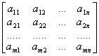
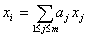
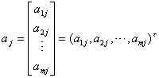

<h1 style='margin-left:216.0pt'>第四章 矩阵·行列式·线性方程组</h1>
<h1 style='margin-left:216.0pt'>&nbsp;</h1>

本章内容包括矩阵、行列式与线性代数方程组两部分.

在前一部分，叙述了矩阵和行列式的基本概念，重点介绍各种类型矩阵的性质、基本运算，此外，还介绍了矩阵的特征值与特征矢量的求法，及有关的内容，如相似变换等；在线性方程组部分，着重介绍含<i>n</i>个未知量的<i>n</i>个方程的方程组解法，也简单地讨论了解的结构.最后对整系数线性方程组和线性不等式组也作了扼要说明.

<h2>§1 矩阵与行列式</h2>
<h3>&nbsp; </h3>
<h3 style='margin-left:36.0pt'>一、矩阵及其秩</h3>

&nbsp;&nbsp;&nbsp;&nbsp;&nbsp;&nbsp; [矩阵与方阵]数域（第三章，§1）<i>F</i>上的<i>m</i>×<i>n</i>个数<i>aij</i>(<i>i</i>=1,2,…,<i>m</i>;<i>j</i>=1,2,…,<i>n</i>)按确定的位置排成的矩形阵列，称为<i>m</i>×<i>n</i>矩阵.记作

<i>A</i>=

其中横的一排叫做行，竖的一排叫做列，<i>aij</i>称为矩阵的第<i>i</i>行第<i>j</i>列的元素，矩阵<i>A</i>简记为(<i>aij</i>)或(<i>aij</i>)<i>m</i><i>&acute; n</i>.

<i>n</i>×<i>n</i>矩阵也称为<i>n</i>阶方阵，<i>a</i>11，<i>a</i>12，…，<i>ann</i>称为矩阵<i>A</i>的主对角线的元素.

行数<i>m</i>与列数<i>n</i>都是有限的矩阵，称为有限矩阵.否则称为无限矩阵.

[矢量的线性相关与线性无关]对于<i>n</i>维空间的一组矢量<i>x</i>1，<i>x</i>2，…，<i>xm</i>，若数域<i>F</i>中有一组不全为零的数<i>ki</i> (<i>i</i>=1，2，…，<i>m</i>)，使

<i>k</i>1<i>x</i>1+<i>k</i>2<i>x</i>2+…+<i>kmxm</i>=0

成立，则称这组矢量在<i>F</i>上线性相关，否则称这组矢量在<i>F</i>上线性无关.

矢量组的线性相关性的讨论：

1° 矢量组<i>x</i>1，<i>x</i>2，…，<i>xm</i>线性相关的充分必要条件是：其中至少有一个矢量<i>xi</i>可用其他矢量的线性组合来表示，即

2° 包含零矢量的矢量组一定线性相关.

3° 矢量组<i>x</i>1，<i>x</i>2，…，<i>xm</i>
中，若有两个矢量相等：<i>xi</i>=<i>xj</i>(<i>i</i><i>≠j</i>),则该矢量组线性相关.

4° 若矢量组<i>x</i>1，<i>x</i>2，…，<i>xr </i>线性相关，则再添加若干个矢量后所组成的矢量组仍然线性相关；若矢量组<i>x</i>1，<i>x</i>2，…，<i>xm </i>线性无关，则其中任一部分矢量组成的矢量组也线性无关.

5° 若<i>x</i>1，<i>x</i>2，…，<i>xr</i>线性无关，而<i>x</i>1，<i>x</i>2，…，<i>xr</i>+1线性相关，则<i>xr</i>+1可以表示为<i>x</i>1，<i>x</i>2，…，<i>xr</i>的线性组合.

[行矢量与列矢量 · 矩阵的秩] 由矩阵任一行的元素构成的<i>n</i>维矢量称为行矢量，记为

<i>ai</i>=(<i>ai</i>1,<i>ai</i>2,...,<i>ain</i>)
(<i>i</i>=1,2,...,<i>m</i>)

由矩阵任一列的元素构成的<i>m</i>维矢量称为列矢量，记为

(<i>j</i>=1,2,...,<i>n</i>)

式中t
表示转置，即行（列）转换为列（行）.

若矩阵<i>A</i>的<i>n</i>个列矢量中有<i>r</i>个线性无关（<i>r</i>≤<i>n</i>），而所有个数大于<i>r</i>的列矢量组都线性相关，则称数<i>r</i>为矩阵<i>A</i>的列秩.类似可定义矩阵<i>A</i>的行秩.

矩阵<i>A</i>的列秩与行秩一定相等，它也称为矩阵的秩，记作rank <i>A</i>=<i>r</i>.

矩阵的秩也等于该矩阵中不等于零的子式（见本节，二）的最大阶数.

