

<h3>二、行列式 </h3>

1. 行列式及其拉普拉斯展开定理

[<i>n</i>阶行列式] 设

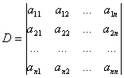

是由排成<i>n</i>阶方阵形式的<i>n</i>2个数<i>aij</i>(<i>i</i>,<i>j</i>=1,2,...,<i>n</i>)确定的一个数，其值为<i>n</i>！项之和

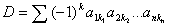

式中<i>k</i>1,<i>k</i>2,...,<i>kn</i>是将序列1,2,...,<i>n</i>的元素次序交换<i>k</i>次所得到的一个序列，Σ号表示对<i>k</i>1,<i>k</i>2,...,<i>kn</i>取遍1,2,...,<i>n</i>的一切排列求和，那末数<i>D</i>称为<i>n</i>阶方阵相应的行列式.例如，四阶行列式是4！个形为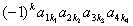的项的和，而其中<i>a</i>13<i>a</i>21<i>a</i>34<i>a</i>42相应于<i>k</i>=3,即该项前端的符号应为

(－1)3.

若<i>n</i>阶方阵<i>A</i>=（<i>aij</i>）,则<i>A</i>相应的行列式<i>D</i>记作

<i>D</i>=|<i>A</i>|=det<i>A</i>=det(<i>aij</i>)

&nbsp;&nbsp;&nbsp;&nbsp;&nbsp;&nbsp; 若矩阵<i>A</i>相应的行列式<i>D</i>=0，称<i>A</i>为奇异矩阵，否则称为非奇异矩阵.

&nbsp;&nbsp;&nbsp;&nbsp;&nbsp;&nbsp; [标号集] 序列1,2,...,<i>n</i>中任取<i>k</i>个元素<i>i</i>1,<i>i</i>2,...,<i>ik</i>满足

1≤<i>i</i>1&lt;<i>i</i>2&lt;...&lt;<i>ik</i>≤<i>n</i>&nbsp;&nbsp;&nbsp;&nbsp;  &nbsp;&nbsp;&nbsp;&nbsp;&nbsp;&nbsp;&nbsp;&nbsp;&nbsp;&nbsp;&nbsp;&nbsp;&nbsp;&nbsp;&nbsp;&nbsp;&nbsp;&nbsp;&nbsp; &nbsp;&nbsp;&nbsp;&nbsp;&nbsp;&nbsp;&nbsp;&nbsp;&nbsp;&nbsp;&nbsp;&nbsp;&nbsp;&nbsp;&nbsp;&nbsp;&nbsp;&nbsp;&nbsp;&nbsp;&nbsp;&nbsp;&nbsp;&nbsp;&nbsp;&nbsp;&nbsp; &nbsp;(1)

<i>i</i>1,<i>i</i>2,...,<i>ik</i>构成{1,2,...,<i>n</i>}的一个具有<i>k</i>个元素的子列，{1,2,...,<i>n</i>}的具有<i>k</i>个元素的满足(1)的子列的全体记作<i>C</i>(<i>n</i>,<i>k</i>),显然<i>C</i>(<i>n</i>,<i>k</i>)共有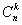个子列.因此<i>C</i>(<i>n</i>,<i>k</i>)是一个具有个元素的标号集（参见第二十一章，§1，二），<i>C</i>(<i>n</i>,<i>k</i>)的元素记作σ,<i>τ</i>,..., σ∈<i>C</i>(<i>n</i>,<i>k</i>)表示

σ={<i>i</i>1,<i>i</i>2,...,<i>ik</i>}

是{1,2,...,<i>n</i>}的满足(1)的一个子列.若令<i>τ</i>={<i>j</i>1,<i>j</i>2,...,<i>jk</i>}∈<i>C</i>(<i>n</i>,<i>k</i>),则σ=<i>τ</i>表示<i>i</i>1=<i>j</i>1,<i>i</i>2=<i>j</i>2,...,<i>ik</i>=<i>jk</i>.

&nbsp;&nbsp;&nbsp;&nbsp;&nbsp;&nbsp; [子式 · 主子式 · 余子式 ·代数余子式]

&nbsp;&nbsp;&nbsp;&nbsp;&nbsp;&nbsp; 从<i>n</i>阶行列式<i>D</i>中任取<i>k</i>行与<i>k</i>列（1≤<i>k</i>≤<i>n</i>－1）,由这<i>k</i>行与<i>k</i>列交点处的元素构成的<i>k</i>阶行列式称为行列式<i>D</i>的<i>k</i>阶子式，记作

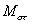, σ,<i>τ</i>∈<i>C</i>(<i>n</i>,<i>k</i>) 

&nbsp;&nbsp;&nbsp;&nbsp;&nbsp;&nbsp; 如果所选取的<i>k</i>行<i>k</i>列分别是第<i>i</i>1,<i>i</i>2,...,<i>ik</i>行与第<i>i</i>1,<i>i</i>2,...,<i>ik</i>列，则所得到的<i>k</i>阶子式称为主子式.即当σ=<i>τ</i>∈<i>C</i>(<i>n</i>,<i>k</i>)时，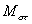是主子式.

&nbsp;&nbsp;&nbsp;&nbsp;&nbsp;&nbsp; 从行列式<i>D</i>中划去<i>k</i>行（σ）与<i>k</i>列（<i>τ</i>）后得到的<i>n</i>－<i>k</i>阶行列式称为子式的余子式，记作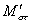.

&nbsp;&nbsp;&nbsp;&nbsp;&nbsp;&nbsp; 如果σ={ <i>i</i>1,<i>i</i>2,...,<i>ik</i>}，<i>τ</i>={ <i>j</i>1,<i>j</i>2,...,<i>jk</i>}，则称

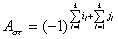

为子式的代数余子式.

&nbsp;&nbsp;&nbsp;&nbsp;&nbsp;&nbsp; 特别，当<i>k</i>=1时，σ={<i>i</i>}，<i>τ</i>={<i>j</i>},子式就是一个元素<i>aij</i>, <i>aij</i>的余子式记作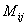，<i>aij</i>的代数余子式记作<i>Aij</i>,即

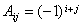

且有&nbsp;&nbsp;&nbsp;&nbsp;&nbsp;&nbsp;&nbsp;&nbsp;&nbsp;&nbsp;&nbsp;&nbsp;&nbsp;&nbsp;&nbsp;&nbsp;&nbsp;&nbsp;&nbsp;&nbsp;&nbsp;&nbsp;&nbsp;&nbsp;&nbsp;&nbsp;&nbsp;&nbsp;&nbsp;&nbsp;&nbsp;&nbsp;&nbsp;&nbsp;&nbsp;&nbsp;&nbsp; 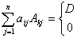 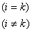&nbsp;&nbsp;&nbsp;&nbsp;&nbsp;&nbsp;&nbsp;&nbsp;&nbsp;&nbsp;&nbsp;&nbsp;&nbsp;&nbsp;&nbsp; &nbsp;&nbsp;&nbsp;&nbsp;&nbsp;&nbsp;&nbsp;&nbsp;&nbsp;&nbsp;&nbsp;&nbsp;&nbsp; &nbsp;&nbsp;&nbsp;&nbsp;&nbsp;&nbsp; （2）

或&nbsp;&nbsp;&nbsp;&nbsp;&nbsp;&nbsp;&nbsp;&nbsp;&nbsp;&nbsp;&nbsp;&nbsp;&nbsp;&nbsp;&nbsp;&nbsp;&nbsp;&nbsp;&nbsp;&nbsp;&nbsp;&nbsp;&nbsp;&nbsp;&nbsp;&nbsp;&nbsp;&nbsp;&nbsp;&nbsp;&nbsp;&nbsp;&nbsp;&nbsp;&nbsp;&nbsp;&nbsp;&nbsp;&nbsp;&nbsp;&nbsp;&nbsp;&nbsp;&nbsp;&nbsp;&nbsp; 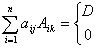 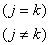&nbsp;&nbsp;&nbsp;&nbsp;&nbsp;&nbsp;&nbsp;&nbsp;&nbsp;&nbsp;&nbsp;&nbsp;&nbsp;&nbsp;&nbsp;&nbsp;&nbsp;&nbsp;&nbsp;&nbsp;&nbsp;&nbsp; &nbsp;&nbsp;&nbsp;&nbsp;&nbsp;&nbsp; &nbsp;（3）

&nbsp;&nbsp;&nbsp;&nbsp;&nbsp;&nbsp; [拉普拉斯展开定理] 在<i>n</i>阶行列式<i>D</i>中任取<i>k</i>行（1≤<i>k</i>≤<i>n</i>-1）,那末包含于所选定的这些行中的所有<i>k</i>阶子式与它们各自的代数余子式的乘积之和等于行列式<i>D</i>，即对任意σ∈<i>C</i>(<i>n</i>,<i>k</i>)，1≤<i>k</i>≤<i>n</i>-1，

&nbsp;&nbsp;&nbsp;&nbsp;&nbsp;&nbsp;&nbsp;&nbsp;&nbsp;&nbsp;&nbsp;&nbsp;&nbsp;&nbsp;&nbsp;&nbsp;&nbsp;&nbsp;&nbsp;&nbsp;&nbsp;&nbsp;&nbsp;&nbsp;&nbsp;&nbsp;&nbsp;&nbsp;&nbsp;&nbsp;&nbsp;&nbsp;&nbsp;&nbsp;&nbsp;&nbsp;&nbsp;&nbsp;&nbsp;&nbsp;&nbsp;&nbsp;&nbsp;&nbsp;&nbsp;&nbsp;&nbsp;&nbsp; 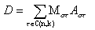（4）

式中∑表示对标号集<i>C</i>(<i>n</i>,<i>k</i>)中的所有元素求和.

拉普拉斯定理中是对行进行的，对列有类似结果

&nbsp;&nbsp;&nbsp;&nbsp;&nbsp;&nbsp;&nbsp;&nbsp;&nbsp;&nbsp;&nbsp;&nbsp;&nbsp;&nbsp;&nbsp;&nbsp;&nbsp;&nbsp;&nbsp;&nbsp;&nbsp;&nbsp;&nbsp;&nbsp;&nbsp;&nbsp;&nbsp;&nbsp;&nbsp;&nbsp;&nbsp;&nbsp;&nbsp;&nbsp;&nbsp;&nbsp;&nbsp;&nbsp;&nbsp;&nbsp;&nbsp;&nbsp;&nbsp;&nbsp;&nbsp;&nbsp;&nbsp;&nbsp; 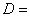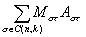&nbsp;&nbsp;&nbsp;&nbsp;&nbsp;&nbsp;&nbsp;&nbsp;&nbsp;&nbsp;&nbsp;&nbsp;&nbsp;&nbsp;&nbsp;&nbsp;&nbsp;&nbsp;&nbsp;&nbsp;&nbsp;&nbsp;&nbsp;&nbsp;&nbsp;&nbsp;&nbsp; &nbsp;&nbsp;&nbsp;&nbsp;&nbsp;&nbsp;&nbsp;&nbsp;&nbsp;&nbsp;&nbsp;&nbsp;&nbsp;&nbsp;&nbsp;&nbsp;&nbsp;&nbsp;&nbsp;&nbsp; &nbsp;（5）

此外还有

&nbsp;&nbsp;&nbsp;&nbsp;&nbsp;&nbsp;&nbsp;&nbsp;&nbsp;&nbsp;&nbsp;&nbsp;&nbsp;&nbsp;&nbsp;&nbsp;&nbsp;&nbsp;&nbsp;&nbsp;&nbsp;&nbsp;&nbsp;&nbsp;&nbsp;&nbsp;&nbsp;&nbsp;&nbsp;&nbsp;&nbsp;&nbsp;&nbsp;&nbsp;&nbsp;&nbsp;&nbsp;&nbsp;&nbsp;&nbsp;&nbsp;&nbsp;&nbsp;&nbsp;&nbsp;&nbsp;&nbsp;&nbsp; 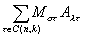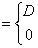&nbsp;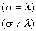&nbsp;&nbsp;&nbsp;&nbsp;&nbsp;&nbsp;&nbsp;&nbsp;&nbsp;&nbsp;&nbsp; &nbsp;（6）

&nbsp;&nbsp;&nbsp;&nbsp;&nbsp;&nbsp;&nbsp;&nbsp;&nbsp;&nbsp;&nbsp;&nbsp;&nbsp;&nbsp;&nbsp;&nbsp;&nbsp;&nbsp;&nbsp;&nbsp;&nbsp;&nbsp;&nbsp;&nbsp;&nbsp;&nbsp;&nbsp;&nbsp;&nbsp;&nbsp;&nbsp;&nbsp;&nbsp;&nbsp;&nbsp;&nbsp;&nbsp;&nbsp;&nbsp;&nbsp;&nbsp;&nbsp;&nbsp;&nbsp;&nbsp;&nbsp;&nbsp;&nbsp; 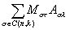&nbsp;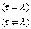&nbsp;&nbsp;&nbsp;&nbsp;&nbsp;&nbsp;&nbsp;&nbsp;&nbsp;&nbsp;&nbsp;&nbsp;&nbsp;&nbsp;&nbsp;&nbsp;&nbsp;&nbsp; &nbsp;&nbsp;&nbsp;&nbsp;&nbsp;&nbsp; &nbsp;（7）

显然（2），（3）分别是（6），（7）的特例.

&nbsp;&nbsp;&nbsp;&nbsp;&nbsp; [拉普拉斯恒等式] 设<i>A</i>=(<i>aij</i>)<i>m</i><i>&acute; n</i>,<i>B</i>=(<i>bij</i>) <i>m</i><i>&acute; n</i>(<i>m</i>≥<i>n</i>),又设<i>l</i>=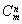,<i>A</i>的所有<i>n</i>阶子式为<i>U</i>1，<i>U</i>2，...，<i>Ul</i>，<i>B</i>的相应的<i>n</i>阶子式为<i>V</i>1,<i>V</i>2,...,<i>Vl</i>,则

det(<i>A</i>τ<i>B</i>)=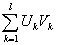

