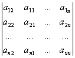

2.行列式的性质

&nbsp;&nbsp;&nbsp;
10&nbsp; &iuml;<i>A</i>1<i>A</i>2L<i>Am</i>&iuml;=&iuml;<i>A</i>1&iuml;&iuml;<i>A</i>2&iuml;L&iuml;<i>Am</i>&iuml;

&nbsp;&nbsp;&nbsp;&nbsp;&nbsp;&nbsp;&nbsp;
&iuml;<i>Am</i>&iuml;=&iuml;<i>A</i>&iuml;<i>m</i>,&nbsp;&nbsp;&nbsp; &iuml;<i>kA</i>&iuml;=<i>kn</i>&iuml;<i>A</i>&iuml;

式中<i>A</i>1，<i>A</i>2，L，<i>Am</i>全为<i>n</i>阶方阵，<i>k</i>为任一复数.

&nbsp;&nbsp;&nbsp;
20&nbsp; 行与列互换后，行列式的值不变，即

||=|<i>A</i>|

式中表示<i>A</i>的转置矩阵（见本章§2）.

&nbsp;&nbsp;&nbsp; 30&nbsp; 互换行列式的任意两行（或列），行列式变号.例如

=

&nbsp;&nbsp;&nbsp;
40&nbsp; 用数α乘行列式的一行（或列），等于将行列式乘以数<i>α</i>.例如

=α

&nbsp;&nbsp;&nbsp;
50&nbsp; 将行列式的一行（或列）元素乘以数<i>α</i>后加到另一行（或列）的相应元素上，行列式的值不变.例如

=

&nbsp;&nbsp;&nbsp;
60&nbsp; 若行列式中有一行（或列）全为零，则行列式等于零.

&nbsp;&nbsp;&nbsp;
若行列式中有两行（或列）对应的元素完全相同或成比例，则行列式为零.

&nbsp;&nbsp;&nbsp;
若行列式中有一行（或列）元素是其他某些行（或列）对应元素的线性组合，则行列式为零.

&nbsp;&nbsp;&nbsp;
70&nbsp; 若行列式中某一行（或列）的所有元素都可表示为两项之和，则该行列式可用两个同阶的行列式之和来表达.例如

=+

