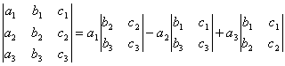
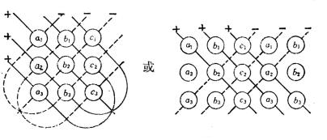
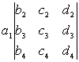

3.几个特殊行列式

&nbsp;&nbsp;&nbsp;
[对角行列式]

=

[三角形行列式]

=

&nbsp;&nbsp;&nbsp;
[二阶行列式]

&nbsp;&nbsp;&nbsp;&nbsp;&nbsp;&nbsp;&nbsp;&nbsp;&nbsp;&nbsp;&nbsp;&nbsp;&nbsp;&nbsp;&nbsp;&nbsp;&nbsp;&nbsp;&nbsp;&nbsp;&nbsp;&nbsp;&nbsp;&nbsp; 

&nbsp;&nbsp;&nbsp;
[三阶行列式]

&nbsp; 

=++———

记忆方法 

行列式的值，等于各实线上元素乘积之和减去各虚线上元素乘积之和.

&nbsp;&nbsp;&nbsp;
[四阶行列式]

=-+-

&nbsp;&nbsp;&nbsp;&nbsp;&nbsp;&nbsp;&nbsp;&nbsp;
=-+

&nbsp;&nbsp;&nbsp;&nbsp;&nbsp;&nbsp;&nbsp;&nbsp;
+-+

&nbsp;&nbsp;&nbsp;&nbsp;&nbsp;&nbsp; 注意，四阶和四阶以上的行列式不能采用三阶行列式那种记忆方法，应按拉普拉斯展开定理采用逐步降阶的方法展开.

&nbsp;&nbsp;&nbsp;&nbsp;&nbsp;&nbsp; [范德蒙行列式]

=

式中&Otilde;是对一切数对（<i>i</i>,<i>j</i>）（1&pound;<i>j</i>&lt;<i>i</i>&pound;<i>n</i>）求积.

[倒数对称行列式]

=

