

<b>§2&nbsp; </b><b>矩阵的运算</b>

一、&nbsp;&nbsp; 一、&nbsp;&nbsp;&nbsp;&nbsp;&nbsp;&nbsp;&nbsp; 矩阵的相等、加、减、数乘、乘法、转置与共轭

<table class=MsoNormalTable border=1 cellspacing=0 cellpadding=0
 style='border-collapse:collapse;border:none'>
 <tr>
  <td width=343 valign=top style='width:257.25pt;border:solid windowtext 1.0pt;
  border-left:none;padding:0mm 5.4pt 0mm 5.4pt'>
  
运算及其规则

  </td>
  <td width=259 valign=top style='width:194.25pt;border-top:solid windowtext 1.0pt;
  border-left:none;border-bottom:solid windowtext 1.0pt;border-right:none;
  padding:0mm 5.4pt 0mm 5.4pt'>
  
&nbsp; 性质与说明

  </td>
 </tr>
 <tr>
  <td width=343 valign=top style='width:257.25pt;border-top:none;border-left:
  none;border-bottom:solid windowtext 1.0pt;border-right:solid windowtext 1.0pt;
  padding:0mm 5.4pt 0mm 5.4pt'>
  
&nbsp; [相等]

  
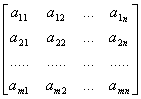=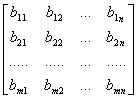

  
当且仅当

  
&nbsp;&nbsp;&nbsp;&nbsp;&nbsp; 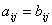&nbsp;&nbsp;&nbsp;&nbsp;&nbsp;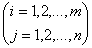&nbsp;&nbsp;

  </td>
  <td width=259 valign=top style='width:194.25pt;border:none;border-bottom:
  solid windowtext 1.0pt;padding:0mm 5.4pt 0mm 5.4pt'>
  
&nbsp;&nbsp;&nbsp; 相等矩阵必须具有相同行数与相同列数.

  
&nbsp;&nbsp;&nbsp; 两矩阵相等，指各对应位置的元素分别相等.

  </td>
 </tr>
 <tr>
  <td width=343 valign=top style='width:257.25pt;border-top:none;border-left:
  none;border-bottom:solid windowtext 1.0pt;border-right:solid windowtext 1.0pt;
  padding:0mm 5.4pt 0mm 5.4pt'>
  
&nbsp; [加减]

  
± 

  
&nbsp;&nbsp;&nbsp;&nbsp;&nbsp;&nbsp;&nbsp;&nbsp;&nbsp;&nbsp;&nbsp;&nbsp;&nbsp;&nbsp;&nbsp;&nbsp;&nbsp;&nbsp;
  =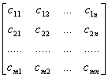 

  
其中

  
&nbsp;&nbsp;&nbsp; 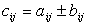&nbsp;&nbsp;&nbsp;&nbsp;&nbsp;&nbsp;&nbsp;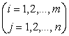&nbsp;&nbsp;&nbsp;&nbsp;&nbsp;&nbsp;&nbsp;&nbsp;&nbsp;&nbsp;&nbsp;&nbsp;&nbsp;

  </td>
  <td width=259 valign=top style='width:194.25pt;border:none;border-bottom:
  solid windowtext 1.0pt;padding:0mm 5.4pt 0mm 5.4pt'>
  
同类型的矩阵才能相加减（各对应位置的元素相加减）.

  
<i>A</i>+<i>B</i>=<i>B</i>+<i>A</i>&nbsp;&nbsp;&nbsp;&nbsp;&nbsp;
  (交换律)

  
(<i>A</i>+<i>B</i>)+<i>C</i>=<i>A</i>+(<i>B</i>+<i>C</i>)&nbsp;&nbsp;
  

  
&nbsp;&nbsp;&nbsp;&nbsp;&nbsp;&nbsp;&nbsp;&nbsp;&nbsp;&nbsp;&nbsp;&nbsp;&nbsp;&nbsp;
  (结合律)

  </td>
 </tr>
 <tr>
  <td width=343 valign=top style='width:257.25pt;border-top:none;border-left:
  none;border-bottom:solid windowtext 1.0pt;border-right:solid windowtext 1.0pt;
  padding:0mm 5.4pt 0mm 5.4pt'>
  
&nbsp; [数乘]

  
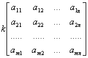=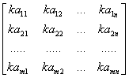

  </td>
  <td width=259 valign=top style='width:194.25pt;border:none;border-bottom:
  solid windowtext 1.0pt;padding:0mm 5.4pt 0mm 5.4pt'>
  
数乘矩阵时，将数乘到矩阵的每个元素上.

  
<i>kA</i>=<i>Ak</i>

  
<i>k</i>(<i>A</i>+<i>B</i>)=<i>kA</i>+<i>kB</i>

  
(<i>k</i>+<i>l</i>)<i>A</i>=<i>kA</i>+<i>lA</i>

  
<i>k</i>(<i>lA</i>)=(<i>kl</i>)<i>A</i>

  
(<i>k</i>,<i>l</i>为任意两个复数)

  </td>
 </tr>
 <tr style='height:19.5pt'>
  <td width=343 valign=top style='width:257.25pt;border-top:none;border-left:
  none;border-bottom:solid windowtext 1.0pt;border-right:solid windowtext 1.0pt;
  padding:0mm 5.4pt 0mm 5.4pt;height:19.5pt'>
  
&nbsp; [乘法] 若

  
&nbsp; <i>A</i>=(<i>aij</i>)为<i>m</i>&acute;<i>n</i>矩阵

  
&nbsp; <i>B</i>=(<i>bij</i>)为<i>n</i>&acute;<i>s</i>矩阵,则

  
&nbsp; <i>AB</i>=(<i>aij</i>)
  (<i>bij</i>)=(<i>cij</i>)=<i>C</i>

  
式中<i>C</i>为<i>m</i>&acute;<i>s</i>矩阵，且

  
<i>cij</i>=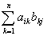&nbsp;&nbsp;&nbsp;&nbsp; 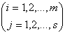

  
&nbsp;&nbsp;
  运算及其规则

  </td>
  <td width=259 valign=top style='width:194.25pt;border:none;border-bottom:
  solid windowtext 1.0pt;padding:0mm 5.4pt 0mm 5.4pt;height:19.5pt'>
  
乘积的元素<i>cij</i>，等于左矩阵的第<i>i</i>行与右矩阵的第<i>j</i>列对应元素相乘之后相加.

  
左矩阵的列数必须等于右矩阵的行数.

  
（<i>AB</i>）<i>C</i>=<i>A</i>（<i>BC</i>）&nbsp;&nbsp;&nbsp;
  (结合律)&nbsp; 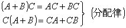

  
&nbsp; <i>k</i>(<i>AB</i>)=(<i>kA</i>)<i>B</i>=<i>A</i>(<i>kB</i>)

  
&nbsp;&nbsp;&nbsp;&nbsp;&nbsp; (<i>k</i>是任意复数)

  
[注]<i>AB</i>=<i>BA</i>一般情况下不成立，即无交换律.

  
&nbsp;&nbsp;
  性质与说明

  </td>
 </tr>
 <tr style='height:208.5pt'>
  <td width=343 valign=top style='width:257.25pt;border-top:none;border-left:
  none;border-bottom:solid windowtext 1.0pt;border-right:solid windowtext 1.0pt;
  padding:0mm 5.4pt 0mm 5.4pt;height:208.5pt'>
  
&nbsp; [转置] 把<i>m</i>&acute;<i>n</i>矩阵<i>A</i>=(<i>aij</i>)的列同行互换后所得到的<i>n</i>&acute;<i>m</i>矩阵称为<i>A</i>的转置矩阵，记作<i>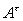</i>,即

  
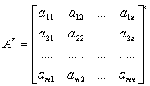&nbsp; 

  
&nbsp;&nbsp; =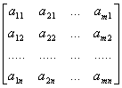&nbsp;&nbsp;&nbsp;&nbsp;&nbsp;&nbsp;&nbsp;&nbsp;&nbsp;
  

  </td>
  <td width=259 valign=top style='width:194.25pt;border:none;border-bottom:
  solid windowtext 1.0pt;padding:0mm 5.4pt 0mm 5.4pt;height:208.5pt'>
  
(<i>A</i>+<i>B</i>)<i>t</i>=<i>A</i><i>t</i>+<i>B</i><i>t</i>

  
(<i>kA</i>)<i>t</i>=<i>kA</i><i>t</i>(<i>k</i>为任意复数)

  
(<i>AB</i>)<i>t</i>=<i>B</i><i>tA</i><i>t</i>(反序定律)

  
(<i>A</i>1<i>A</i>2...<i>As</i>)<i>t</i>=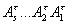

  
(<i>Ak</i>)<i>t</i>=(<i>A</i><i>t</i>)<i>k</i>
  (<i>k</i>为整数)

  </td>
 </tr>
 <tr style='height:42.75pt'>
  <td width=343 valign=top style='width:257.25pt;border-top:none;border-left:
  none;border-bottom:solid windowtext 1.0pt;border-right:solid windowtext 1.0pt;
  padding:0mm 5.4pt 0mm 5.4pt;height:42.75pt'>
  
[共轭] 把矩阵<i>A</i>=(<i>aij</i>)的所有元素换成它们的共轭复数后所得到的矩阵称为<i>A</i>的共轭矩阵，记作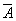，即

  
&nbsp;&nbsp;&nbsp;&nbsp;&nbsp;&nbsp;&nbsp;&nbsp;&nbsp;&nbsp;&nbsp;&nbsp;&nbsp;&nbsp;&nbsp;&nbsp;&nbsp;
  =（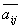）

  </td>
  <td width=259 valign=top style='width:194.25pt;border:none;border-bottom:
  solid windowtext 1.0pt;padding:0mm 5.4pt 0mm 5.4pt;height:42.75pt'>
  
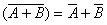

  
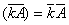&nbsp;&nbsp; (<i>k</i>为任意复数)

  
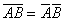

  
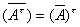

  </td>
 </tr>
</table>

&nbsp;

