

二、&nbsp;&nbsp;&nbsp;&nbsp;&nbsp;&nbsp;&nbsp;
二、&nbsp;&nbsp;&nbsp; 阵的初等变换与初等矩阵

设<i>I</i>=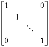，称为单位矩阵.

<table class=MsoNormalTable border=1 cellspacing=0 cellpadding=0
 style='border-collapse:collapse;border:none'>
 <tr>
  <td width=203 valign=top style='width:152.25pt;border:solid windowtext 1.0pt;
  border-left:none;padding:0mm 5.4pt 0mm 5.4pt'>
  
初等变换

  </td>
  <td width=196 valign=top style='width:147.0pt;border:solid windowtext 1.0pt;
  border-left:none;padding:0mm 5.4pt 0mm 5.4pt'>
  
初等矩阵

  </td>
  <td width=203 valign=top style='width:152.25pt;border-top:solid windowtext 1.0pt;
  border-left:none;border-bottom:solid windowtext 1.0pt;border-right:none;
  padding:0mm 5.4pt 0mm 5.4pt'>
  
初等矩阵与初等变换之间的关系

  </td>
 </tr>
 <tr>
  <td width=203 valign=top style='width:152.25pt;border-top:none;border-left:
  none;border-bottom:solid windowtext 1.0pt;border-right:solid windowtext 1.0pt;
  padding:0mm 5.4pt 0mm 5.4pt'>
  
矩阵的第<i>i</i>列（或行）与第<i>j</i>列（或行）互调

  
&nbsp;&nbsp;&nbsp;&nbsp;&nbsp;
  初等变换

  </td>
  <td width=196 valign=top style='width:147.0pt;border-top:none;border-left:
  none;border-bottom:solid windowtext 1.0pt;border-right:solid windowtext 1.0pt;
  padding:0mm 5.4pt 0mm 5.4pt'>
  
&nbsp;
  对单位矩阵<i>I</i>施行这种初等变换后得到的矩阵称为初等矩阵，记作<i>Iij</i>

  <pre align=left>&nbsp;&nbsp;&nbsp; 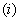&nbsp;&nbsp;&nbsp;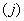</pre><pre align=left>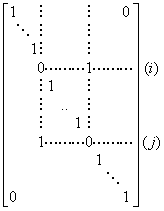</pre>
  
&nbsp;&nbsp;&nbsp;&nbsp;&nbsp;
  初等矩阵

  </td>
  <td width=203 valign=top style='width:152.25pt;border:none;border-bottom:
  solid windowtext 1.0pt;padding:0mm 5.4pt 0mm 5.4pt'>
  
&nbsp;
  对矩阵<i>A</i>施行这种初等变换相当于用初等矩阵<i>Iij</i>右（或左）乘<i>A</i>.例如

  
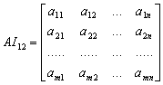

  
&nbsp;
  &nbsp;&nbsp;&nbsp;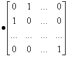

  
&nbsp;&nbsp;
  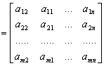

  
初等矩阵与初等变换之间的关系

  </td>
 </tr>
 <tr>
  <td width=203 valign=top style='width:152.25pt;border-top:none;border-left:
  none;border-bottom:solid windowtext 1.0pt;border-right:solid windowtext 1.0pt;
  padding:0mm 5.4pt 0mm 5.4pt'>
  
用数<i>k</i>（&sup1;0）乘矩阵的第<i>i</i>列（或行）

  </td>
  <td width=196 valign=top style='width:147.0pt;border-top:none;border-left:
  none;border-bottom:solid windowtext 1.0pt;border-right:solid windowtext 1.0pt;
  padding:0mm 5.4pt 0mm 5.4pt'>
  
&nbsp;对单位矩阵<i>I</i>施行这种初等变换后得到的矩阵称为初等矩阵，记作<i>Pi</i>(<i>k</i>)

  <pre align=left>&nbsp;&nbsp;&nbsp;&nbsp;&nbsp;&nbsp;&nbsp;&nbsp;&nbsp; </pre>
  
<i>Pi</i>(<i>k</i>)= 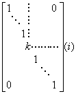

  </td>
  <td width=203 valign=top style='width:152.25pt;border:none;border-bottom:
  solid windowtext 1.0pt;padding:0mm 5.4pt 0mm 5.4pt'>
  
&nbsp;
  对矩阵<i>A</i>施行这种初等变换相当于用初等矩阵<i>Pi</i>(<i>k</i>)右（或左）乘<i>A</i>.例如

  
<i>P</i>2(<i>k</i>)<i>A</i>=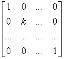

  
&nbsp;&nbsp;
  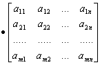=

  
&nbsp;&nbsp;&nbsp;
  

  </td>
 </tr>
 <tr>
  <td width=203 valign=top style='width:152.25pt;border-top:none;border-left:
  none;border-bottom:solid windowtext 1.0pt;border-right:solid windowtext 1.0pt;
  padding:0mm 5.4pt 0mm 5.4pt'>
  
矩阵的第<i>i</i>行（或列）加上第<i>j</i>列（或行）的<i>k</i>倍

  </td>
  <td width=196 valign=top style='width:147.0pt;border-top:none;border-left:
  none;border-bottom:solid windowtext 1.0pt;border-right:solid windowtext 1.0pt;
  padding:0mm 5.4pt 0mm 5.4pt'>
  
对单位矩阵<i>I</i>施行这种初等变换后得到的矩阵称为初等矩阵，记作<i>Aij</i>(<i>k</i>)

  <pre align=left>&nbsp;&nbsp;&nbsp;&nbsp;&nbsp;&nbsp;&nbsp;&nbsp; &nbsp;</pre>
  
<i>Aij</i>(<i>k</i>)=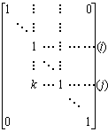

  </td>
  <td width=203 valign=top style='width:152.25pt;border:none;border-bottom:
  solid windowtext 1.0pt;padding:0mm 5.4pt 0mm 5.4pt'>
  
对矩阵<i>A</i>施行这种初等变换相当于用初等矩阵<i>Aij</i>(<i>k</i>)右（或左）乘<i>A</i>.例如

  
<i>AA</i>12(<i>k</i>)= 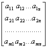

  
&nbsp;&nbsp;&nbsp;&nbsp;&nbsp;&nbsp;
  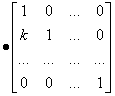

  
&nbsp;&nbsp;&nbsp;
  =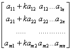

  </td>
 </tr>
</table>

初等变换具有性质：

1°&nbsp; 任何矩阵（<i>aij</i>）都可经过有限次初等变换化为对角矩阵

（<i>aij</i>）&reg;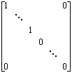

2°&nbsp; 初等变换不改变矩阵的秩.

