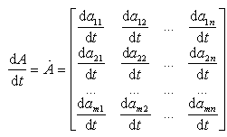
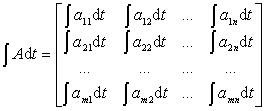

<h3 style='margin-left:36.0pt'>三、矩阵的微积分</h3>

&nbsp;&nbsp;&nbsp;&nbsp;&nbsp;&nbsp; 假设矩阵<i>A</i>的元素<i>aij</i>都是参数<i>t</i>的函数，那末

1° 矩阵<i>A</i>的导数定义为

同样可定义矩阵的高阶导数.

2° 矩阵<i>A</i>的积分定义为

同样可定义矩阵的多重积分.

