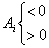

<h3>四、特殊矩阵</h3>

[零矩阵与零因子] 元素<i>aij</i>全为零的矩阵称为零矩阵，记作

<i>O</i>=(0)=

零矩阵具有性质：

<i>O</i>+<i>A</i>=<i>A</i>+<i>O</i>=<i>A</i>

<i>OA</i>=<i>AO</i>=<i>O</i>

<i>A</i>+(－<i>A</i>)=<i>O</i>,－<i>A</i>称为<i>A</i>的负矩阵

&nbsp;&nbsp;&nbsp;&nbsp;&nbsp;&nbsp; 若<i>A</i>,<i>B</i>为非零矩阵，即<i>A</i><i>&sup1; O</i>,<i>B</i><i>&sup1; O</i>,而<i>AB</i>=<i>O</i>,则称矩阵<i>A</i>为矩阵<i>B</i>的左零因子，矩阵<i>B</i>为矩阵<i>A</i>的右零因子，例如

<i>A</i>=, <i>B</i>=

<i>AB</i>===<i>O</i>

&nbsp;&nbsp;&nbsp;&nbsp;&nbsp;&nbsp; [对角矩阵] 主对角线以外的元素都是零（<i>dij</i>=0,<i>i</i><i>&sup1; </i><i>j</i>）的方阵称为对角矩阵，记作

<i>D</i>==diag(<i>d</i>1,<i>d</i>2,...,<i>dn</i>)=[
<i>d</i>1 <i>d</i>2 ... <i>dn</i>]

对角矩阵具有性质：

1° 左乘<i>B</i>

=

2° 右乘<i>B</i>

<i>BD</i>==

3° 两个对角矩阵的和、差、积仍为对角矩阵.

[数量矩阵] <i>di</i>=<i>d</i>(<i>i</i>=1,2,...,<i>n</i>)的对角矩阵称为数量矩阵，记作

<i>D</i>==[<i>d</i> <i>d</i>&nbsp;&nbsp;&nbsp;&nbsp;&nbsp; ...&nbsp;&nbsp;&nbsp; <i>d</i>]

&nbsp;&nbsp;&nbsp;&nbsp;&nbsp;&nbsp; 显然<i>DB</i>=<i>BD</i>=<i>dB</i>.

&nbsp;&nbsp;&nbsp;&nbsp;&nbsp;&nbsp; [单位矩阵] <i>d</i>=1的数量矩阵称为单位矩阵，记作

<i>I</i>==「1 1&nbsp;&nbsp;&nbsp;&nbsp;&nbsp; ...&nbsp;&nbsp;&nbsp; 1」

&nbsp;&nbsp;&nbsp;&nbsp;&nbsp;&nbsp; 显然<i>IB</i>=<i>BI</i>=<i>B</i>.

&nbsp;&nbsp;&nbsp;&nbsp;&nbsp;&nbsp; [对称矩阵] 满足条件

<i>aij</i>=<i>aji</i> (<i>i</i>,<i>j</i>=1,2,...,<i>n</i>)

的方阵<i>A</i>=(<i>aij</i>)称为对称矩阵.例如

<i>A</i>=

是对称矩阵.对称矩阵具有性质：

&nbsp;&nbsp;&nbsp;&nbsp;&nbsp;&nbsp; 若<i>A</i>,<i>B</i>都是对称矩阵，则,且<i>A</i>－1（使<i>A</i>－1=<i>A</i>－1<i>A</i>=<i>I</i>的矩阵.详见本节，六），<i>Am</i>(<i>m</i>为正整数)，<i>A</i>+<i>B</i>仍是对称矩阵.

&nbsp;&nbsp;&nbsp;&nbsp;&nbsp;&nbsp; ［实对称矩阵］实对称矩阵按其特征值（本节，七）可分为正定矩阵，半正定矩阵、负定矩阵、半负定矩阵和不定矩阵，它们的定义与充分必要条件如下

<table class=MsoNormalTable border=1 cellspacing=1 cellpadding=0 width=595
 style='width:446.25pt'>
 <tr>
  <td width="32%" valign=top style='width:32.0%;padding:5.25pt 5.25pt 5.25pt 5.25pt'>
  
名 称 

  </td>
  <td width="30%" valign=top style='width:30.0%;padding:5.25pt 5.25pt 5.25pt 5.25pt'>
  
定 义 

  </td>
  <td width="38%" valign=top style='width:38.0%;padding:5.25pt 5.25pt 5.25pt 5.25pt'>
  
充分必要条件 

  </td>
 </tr>
 <tr style='height:246.75pt'>
  <td width="32%" valign=top style='width:32.0%;padding:5.25pt 5.25pt 5.25pt 5.25pt;
  height:246.75pt'>
  
正定矩阵

  
　

  
半正定矩阵

  
　

  
　

  
负定矩阵

  
　

  
　

  
半负定矩阵

  
　

  
　

  
　

  
不定矩阵 

  </td>
  <td width="30%" valign=top style='width:30.0%;padding:5.25pt 5.25pt 5.25pt 5.25pt;
  height:246.75pt'>
  
特征值都大于零的实对称矩阵

  
特征值都不小于零的实对称矩阵

  
特征值都小于零的实对称矩阵

  
　

  
特征值都不大于零的实对称矩阵

  
　

  
　

  
特征值既有大于零又有小于零的实对称矩阵 

  </td>
  <td width="38%" valign=top style='width:38.0%;padding:5.25pt 5.25pt 5.25pt 5.25pt;
  height:246.75pt'>
  
所有主子式都大于零，即

  
<i>Ai</i>&gt;0 (<i>i</i>=1,2,...,<i>n</i>)

  
det<i>A</i>=0

  
<i>Ai</i><i>&sup3; </i>0 (<i>i</i>=1,2,...,<i>n</i>－1)

  

  
（=1,2,...,<i>n</i>）

  
det<i>A</i>=0

  

  
（=1,2,...,<i>n</i>－1）

  
或有一个偶数阶主子式<i>A</i>2<i>k</i>=0,或有两个奇数阶主子式，其中一个为正另一个为负 

  </td>
 </tr>
</table>

&nbsp;&nbsp;&nbsp;&nbsp;&nbsp;&nbsp; [反对称矩阵] 满足条件

(<i>i</i>,<i>j</i>=1,2,...,<i>n</i>)

的方阵<i>A</i>=(<i>aij</i>)称为反对称矩阵.例如

<i>A</i>=

是反对称矩阵.反对称矩阵具有性质：

１° 若<i>A</i>,<i>B</i>都是反对称矩阵，则<i>A</i><i>τ</i>=－<i>A</i>,且<i>A</i>－1, <i>A</i>+<i>B</i>仍是反对称矩阵，

<i>Am</i>为 

２° 任意方阵<i>A</i>都可分解为一个对称矩阵<i>B</i>=(<i>bij</i>)与一个反对称矩阵<i>C</i>=(<i>cij</i>)之和，即

<i>A</i>=<i>B</i>+<i>C</i>

只需取

<i>bij</i>= (<i>aij</i>+<i>aji</i>), <i>cij</i>= (<i>aij</i>-<i>aji</i>)

(<i>i</i>,<i>j</i>=1,2,...<i>n</i>)

[埃尔米特矩阵] 满足条件

<i>A</i><i>t </i>=

的方阵<i>A</i>称为埃尔米特矩阵.例如

<i>A</i>=

是埃尔米特矩阵.埃尔米特矩阵具有性质：

若<i>A</i>,<i>B</i>都是埃尔米特矩阵，则,<i>A</i>+<i>B</i>仍是埃尔米特矩阵.若<i>A</i>又是实方阵（即<i>aij</i>全为实数），则<i>A</i>就是对称矩阵.

&nbsp;&nbsp;&nbsp;&nbsp;&nbsp;&nbsp; [反埃尔米特矩阵] 满足条件

<i>A</i><i>t </i>=

的方阵<i>A</i>称为反埃尔米特矩阵.例如

<i>A</i>=

是反埃尔米特矩阵.反埃尔米特矩阵具有性质：

&nbsp;&nbsp;&nbsp;&nbsp;&nbsp;&nbsp; 若<i>A</i>,<i>B</i>都是反埃尔米特矩阵，则, <i>A</i>+<i>B</i>仍是反埃尔米特矩阵.若<i>A</i>又是实方阵，则<i>A</i>就是反对称矩阵.

&nbsp;&nbsp;&nbsp;&nbsp;&nbsp;&nbsp; [正交矩阵] 满足条件

<i>A</i><i>t </i>=

的方阵<i>A</i>称为正交矩阵.例如

<i>A</i>=

是正交矩阵.正交矩阵具有性质：

&nbsp;&nbsp;&nbsp;&nbsp;&nbsp;&nbsp; 若<i>A</i>=(<i>aij</i>)和<i>B</i>都是正交矩阵，则

1° , <i>AB</i>仍是正交矩阵.

2° det<i>A</i>=± 1.

3° 

&nbsp;&nbsp;&nbsp;&nbsp;&nbsp;&nbsp; &nbsp;

&nbsp;&nbsp;&nbsp;&nbsp;&nbsp;&nbsp; [酉(<i>U</i>)矩阵] 满足条件

的方阵<i>A</i>称为酉(<i>U</i>)矩阵.例如：

<i>A</i>=

是酉矩阵.酉矩阵具有性质：

&nbsp;&nbsp;&nbsp;&nbsp;&nbsp;&nbsp; 若<i>A</i>=(<i>aij</i>)和<i>B</i>都是酉矩阵，则

1° <i>A</i>-1,<i>AB</i>仍是酉矩阵.

2° det <i>A</i><i>· </i>det=1.

3° 若<i>A</i>又是实方阵，则<i>A</i>是正交矩阵.

&nbsp;&nbsp;&nbsp;&nbsp;&nbsp;&nbsp; [带型矩阵] 满足条件

<i>aij</i>=0 

的方阵<i>A</i>=(<i>aij</i>)称为带型矩阵.2<i>m</i>+1称为带宽.一般形式为

<i>A</i>=

&nbsp;&nbsp;&nbsp;&nbsp;&nbsp;&nbsp; [三角矩阵] 满足条件

<i>aij</i>=0 (<i>i</i>&gt;<i>j</i>)

的方阵<i>A</i>=(<i>aij</i>)称为上三角形矩阵，一般形式为

<i>A</i>=

满足条件

的方阵称为下三角形矩阵，一般形式为

<i>B</i>=

&nbsp;&nbsp;&nbsp;&nbsp;&nbsp;&nbsp; 三角形矩阵具有性质：

&nbsp;&nbsp;&nbsp;&nbsp;&nbsp;&nbsp; 1° 任何秩为<i>r</i>的方阵<i>C</i>的前<i>r</i>个顺序的主子式不为0时，<i>C</i>可表为一个上三角形矩阵<i>A</i>与一个下三角形矩阵<i>B</i>的乘积，即

<i>C</i>=<i>AB</i>

&nbsp;&nbsp;&nbsp;&nbsp;&nbsp;&nbsp; 2° 上（或下）三角形矩阵的和、差、积及数乘仍是上（或下）三角形矩阵.

&nbsp;&nbsp;&nbsp;&nbsp;&nbsp; [分块矩阵] 用水平和垂直虚线将矩阵<i>A</i>中的元素的阵列分成小块（称为子阵），<i>A</i>就成为分块矩阵.例如

<i>A</i>==

式中

<i>B</i>11=，<i>B</i>12=

<i>B</i>21=, <i>B</i>22=

它们都是<i>A</i>的子阵.

&nbsp;&nbsp;&nbsp;&nbsp;&nbsp;&nbsp; 进行分块矩阵的运算时，可将子阵当作通常矩阵的元素看待.这些运算指加、减、乘法、数乘、转置与共轭等.

&nbsp;&nbsp;&nbsp;&nbsp;&nbsp;&nbsp; [分块对角矩阵] 主对角线上的子阵都是方阵，其余子阵都是零矩阵的分块矩阵称为分块对角矩阵.一般形式为

<i>A</i>=

分块对角矩阵<i>A</i>的逆矩阵<i>A</i>－1和<i>A</i>的行列式可以用下面简单公式求出

<i>A</i>－1=

det <i>A</i>=det <i>B</i>11·det <i>B</i>22·...·det <i>Bkk</i>

&nbsp;&nbsp;&nbsp;&nbsp;&nbsp;&nbsp; 注意，一般分块矩阵的行列式不能用把子阵当作通常矩阵的元素的方法来计算，例如把四阶方阵化为分块矩阵

<i>A</i>==

一般det
<i>A</i>=det <i>B</i>11·det <i>B</i>22－det <i>B</i>21·det <i>B</i>12不成立（参见§1，二，3中的四阶行列式）.

