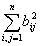

<h3>五、相似变换</h3>

&nbsp;&nbsp;&nbsp;&nbsp;&nbsp;&nbsp; [相似变换] 如果有一非奇异矩阵<i>X</i>（即det <i>X</i><i>&sup1; </i>0）使得

<i>B</i>=<i> AX</i>

那末称矩阵<i>A</i>与矩阵<i>B</i>相似，也称<i>A</i>经相似变换化为<i>B</i>，记作<i>A</i><i>~ B</i>.它具有下列性质：

&nbsp;&nbsp;&nbsp;&nbsp;&nbsp;&nbsp; 1° <i>A</i><i>~ A</i>,<i>A</i><i>t </i><i>~ A</i>.

&nbsp;&nbsp;&nbsp;&nbsp;&nbsp;&nbsp; 2° 若<i>A</i><i>~ B</i>,则<i>B</i><i>~ A</i>.

&nbsp;&nbsp;&nbsp;&nbsp;&nbsp;&nbsp; 3° 若<i>A</i><i>~ C</i>,<i>B</i><i>~ C</i>,则<i>A</i><i>~ B</i>.&nbsp;&nbsp;&nbsp;&nbsp;&nbsp;&nbsp;&nbsp;&nbsp;&nbsp;&nbsp; 

&nbsp;&nbsp;&nbsp;&nbsp;&nbsp;&nbsp; 4° (<i>A</i>1+ <i>A</i>2+...+ <i>Am</i>)<i>X</i>=<i>A</i>1<i>X</i>+<i>A</i>2<i>X</i>+ ...+<i>AmX</i>

&nbsp;&nbsp;&nbsp;&nbsp;&nbsp;&nbsp; 5° 

&nbsp;&nbsp;&nbsp;&nbsp;&nbsp;&nbsp; 6° <i>AmX</i>=(<i>AX</i>)<i>m</i>

&nbsp;&nbsp;&nbsp;&nbsp;&nbsp;&nbsp; 7°&nbsp;&nbsp;&nbsp; 若为矩阵<i>A</i>的多项式，则

<i>X</i>=

&nbsp;&nbsp;&nbsp;&nbsp;&nbsp;&nbsp; 8° 若<i>A</i><i>~ B</i>，则

&nbsp;&nbsp;&nbsp;&nbsp;&nbsp;&nbsp; <i>A</i>与<i>B</i>的秩相同，即rank <i>A</i>=rank <i>B</i>.

&nbsp;&nbsp;&nbsp;&nbsp;&nbsp;&nbsp; <i>A</i>与<i>B</i>的行列式相同，即det <i>A</i>=det <i>B</i>.

&nbsp;&nbsp;&nbsp;&nbsp;&nbsp;&nbsp; <i>A</i>与<i>B</i>的迹（定义见本节，七）相同，即tr <i>A</i>=tr <i>B</i>.

&nbsp;&nbsp;&nbsp;&nbsp;&nbsp;&nbsp; <i>A</i>与<i>B</i>具有相同的特征多项式和特征值（本节，七）.

&nbsp;&nbsp;&nbsp;&nbsp;&nbsp;&nbsp; [正交变换] 若<i>Q</i>为正交矩阵（即=<i>Q</i><i>t </i>）,则称

<i>Q</i><i>t AQ</i>

为矩阵<i>A</i>的正交变换，其性质与相似变换类似.特别还有性质：

对称矩阵<i>A</i>经正交变换后仍是对称矩阵.

[旋转变换] 取正交矩阵<i>U</i>为

&nbsp;&nbsp;&nbsp; &nbsp;&nbsp;&nbsp;&nbsp;&nbsp;&nbsp;&nbsp;&nbsp;&nbsp;&nbsp;&nbsp;&nbsp;&nbsp; &nbsp;

<i>Upq</i>=(<i>uij</i>)=

即

这时称<i> </i>

<i>B</i>=

为<i>A</i>的旋转变换，q
称为旋转角，如果<i>A</i>是对称矩阵，那末<i>B</i>的元素<i>bij</i>与<i>A</i>的元素<i>aij</i>有

如下对应关系： 
&nbsp;&nbsp;&nbsp;&nbsp;&nbsp;&nbsp;&nbsp;&nbsp; 

同时有性质：&nbsp;&nbsp;&nbsp;&nbsp;&nbsp;&nbsp;&nbsp;&nbsp; 

=

&nbsp;&nbsp;&nbsp;&nbsp;&nbsp;&nbsp; 若取旋转角

则旋转变换使

