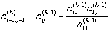
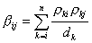

<h3>六、逆矩阵 </h3>

&nbsp;&nbsp;&nbsp;&nbsp;&nbsp;&nbsp; [逆矩阵及其性质] 若方阵<i>A</i>,<i>B</i>满足等式

<i>AB=BA=I</i>&nbsp;&nbsp;&nbsp;&nbsp;&nbsp;&nbsp; (<i>I</i>为单位矩阵)

则称<i>A</i>为<i>B</i>的逆矩阵，或称<i>B</i>为<i>A</i>的逆矩阵,记作

<i>A=</i><i></i> 或 <i>B=</i><i></i>

这时<i>A,B</i>都称为可逆矩阵（或非奇异矩阵，或满秩矩阵）.否则称为不可逆矩阵（或奇异矩阵，或降秩矩阵）.

可逆矩阵具有性质：

1° 若<i>A,B</i>为可逆矩阵，则<i>AB</i>仍为可逆矩阵，且

（反序定律）

一般地，若<i>A1 ,A2 ,…,As</i>为可逆矩阵，则

&nbsp;&nbsp;&nbsp;&nbsp;&nbsp;&nbsp; 2° 矩阵<i>A</i>可逆的充分必要条件是：det <i>A</i><i>&sup1; </i>0.

&nbsp;&nbsp;&nbsp;&nbsp;&nbsp;&nbsp; 3° 若矩阵<i>A</i>可逆，则

det<i>&sup1;</i><i> </i>0 且 det=(det

=<i>A</i>, (<i>a</i><i>&sup1; </i>0)

=()t ,&nbsp;&nbsp;&nbsp;&nbsp;&nbsp;&nbsp;&nbsp;&nbsp;&nbsp;&nbsp;&nbsp;&nbsp; 

&nbsp;&nbsp;&nbsp;&nbsp;&nbsp;&nbsp; 4° 矩阵<i>A</i>可逆的充分必要条件是：矩阵<i>A</i>的特征值全不为零.

&nbsp;&nbsp;&nbsp;&nbsp;&nbsp;&nbsp; [伴随矩阵与逆矩阵表达式] 设<i>Aij</i>为矩阵<i>A</i>=(<i>aij</i>)的第<i>i</i>行第<i>j</i>列元素<i>aij</i>的代数余子式，则矩阵

<i>A</i>*=

称为矩阵<i>A</i>的伴随矩阵.

&nbsp;&nbsp;&nbsp;&nbsp;&nbsp;&nbsp; 若<i>A</i>为非奇异矩阵，即det <i>A</i><i>&sup1; </i>0,则<i>A</i>的逆矩阵表达式为

&nbsp;&nbsp;&nbsp;&nbsp;&nbsp;&nbsp; 注意，<i>A</i>*的第<i>i</i>行第<i>j</i>列元素是<i>A</i>的第<i>j</i>行第<i>i</i>列元素的代数余子式.

&nbsp;&nbsp;&nbsp;&nbsp;&nbsp;&nbsp; [对角矩阵的逆矩阵] 对角矩阵

<i>D</i>=,&nbsp;&nbsp; <i>di</i><i>&sup1; </i>0 (<i>i</i>=1,2,...,<i>n</i>)

的逆矩阵为

<i>D</i>－1=

&nbsp;&nbsp;&nbsp;&nbsp;&nbsp;&nbsp; 显然对角矩阵的逆矩阵仍是对角矩阵.

&nbsp;&nbsp;&nbsp;&nbsp;&nbsp;&nbsp; [三角形矩阵的逆矩阵] 三角形矩阵

<i>L</i>=, &nbsp; &nbsp; &nbsp;

的逆矩阵为

<i></i>=<i>P</i>=

式中

&nbsp;&nbsp;&nbsp;&nbsp;&nbsp;&nbsp;&nbsp;&nbsp;&nbsp;&nbsp;&nbsp;&nbsp;&nbsp;&nbsp;&nbsp;&nbsp;&nbsp;&nbsp;&nbsp;&nbsp; (<i>i</i>=1,2,...,<i>n</i>)

&nbsp;&nbsp;&nbsp;&nbsp;&nbsp;&nbsp;&nbsp;&nbsp;&nbsp;&nbsp;&nbsp;&nbsp; 

&nbsp;&nbsp;&nbsp;&nbsp;&nbsp;&nbsp;&nbsp;&nbsp;&nbsp;&nbsp;&nbsp;&nbsp;&nbsp;&nbsp;&nbsp;&nbsp;&nbsp;&nbsp;&nbsp;&nbsp;&nbsp; 

&nbsp;&nbsp;&nbsp;&nbsp;&nbsp;&nbsp; 显然非奇异下（上）三角形矩阵的逆矩阵仍是下（上）三角形矩阵.

&nbsp;&nbsp;&nbsp;&nbsp;&nbsp;&nbsp; [正定矩阵的逆矩阵]

&nbsp;&nbsp;&nbsp;&nbsp;&nbsp;&nbsp; 1° 高斯-若当法

&nbsp;&nbsp;&nbsp;&nbsp;&nbsp;&nbsp; 正定矩阵<i>A</i>=(<i>aij</i>)的逆<i>A</i>－1=(<i>bij</i>)可由下列递推公式求出：

,&nbsp;&nbsp; ,&nbsp;&nbsp;&nbsp;&nbsp;&nbsp;&nbsp; 

&nbsp;&nbsp;&nbsp;&nbsp;&nbsp;&nbsp;&nbsp;&nbsp;&nbsp;&nbsp;&nbsp; 

&nbsp;&nbsp;&nbsp;&nbsp;&nbsp;&nbsp;&nbsp;&nbsp;&nbsp;&nbsp;&nbsp;&nbsp;&nbsp;&nbsp;&nbsp;&nbsp;&nbsp;&nbsp;&nbsp;&nbsp;&nbsp;&nbsp;&nbsp;&nbsp;&nbsp;&nbsp;&nbsp;&nbsp;&nbsp;&nbsp;&nbsp;&nbsp;&nbsp;&nbsp;&nbsp;&nbsp;&nbsp;&nbsp;&nbsp;&nbsp;&nbsp; (<i>k=1,2,...,n</i>)

最后得到

式中<i>n</i>为该正定矩阵<i>A</i>的阶.

&nbsp;&nbsp;&nbsp;&nbsp;&nbsp;&nbsp; 2° 三角阵法 其步骤如下：

&nbsp;&nbsp;&nbsp;&nbsp;&nbsp;&nbsp; （1） 把正定矩阵<i>A</i>=(<i>aij</i>)表示为

<i>A</i>=L <i>D</i><i>L </i><i>t </i>

式中<i>D</i>为实的非奇异对角矩阵

<i>D</i>=

<i>L</i><i> </i>为实的非奇异下三角矩阵.

<i>L</i><i> </i>=

<i>L</i><i> </i><i>t</i><i> </i>是L 的转置矩阵.<i>di</i>(<i>i</i>=1,2,...,<i>n</i>)与l
<i>ij</i>(<i>i</i>=2,...,<i>n;j=1,…,n</i>)由下面递推公式算出：

&nbsp;&nbsp;&nbsp;&nbsp;&nbsp;&nbsp;&nbsp; 

 &nbsp;

&nbsp;&nbsp;&nbsp;&nbsp;&nbsp;&nbsp;&nbsp;&nbsp;&nbsp;&nbsp;&nbsp;&nbsp;&nbsp;&nbsp;&nbsp;&nbsp;&nbsp;&nbsp; 

&nbsp;&nbsp;&nbsp;&nbsp;&nbsp;&nbsp;&nbsp;&nbsp;&nbsp;&nbsp;&nbsp;&nbsp;&nbsp;&nbsp;&nbsp;&nbsp;&nbsp;&nbsp;&nbsp;&nbsp; 

&nbsp;&nbsp;&nbsp;&nbsp;&nbsp;&nbsp;&nbsp;&nbsp;&nbsp;&nbsp;&nbsp;&nbsp; 

&nbsp;&nbsp;&nbsp;&nbsp;&nbsp;&nbsp; （2）求出<i>D</i>的逆矩阵

=

&nbsp;&nbsp;&nbsp;&nbsp;&nbsp;&nbsp; （3）求出L
的逆矩阵

式中

&nbsp;&nbsp;&nbsp;&nbsp;&nbsp;&nbsp; 

&nbsp;&nbsp;&nbsp;&nbsp;&nbsp;&nbsp; （4）求出<i>A</i>的逆矩阵

=(L <i>D</i><i></i>=()t 

=

式中

&nbsp;&nbsp;&nbsp;&nbsp;&nbsp;&nbsp;&nbsp;&nbsp;&nbsp;&nbsp;&nbsp;&nbsp;&nbsp;&nbsp; 

&nbsp;&nbsp;&nbsp;&nbsp;&nbsp;&nbsp; 注意，这种方法的好处是避免了求平方根的运算.

&nbsp;&nbsp;&nbsp;&nbsp;&nbsp;&nbsp; [分块矩阵的逆矩阵] 设非奇异矩阵<i>A</i>的分块矩阵为

<i>A</i>=

式中<i>B</i>11,<i>B</i>22为方子阵，那末<i>A</i>的逆矩阵

<i>A</i>－1=

由下面公式求出

&nbsp;&nbsp;&nbsp;&nbsp;&nbsp;&nbsp; [初等变换法求逆矩阵] 设

===<i>B</i>

对矩阵

作一系列行的初等变换，使虚线左边一块矩阵化为单位矩阵，而右边一块单位矩阵就变为<i>A</i>的逆矩阵<i>B</i>=<i>A</i>－1,即

&nbsp;&nbsp;&nbsp;&nbsp;&nbsp;&nbsp; [逆矩阵的近似求法] 设为矩阵<i>A</i>的初始近似逆矩阵，可由下列迭代公式求出更精确的逆矩阵：

&nbsp;&nbsp;&nbsp;&nbsp;&nbsp;&nbsp;&nbsp;&nbsp; (<i>n=</i>0,1,2,<i>...</i>)

式中<i>I</i>为与<i>A</i>同阶的单位矩阵.

&nbsp;&nbsp;&nbsp;&nbsp;&nbsp;&nbsp; [计算机求逆程序的检验矩阵] 用下列<i>n</i>阶非奇异矩阵及其逆矩阵，来检验大矩阵求逆的计算程序.

<i>A</i>=

=

