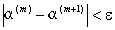
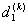
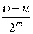

<h3>七、特征值与特征矢量 </h3>

&nbsp;&nbsp;&nbsp;&nbsp;&nbsp;&nbsp; [特征值与特征矢量] 对<i>n</i>阶方阵

<i>A</i>=

和<i>n</i>维非零列矢量

<i>=(a1,a2,...,an)</i><i>t </i>

如果有一个数<i>λ</i>，使得

<i>A</i><i>α</i>=<i>λα</i>

则称<i>λ</i>为矩阵<i>A</i>的特征值（特征根），<i>α</i>为矩阵<i>A</i>的特征值<i>λ</i>所对应的特征矢量.

&nbsp;&nbsp;&nbsp;&nbsp;&nbsp;&nbsp; 矩阵<i>A</i>的所有特征值中绝对值最大的一个称为<i>A</i>的第一特征值.

&nbsp;&nbsp;&nbsp;&nbsp;&nbsp;&nbsp; [特征矩阵·
特征多项式· 特征方程] <i>n</i>阶方阵

<i>A</i>=

的特征矩阵定义为

式中<i>I</i>为<i>n</i>阶单位矩阵.行列式|<i>A</i>－<i>λ</i><i>I</i>|称为矩阵<i>A</i>的特征多项式，记作

<i>j</i>（l）=|<i>λI</i>|

方程

<i>j</i>（l）＝０

称为矩阵<i>A</i>的特征方程.

&nbsp;&nbsp;&nbsp;&nbsp;&nbsp;&nbsp; [矩阵的迹与谱] <i>n</i>阶方阵<i>A</i>的主对角线上各元素之和称为<i>A</i>的迹，记作

&nbsp;&nbsp;&nbsp;&nbsp;&nbsp;&nbsp; 特征方程j（l ）＝０的<i>n</i>个根l 1，l
2，...，l <i>n</i>就是矩阵<i>A</i>的<i>n</i>个特征值.集合{l 1，l
2，...，l <i>n</i> }称为矩阵<i>A</i>的谱，记作ch<i>A</i>.

&nbsp;&nbsp;&nbsp;&nbsp;&nbsp;&nbsp; 线性齐次方程组

的非零解a
便是矩阵<i>A</i>的特征值l <i>i</i>所对应的特征矢量.

&nbsp;&nbsp;&nbsp;&nbsp;&nbsp;&nbsp; [特征值与特征矢量的性质] 

&nbsp;&nbsp;&nbsp;&nbsp;&nbsp;&nbsp; 1° 设l
1，l 2，...，l
<i>n</i>为<i>n</i>阶方阵<i>A</i>的<i>n</i>个特征值，则

<i>Ak</i>的特征值为 （<i>k</i>为正整数）.

<i>A</i>的逆矩阵<i>A</i>－1的特征值为.

<i>A</i>的伴随矩阵<i>A</i>*的特征值为.

&nbsp;&nbsp;&nbsp;&nbsp;&nbsp;&nbsp; 2° <i>n</i>阶方阵<i>A</i>的<i>n</i>个特征值之和等于<i>A</i>的迹，矩阵<i>A</i>的<i>n</i>个特征值之积等于<i>A</i>的行列式，即

<i>l</i>1+l2+...+l<i>n</i>=<i>a</i>11+<i>a</i>22+...+<i>ann</i>

<i></i>

由此可以推出矩阵可逆的另一充分必要条件是：<i>A</i>的所有特征值都不为零.

&nbsp;&nbsp;&nbsp;&nbsp;&nbsp;&nbsp; 3° 若l<i>i</i>是特征方程的<i>k</i>重根，则对应于l<i>i</i>的线性无关的特征矢量的个数不大于<i>k</i>.当l<i>i</i>为单根时，对应于l<i>i</i>的线性无关特征矢量只有一个.

&nbsp;&nbsp;&nbsp;&nbsp;&nbsp;&nbsp; 4° 矩阵<i>A</i>的不同特征值所对应的特征矢量线性无关.

&nbsp;&nbsp;&nbsp;&nbsp;&nbsp;&nbsp; 若<i>n</i>阶方阵<i>A</i>对应于特征值l1，l2，...，l<i>s</i>的线性无关的特征矢量分别有<i>k</i>1,<i>k</i>2,...,<i>ks</i>个，则这个特征矢量线性无关，且.

&nbsp;&nbsp;&nbsp; 5° 实对称矩阵的特征值都是实数，并且有　<i>n</i>个线性无关（而且是正交）的特征矢量.

&nbsp;&nbsp;&nbsp;&nbsp;&nbsp;&nbsp; 6° 矩阵的特征值在相似变换下保持不变，特别，<i>A</i><i>t </i>与<i>A</i>具有相同的特征值.

&nbsp;&nbsp;&nbsp;&nbsp;&nbsp;&nbsp; [求第一特征值的迭代法] 在实际问题中，往往不要求算出矩阵<i>A</i>的全部特征值，只需算出第一特征值，用迭代法计算如下：

&nbsp;&nbsp;&nbsp;&nbsp;&nbsp;&nbsp;&nbsp;&nbsp;&nbsp;&nbsp;&nbsp;&nbsp;&nbsp;&nbsp;&nbsp;&nbsp;&nbsp; 

&nbsp;&nbsp;&nbsp;&nbsp;&nbsp;&nbsp; 假定当时，可以认为a(<i>k</i>) ≈a(<i>m</i>+1)，那末迭代到即可.这时为矩阵<i>A</i>的第一特征值的近似值，a(<i>m</i>+1)为所对应的特征矢量.

&nbsp;&nbsp;&nbsp;&nbsp;&nbsp;&nbsp; [求实对称矩阵的雅可比法] 设<i>n</i>阶实对称矩阵<i>A</i>=(<i>aij</i>)的特征值是l1，l2，...，l<i>n</i>，则必存在一正交矩阵<i>Q</i>，使得

<i>Q</i><i>t AQ</i>=

为对角矩阵.正交矩阵<i>Q</i>可用一系列旋转矩阵的积来逼近：

<i>Q</i>=

式中

&nbsp;&nbsp;&nbsp;&nbsp;&nbsp;&nbsp;&nbsp;&nbsp;&nbsp;&nbsp;&nbsp;&nbsp;&nbsp;&nbsp;&nbsp;&nbsp;&nbsp;&nbsp;&nbsp;&nbsp; 

取

&nbsp;&nbsp;&nbsp;&nbsp;&nbsp;&nbsp; 因为在这种旋转变换下，消去了矩阵中位于第<i>p</i>行第<i>q</i>列(<i>p</i><i>&sup1; q</i>)交点上的元素（见本节，五），而矩阵所有元素的平方和保持不变，而且对角线上的元素的平方和增大，因而非对角线元素的平方和随之减小，因此，当旋转次数足够大时,可使非对角线元素的绝对值足够小.对于预先给定的精度e &gt;0,如果｜<i>aij</i>｜&lt;e (<i>i</i><i>&sup1; j</i>),则可认为<i>aij</i>≈0.于是得到求矩阵<i>A</i>的特征值与特征矢量的具体迭代方法.

&nbsp;&nbsp;&nbsp;&nbsp;&nbsp;&nbsp; 1° 按以下递推公式求特征值l1，l2，...，l<i>n</i>：

&nbsp;&nbsp;&nbsp;&nbsp;&nbsp;&nbsp; 假定当时，可以认为，则迭代到即可.而取作为l<i>i</i>的近似值：

&nbsp;&nbsp;&nbsp;&nbsp;&nbsp;&nbsp; 2° 求特征矢量从1°有

=

记

<i>Pm=U</i>1…<i>Um-</i>1<i>Um</i>

则

<i>APm= Pm</i>

所以<i>Pm</i>为特征矢量矩阵.

&nbsp;&nbsp;&nbsp;&nbsp;&nbsp;&nbsp; <i>Pm</i>由下列递推公式算出：

最后得到 

即 

为对应于特征值l <i>i</i>的特征矢量的近似值.

&nbsp;&nbsp;&nbsp;&nbsp;&nbsp;&nbsp; [求对称三对角矩阵特征值的方法]

&nbsp;&nbsp;&nbsp;&nbsp;&nbsp;&nbsp; 1° 相似变换法 设<i>A</i>为<i>n</i>阶对称三对角矩阵：

&nbsp;&nbsp;&nbsp;&nbsp;&nbsp;&nbsp;&nbsp;&nbsp;&nbsp;&nbsp;&nbsp;&nbsp;&nbsp;&nbsp;&nbsp;&nbsp;&nbsp;&nbsp;&nbsp;&nbsp;&nbsp;&nbsp;&nbsp;&nbsp;&nbsp;&nbsp;&nbsp; <i>A</i>=&nbsp;&nbsp;&nbsp;&nbsp;&nbsp;&nbsp;&nbsp;&nbsp;&nbsp;&nbsp;&nbsp;&nbsp;&nbsp;&nbsp;  (1)

经过相似变换

式中<i>I</i>为单位矩阵,<i>tk</i>为适当选定的常数，<i>Ui</i>为雅可比旋转矩阵：

为<i>Ui</i>的转置矩阵.又<i>A</i>1=<i>A</i>，<i>Ak</i>+1与<i>I</i>相似，且<i>Am</i>与相似.因此，若<i>Am</i>的特征值为，则<i>A</i>1的特征值l <i>i</i>(<i>i=</i>1,2<i>,...,n</i>)为

&nbsp;&nbsp;&nbsp;&nbsp;&nbsp;&nbsp;&nbsp;&nbsp;&nbsp;&nbsp;&nbsp;&nbsp;&nbsp;&nbsp;&nbsp;&nbsp;&nbsp;&nbsp;&nbsp;&nbsp;&nbsp; (<i>i</i>=1,2,…,<i>n</i>)

&nbsp;&nbsp;&nbsp;&nbsp;&nbsp;&nbsp; 假定当时，可认为，那末可适当选择<i>si</i><i>，ci</i>，使得当<i>m</i>充分大时，<i>Am</i>在该精度下化为对角线矩阵；其特征值.

&nbsp;&nbsp;&nbsp;&nbsp;&nbsp;&nbsp; &nbsp;(<i>i=1,2,...,n</i>)可由下列递推公式算出：

<b></b>

<b>&nbsp;&nbsp;&nbsp;&nbsp;&nbsp; </b><i>tk</i>的选择对收敛速度影响较大，取<i>tk</i>为二阶矩阵

的接近于的那个特征值，即

<i>tk</i><b> =</b><b></b>

式中 

&nbsp;&nbsp;&nbsp;&nbsp;&nbsp;&nbsp; 2° 二分法 设<i>A</i>为<i>n</i>阶对称三对角矩阵（如（1）式），对任意l ，设序列

<i>q1</i>(l )=<i>d1</i><i>?l </i>

<i>qi</i>(l )=

中<i>qi</i>(l )&lt;0的个数为<i>N</i>(l )(在这些关系式中，对于某些<i>i</i>，如果<i>qi</i>-1(l )=0，则只需用适当小的数代替即可），则<i>N</i>(l )等于矩阵<i>A</i> 的小于l 的特征值的个数.

假定矩阵<i>A</i>的第<i>k</i>个特征值l<i>k</i>(l1≤l2≤… ≤l<i>k</i>≤…≤l<i>n</i>) 在区间[<i>u</i>,]中，令 ,当<i>N</i>(<i>r</i>1)≥<i>k</i>时，则l
<i>k</i><i>&Icirc; </i>[<i>u</i>, <i>r</i>1]；当<i>N</i>(<i>r</i>1)&lt;<i>k</i>时，则l<i>k</i><i>&Icirc; </i>[ <i>r</i>1,];…依此类推，<i>m</i>步之后，l <i>k</i>包含在宽度为的区间中.<i>m</i>充分大时，便可得到所求的特征值.

