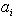
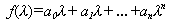

<h3>八、矩阵多项式与最小多项式 </h3>

&nbsp;&nbsp;&nbsp;&nbsp;&nbsp;&nbsp; [矩阵多项式] 设(<i>i=</i>1,2,...,n)为某一数域（实数域或复数域）中的数，<i>A</i>为这个数域上的<i>n</i>阶方阵，则表示式

<i>f</i>(<i>A</i>)=<i>a0I+a1A+...+anAn</i>

称为矩阵<i>A</i>的多项式，式中<i>I</i>为<i>n</i>阶单位矩阵.

&nbsp;&nbsp;&nbsp;&nbsp;&nbsp;&nbsp; 如果矩阵<i>A</i>使得

<i>f</i>(<i>A</i>)<i>=O</i>

那末称<i>A</i>为多项式

的根.

&nbsp;&nbsp;&nbsp;&nbsp;&nbsp;&nbsp; [哈密顿-凯莱定理] 任一方阵都是它的特征多项式的根.

&nbsp;&nbsp;&nbsp;&nbsp;&nbsp;&nbsp; [最小多项式及其性质] 以矩阵<i>A</i>为根的非零多项式<i>f</i>(l)中，存在首项系数为1次数最低的多项式j(l)，它就称为矩阵<i>A</i>的最小多项式.

&nbsp;&nbsp;&nbsp;&nbsp;&nbsp;&nbsp; 最小多项式具有性质：

&nbsp;&nbsp;&nbsp;&nbsp;&nbsp;&nbsp; 1° 任一方阵仅有一个最小多项式；

&nbsp;&nbsp;&nbsp;&nbsp;&nbsp;&nbsp; 2° 任一以<i>A</i>为根的多项式<i>f</i>(l)都可被<i>A</i>的最小多项式j(l)所整除.特别，任一方阵的最小多项式可整除其特征多项式；

&nbsp;&nbsp;&nbsp;&nbsp;&nbsp;&nbsp; 3° 方阵<i>A</i>的特征多项式的根都是<i>A</i>的最小多项式的根：

&nbsp;&nbsp;&nbsp;&nbsp;&nbsp;&nbsp; 4° 相似矩阵具有相同的特征多项式和最小多项式.

