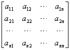
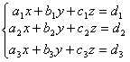
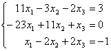
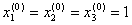
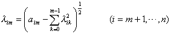

<h2>§3&nbsp;&nbsp;&nbsp;&nbsp;&nbsp; 线性方程组</h2>
<h3>一、含<i>n</i>个未知量<i>n</i>个方程的线性方程组的解法</h3>

[齐次和非齐次线性方程组] 含<i>n</i>个未知量<i>n</i>个方程的线性方程组取如下形式：

&nbsp;&nbsp;&nbsp;&nbsp;&nbsp;&nbsp;&nbsp;&nbsp;&nbsp;&nbsp;&nbsp;&nbsp;&nbsp;&nbsp;&nbsp;&nbsp;&nbsp;&nbsp;&nbsp;&nbsp; &nbsp;（1）

当常数项<i>b1,b2,...,bn</i>不全为零时，（1）称为非齐次线性方程组；当<i>b1,b2,...,bn</i>全为零时，（1）称为齐次线性方程组.

&nbsp;&nbsp;&nbsp;&nbsp;&nbsp;&nbsp; 如果记

<i>A</i>=(<i>aij</i>)=&nbsp;&nbsp;&nbsp;&nbsp;&nbsp;&nbsp;&nbsp;&nbsp;&nbsp;&nbsp;&nbsp;&nbsp;&nbsp;&nbsp;&nbsp;&nbsp;&nbsp;&nbsp;&nbsp;&nbsp;&nbsp;&nbsp;&nbsp;&nbsp;&nbsp;&nbsp;&nbsp;&nbsp;&nbsp;&nbsp;&nbsp;&nbsp;&nbsp;&nbsp;&nbsp;&nbsp;&nbsp;&nbsp;&nbsp;&nbsp;&nbsp;&nbsp;&nbsp;&nbsp;&nbsp; （系数矩阵）

<b><i>x</i></b><i>=</i>(<i>x1,x2,...,xn</i>)t 

<b><i>b</i></b><i>=</i>(<i>b1,b2,...,bn</i>)t &nbsp;&nbsp;&nbsp;&nbsp;&nbsp;&nbsp;&nbsp;&nbsp;&nbsp;&nbsp;&nbsp; &nbsp;（常数项矢量）

式中t
表示转置，那末线性方程组（1）可写成矩阵形式

<i>A<b>x</b>=<b>b </b></i>（2）

&nbsp;&nbsp;&nbsp;&nbsp;&nbsp;&nbsp; [逆矩阵法] 当&iuml;<i>A</i>&iuml;<i> </i>≠0时，线性方程组（2）的解为

<b><i>x</i></b><i>=</i><i><b>b</b></i>

式中<i></i>是系数矩阵<i>A</i>的逆矩阵，<i>x</i>称为（2）的解矢量.

&nbsp;&nbsp;&nbsp;&nbsp;&nbsp;&nbsp; [克莱姆法则] 若&iuml;<i>A</i>&iuml;<i> </i>≠0，则方程组（1）的解为

,&nbsp;&nbsp;&nbsp;&nbsp;&nbsp;&nbsp;&nbsp;&nbsp;&nbsp;&nbsp;&nbsp;&nbsp; ,&nbsp;&nbsp;&nbsp;&nbsp;&nbsp; <b>... , </b>

式中

, , <b>... ,</b>

这里D
<i>j</i>(<i>j=</i>1,2,...,n)是以常数项矢量<b><i>b</i></b>替换<i>A</i>中第<i>j</i>列矢量后得到的<i>n</i>阶行列式.特别

&nbsp;&nbsp;&nbsp;&nbsp;&nbsp;&nbsp; 1° 二阶线性方程组

的解为

, 

式中

, , 

&nbsp;&nbsp;&nbsp;&nbsp;&nbsp;&nbsp; 2° 三阶线性方程组

的解为

, ,&nbsp;&nbsp;&nbsp;&nbsp; 

式中

, &nbsp; 

,&nbsp;&nbsp;&nbsp;&nbsp;&nbsp;&nbsp;&nbsp;&nbsp;&nbsp;&nbsp;&nbsp; 

&nbsp;&nbsp;&nbsp;&nbsp;&nbsp;&nbsp; [有回代过程的主元素消去法（高斯消去法）] 对于<i>n</i>阶线性方程组

可用矩阵表成

消元步骤：

（1）在系数矩阵中找出绝对值最大的元素（这元素称为主元素），不妨设<i>a</i>11（第1行第1列元素）为主元素，（不然，如果为主元素，可先将第<i>i</i>个方程与第1个方程互换位置，再把未知数<i>x</i>1和<i>xj</i>的次序调换，那末得到新的系数矩阵，其主元素必在第1行第1列上）.将第1个方程乘以，分别与第<i>i</i>个方程相加（<i>i</i>=2,3,...,<i>n</i>）,得到新的<i>n</i>阶线性方程组，用矩阵表示如下

&nbsp;&nbsp;&nbsp;&nbsp;&nbsp;&nbsp; &nbsp;（2）在除第1行外的系数矩阵中找出主元素，不妨设<i>b</i>22为主元素.再将第二个方程乘以分别与第<i>i</i>个方程相加(<i>i=3,4,...n</i>),得到新的<i>n</i>阶线性方程组，用矩阵表示如下

<pre ALIGN=CENTER>(3）按照（1），（2）的方法进行<i>n</i><i></i>次以后，在第1至<i>n</i><i></i>行外的系数矩阵</pre>

中找出主元素，不妨设为主元素，将第<i>n</i><i></i>个方程乘以与第<i>n</i>个方程相加，得到新的<i>n</i>阶线性方程组，用矩阵表示如下

&nbsp;&nbsp;&nbsp;&nbsp;&nbsp;&nbsp; 这样做完<i>n</i><i></i>次之后，消元过程结束.原来系数矩阵已经化成上三角形矩阵（这时未知数的次序已做了若干次调换）.

&nbsp;&nbsp;&nbsp;&nbsp;&nbsp;&nbsp; 回代步骤：

&nbsp;&nbsp;&nbsp;&nbsp;&nbsp;&nbsp; 由第<i>n</i>个方程解出

将<i>xn</i>代入第<i>n</i><i></i>个方程，解出，再将，<i> xn</i>代入第<i>n</i><i></i>个方程解出，<b>...</b>，最后将已解出的<i>x</i>2，<i>x</i>3，<b>...</b>，<i>xn</i>代入第一个方程解出<i>x</i>1.

&nbsp;&nbsp;&nbsp;&nbsp;&nbsp;&nbsp; 注意，这里每当找出主元素后，都经过行与行互换和未知数次序调换等手续，也可以把调换未知数次序的步骤放到第<i>n</i>-1步之后一起去做，同样可以得到三角形的系数矩阵.

例1 用主元素消去法解方程组

解 方程组用矩阵表示为：

解的步骤如下：

(1)第2 行第1列的元素－23是主元素，用□框起来，并用矩阵表示成 

把矩阵第2行乘以加到第1行上，把第2行乘以加到第3行上，得到矩阵 

在除第2行外的系数矩阵中找到第二个主元素在第1行第2列上为.

(2)把第1行乘以加到第3行上，得到矩阵 

(3)由第三个方程解出，将代入第二个方程，解出，将,代入第一个方程，解出.

于是方程组的解为(1,2,1).

&nbsp;&nbsp;&nbsp;&nbsp;&nbsp;&nbsp; [无回代过程的主元素消去法] 这种方法与上法基本一样，不同之处在于每次消元时，都用某一方程去消去其余所有<i>n</i>-1个方程的未知数，例如上面方法的消元步骤（2）中，改成将第二个方程乘以分别与第<i>i</i>个方程相加，<i>i=</i>1,3,4,<i>...,n</i>（共<i>n</i>-1个，与上面方法不同的是，这里包括<i>i</i>=1,并设<i>a</i>12=<i>b</i>12），得到新的系数矩阵是 

而最后得到对角系数矩阵是：

因此不需经过回代过程，即可直接解出各个未知数来.

&nbsp;&nbsp;&nbsp;&nbsp;&nbsp;&nbsp; 无回代过程的主元素消去法运算量比有回代过程的大，但在电子计算机上编制程序较为简单.

&nbsp;&nbsp;&nbsp;&nbsp;&nbsp;&nbsp; 为了减少运算量，便于编制程序，第一步可在系数矩阵的第1列找出绝对值最大的元素为列主元素，消元后，第二步从系数矩阵的第2列找出列主元素进行消元，等等.这种消元法称为列主元素消去法，它也可达到较好的精确度.

&nbsp;&nbsp;&nbsp;&nbsp;&nbsp;&nbsp; [简单迭代法] 一般步骤：

&nbsp;&nbsp;&nbsp;&nbsp;&nbsp;&nbsp; （1） 将线性方程组

改写成

（2）任意选取一组初始近似值作为方程的第0次近似解.

（3）依次使<i>k</i>=1,2,3,...,用公式

求出方程的第<i>k</i>次近似解，直至满足

为止，式中e
&gt;0为预先给定的允许误差.于是第<i>k</i>次近似解在允许误差e
的范围内满足方程组.注意这里的允许误差不是指近似解与精确解之间的最大绝对误差.

<ol start=2 type=1>
 <li class=MsoNormal>用简单迭代法求方程组</li>
</ol>

的解，其允许误差.

解 根据例1可化为方程组

分别由,可得迭代方程(满足收敛条件)

选取初始值,逐次迭代得出一系列近似解：

<table class=MsoNormalTable border=1 cellspacing=1 cellpadding=0 width=598
 style='width:448.5pt;margin-left:36.0pt'>
 <tr>
  <td width="8%" valign=top style='width:8.0%;padding:5.25pt 5.25pt 5.25pt 5.25pt'>
  

  </td>
  <td width="14%" valign=top style='width:14.0%;padding:5.25pt 5.25pt 5.25pt 5.25pt'>
  

  </td>
  <td width="14%" valign=top style='width:14.0%;padding:5.25pt 5.25pt 5.25pt 5.25pt'>
  

  </td>
  <td width="14%" valign=top style='width:14.0%;padding:5.25pt 5.25pt 5.25pt 5.25pt'>
  

  </td>
  <td width="9%" valign=top style='width:9.0%;padding:5.25pt 5.25pt 5.25pt 5.25pt'>
  

  </td>
  <td width="14%" valign=top style='width:14.0%;padding:5.25pt 5.25pt 5.25pt 5.25pt'>
  

  </td>
  <td width="13%" valign=top style='width:13.0%;padding:5.25pt 5.25pt 5.25pt 5.25pt'>
  

  </td>
  <td width="14%" valign=top style='width:14.0%;padding:5.25pt 5.25pt 5.25pt 5.25pt'>
  

  </td>
 </tr>
 <tr style='height:18.75pt'>
  <td width="8%" valign=top style='width:8.0%;padding:5.25pt 5.25pt 5.25pt 5.25pt;
  height:18.75pt'>
  
0 

  </td>
  <td width="14%" valign=top style='width:14.0%;padding:5.25pt 5.25pt 5.25pt 5.25pt;
  height:18.75pt'>
  
1 

  </td>
  <td width="14%" valign=top style='width:14.0%;padding:5.25pt 5.25pt 5.25pt 5.25pt;
  height:18.75pt'>
  
1 

  </td>
  <td width="14%" valign=top style='width:14.0%;padding:5.25pt 5.25pt 5.25pt 5.25pt;
  height:18.75pt'>
  
1 

  </td>
  <td width="9%" valign=top style='width:9.0%;padding:5.25pt 5.25pt 5.25pt 5.25pt;
  height:18.75pt'>
  
10 

  </td>
  <td width="14%" valign=top style='width:14.0%;padding:5.25pt 5.25pt 5.25pt 5.25pt;
  height:18.75pt'>
  
0.9581 

  </td>
  <td width="13%" valign=top style='width:13.0%;padding:5.25pt 5.25pt 5.25pt 5.25pt;
  height:18.75pt'>
  
1.9684 

  </td>
  <td width="14%" valign=top style='width:14.0%;padding:5.25pt 5.25pt 5.25pt 5.25pt;
  height:18.75pt'>
  
1.0000 

  </td>
 </tr>
 <tr style='height:13.5pt'>
  <td width="8%" valign=top style='width:8.0%;padding:5.25pt 5.25pt 5.25pt 5.25pt;
  height:13.5pt'>
  
1 

  </td>
  <td width="14%" valign=top style='width:14.0%;padding:5.25pt 5.25pt 5.25pt 5.25pt;
  height:13.5pt'>
  
0.8900 

  </td>
  <td width="14%" valign=top style='width:14.0%;padding:5.25pt 5.25pt 5.25pt 5.25pt;
  height:13.5pt'>
  
2.0000 

  </td>
  <td width="14%" valign=top style='width:14.0%;padding:5.25pt 5.25pt 5.25pt 5.25pt;
  height:13.5pt'>
  
0.2553 

  </td>
  <td width="9%" valign=top style='width:9.0%;padding:5.25pt 5.25pt 5.25pt 5.25pt;
  height:13.5pt'>
  
11 

  </td>
  <td width="14%" valign=top style='width:14.0%;padding:5.25pt 5.25pt 5.25pt 5.25pt;
  height:13.5pt'>
  
0.9643 

  </td>
  <td width="13%" valign=top style='width:13.0%;padding:5.25pt 5.25pt 5.25pt 5.25pt;
  height:13.5pt'>
  
2.0000 

  </td>
  <td width="14%" valign=top style='width:14.0%;padding:5.25pt 5.25pt 5.25pt 5.25pt;
  height:13.5pt'>
  
0.9764 

  </td>
 </tr>
 <tr style='height:16.5pt'>
  <td width="8%" valign=top style='width:8.0%;padding:5.25pt 5.25pt 5.25pt 5.25pt;
  height:16.5pt'>
  
2 

  </td>
  <td width="14%" valign=top style='width:14.0%;padding:5.25pt 5.25pt 5.25pt 5.25pt;
  height:16.5pt'>
  
0.9079 

  </td>
  <td width="14%" valign=top style='width:14.0%;padding:5.25pt 5.25pt 5.25pt 5.25pt;
  height:16.5pt'>
  
1.4987 

  </td>
  <td width="14%" valign=top style='width:14.0%;padding:5.25pt 5.25pt 5.25pt 5.25pt;
  height:16.5pt'>
  
1.0000 

  </td>
  <td width="9%" valign=top style='width:9.0%;padding:5.25pt 5.25pt 5.25pt 5.25pt;
  height:16.5pt'>
  
12 

  </td>
  <td width="14%" valign=top style='width:14.0%;padding:5.25pt 5.25pt 5.25pt 5.25pt;
  height:16.5pt'>
  
0.9723 

  </td>
  <td width="13%" valign=top style='width:13.0%;padding:5.25pt 5.25pt 5.25pt 5.25pt;
  height:16.5pt'>
  
1.9841 

  </td>
  <td width="14%" valign=top style='width:14.0%;padding:5.25pt 5.25pt 5.25pt 5.25pt;
  height:16.5pt'>
  
1.0000 

  </td>
 </tr>
 <tr style='height:17.25pt'>
  <td width="8%" valign=top style='width:8.0%;padding:5.25pt 5.25pt 5.25pt 5.25pt;
  height:17.25pt'>
  
3 

  </td>
  <td width="14%" valign=top style='width:14.0%;padding:5.25pt 5.25pt 5.25pt 5.25pt;
  height:17.25pt'>
  
0.8739 

  </td>
  <td width="14%" valign=top style='width:14.0%;padding:5.25pt 5.25pt 5.25pt 5.25pt;
  height:17.25pt'>
  
2.0000 

  </td>
  <td width="14%" valign=top style='width:14.0%;padding:5.25pt 5.25pt 5.25pt 5.25pt;
  height:17.25pt'>
  
0.6267 

  </td>
  <td width="9%" valign=top style='width:9.0%;padding:5.25pt 5.25pt 5.25pt 5.25pt;
  height:17.25pt'>
  
13 

  </td>
  <td width="14%" valign=top style='width:14.0%;padding:5.25pt 5.25pt 5.25pt 5.25pt;
  height:17.25pt'>
  
0.9769 

  </td>
  <td width="13%" valign=top style='width:13.0%;padding:5.25pt 5.25pt 5.25pt 5.25pt;
  height:17.25pt'>
  
2.0000 

  </td>
  <td width="14%" valign=top style='width:14.0%;padding:5.25pt 5.25pt 5.25pt 5.25pt;
  height:17.25pt'>
  
0.9882 

  </td>
 </tr>
 <tr style='height:15.75pt'>
  <td width="8%" valign=top style='width:8.0%;padding:5.25pt 5.25pt 5.25pt 5.25pt;
  height:15.75pt'>
  
4 

  </td>
  <td width="14%" valign=top style='width:14.0%;padding:5.25pt 5.25pt 5.25pt 5.25pt;
  height:15.75pt'>
  
0.8992 

  </td>
  <td width="14%" valign=top style='width:14.0%;padding:5.25pt 5.25pt 5.25pt 5.25pt;
  height:15.75pt'>
  
1.7487 

  </td>
  <td width="14%" valign=top style='width:14.0%;padding:5.25pt 5.25pt 5.25pt 5.25pt;
  height:15.75pt'>
  
1.0000 

  </td>
  <td width="9%" valign=top style='width:9.0%;padding:5.25pt 5.25pt 5.25pt 5.25pt;
  height:15.75pt'>
  
14 

  </td>
  <td width="14%" valign=top style='width:14.0%;padding:5.25pt 5.25pt 5.25pt 5.25pt;
  height:15.75pt'>
  
0.9821 

  </td>
  <td width="13%" valign=top style='width:13.0%;padding:5.25pt 5.25pt 5.25pt 5.25pt;
  height:15.75pt'>
  
1.9920 

  </td>
  <td width="14%" valign=top style='width:14.0%;padding:5.25pt 5.25pt 5.25pt 5.25pt;
  height:15.75pt'>
  
1.0000 

  </td>
 </tr>
 <tr style='height:17.25pt'>
  <td width="8%" valign=top style='width:8.0%;padding:5.25pt 5.25pt 5.25pt 5.25pt;
  height:17.25pt'>
  
5 

  </td>
  <td width="14%" valign=top style='width:14.0%;padding:5.25pt 5.25pt 5.25pt 5.25pt;
  height:17.25pt'>
  
0.8947 

  </td>
  <td width="14%" valign=top style='width:14.0%;padding:5.25pt 5.25pt 5.25pt 5.25pt;
  height:17.25pt'>
  
2.0000 

  </td>
  <td width="14%" valign=top style='width:14.0%;padding:5.25pt 5.25pt 5.25pt 5.25pt;
  height:17.25pt'>
  
0.8129 

  </td>
  <td width="9%" valign=top style='width:9.0%;padding:5.25pt 5.25pt 5.25pt 5.25pt;
  height:17.25pt'>
  
15 

  </td>
  <td width="14%" valign=top style='width:14.0%;padding:5.25pt 5.25pt 5.25pt 5.25pt;
  height:17.25pt'>
  
0.9853 

  </td>
  <td width="13%" valign=top style='width:13.0%;padding:5.25pt 5.25pt 5.25pt 5.25pt;
  height:17.25pt'>
  
2.0000 

  </td>
  <td width="14%" valign=top style='width:14.0%;padding:5.25pt 5.25pt 5.25pt 5.25pt;
  height:17.25pt'>
  
0.9941 

  </td>
 </tr>
 <tr style='height:15.75pt'>
  <td width="8%" valign=top style='width:8.0%;padding:5.25pt 5.25pt 5.25pt 5.25pt;
  height:15.75pt'>
  
6 

  </td>
  <td width="14%" valign=top style='width:14.0%;padding:5.25pt 5.25pt 5.25pt 5.25pt;
  height:15.75pt'>
  
0.9171 

  </td>
  <td width="14%" valign=top style='width:14.0%;padding:5.25pt 5.25pt 5.25pt 5.25pt;
  height:15.75pt'>
  
1.8741 

  </td>
  <td width="14%" valign=top style='width:14.0%;padding:5.25pt 5.25pt 5.25pt 5.25pt;
  height:15.75pt'>
  
1.0000 

  </td>
  <td width="9%" valign=top style='width:9.0%;padding:5.25pt 5.25pt 5.25pt 5.25pt;
  height:15.75pt'>
  
16 

  </td>
  <td width="14%" valign=top style='width:14.0%;padding:5.25pt 5.25pt 5.25pt 5.25pt;
  height:15.75pt'>
  
0.9887 

  </td>
  <td width="13%" valign=top style='width:13.0%;padding:5.25pt 5.25pt 5.25pt 5.25pt;
  height:15.75pt'>
  
1.9960 

  </td>
  <td width="14%" valign=top style='width:14.0%;padding:5.25pt 5.25pt 5.25pt 5.25pt;
  height:15.75pt'>
  
1.0000 

  </td>
 </tr>
 <tr style='height:18.0pt'>
  <td width="8%" valign=top style='width:8.0%;padding:5.25pt 5.25pt 5.25pt 5.25pt;
  height:18.0pt'>
  
7 

  </td>
  <td width="14%" valign=top style='width:14.0%;padding:5.25pt 5.25pt 5.25pt 5.25pt;
  height:18.0pt'>
  
0.9223 

  </td>
  <td width="14%" valign=top style='width:14.0%;padding:5.25pt 5.25pt 5.25pt 5.25pt;
  height:18.0pt'>
  
2.0000 

  </td>
  <td width="14%" valign=top style='width:14.0%;padding:5.25pt 5.25pt 5.25pt 5.25pt;
  height:18.0pt'>
  
0.9062 

  </td>
  <td width="9%" valign=top style='width:9.0%;padding:5.25pt 5.25pt 5.25pt 5.25pt;
  height:18.0pt'>
  
17 

  </td>
  <td width="14%" valign=top style='width:14.0%;padding:5.25pt 5.25pt 5.25pt 5.25pt;
  height:18.0pt'>
  
0.9908 

  </td>
  <td width="13%" valign=top style='width:13.0%;padding:5.25pt 5.25pt 5.25pt 5.25pt;
  height:18.0pt'>
  
2.0000 

  </td>
  <td width="14%" valign=top style='width:14.0%;padding:5.25pt 5.25pt 5.25pt 5.25pt;
  height:18.0pt'>
  
0.9970 

  </td>
 </tr>
 <tr style='height:17.25pt'>
  <td width="8%" valign=top style='width:8.0%;padding:5.25pt 5.25pt 5.25pt 5.25pt;
  height:17.25pt'>
  
8 

  </td>
  <td width="14%" valign=top style='width:14.0%;padding:5.25pt 5.25pt 5.25pt 5.25pt;
  height:17.25pt'>
  
0.9392 

  </td>
  <td width="14%" valign=top style='width:14.0%;padding:5.25pt 5.25pt 5.25pt 5.25pt;
  height:17.25pt'>
  
1.9369 

  </td>
  <td width="14%" valign=top style='width:14.0%;padding:5.25pt 5.25pt 5.25pt 5.25pt;
  height:17.25pt'>
  
1.0000 

  </td>
  <td width="9%" valign=top style='width:9.0%;padding:5.25pt 5.25pt 5.25pt 5.25pt;
  height:17.25pt'>
  
18 

  </td>
  <td width="14%" valign=top style='width:14.0%;padding:5.25pt 5.25pt 5.25pt 5.25pt;
  height:17.25pt'>
  
0.9929 

  </td>
  <td width="13%" valign=top style='width:13.0%;padding:5.25pt 5.25pt 5.25pt 5.25pt;
  height:17.25pt'>
  
1.9980 

  </td>
  <td width="14%" valign=top style='width:14.0%;padding:5.25pt 5.25pt 5.25pt 5.25pt;
  height:17.25pt'>
  
1.0000 

  </td>
 </tr>
 <tr style='height:14.25pt'>
  <td width="8%" valign=top style='width:8.0%;padding:5.25pt 5.25pt 5.25pt 5.25pt;
  height:14.25pt'>
  
9 

  </td>
  <td width="14%" valign=top style='width:14.0%;padding:5.25pt 5.25pt 5.25pt 5.25pt;
  height:14.25pt'>
  
0.9463 

  </td>
  <td width="14%" valign=top style='width:14.0%;padding:5.25pt 5.25pt 5.25pt 5.25pt;
  height:14.25pt'>
  
2.0000 

  </td>
  <td width="14%" valign=top style='width:14.0%;padding:5.25pt 5.25pt 5.25pt 5.25pt;
  height:14.25pt'>
  
0.9530 

  </td>
  <td width="9%" valign=top style='width:9.0%;padding:5.25pt 5.25pt 5.25pt 5.25pt;
  height:14.25pt'>
  
19 

  </td>
  <td width="14%" valign=top style='width:14.0%;padding:5.25pt 5.25pt 5.25pt 5.25pt;
  height:14.25pt'>
  
0.9943 

  </td>
  <td width="13%" valign=top style='width:13.0%;padding:5.25pt 5.25pt 5.25pt 5.25pt;
  height:14.25pt'>
  
2.0000 

  </td>
  <td width="14%" valign=top style='width:14.0%;padding:5.25pt 5.25pt 5.25pt 5.25pt;
  height:14.25pt'>
  
0.9985 

  </td>
 </tr>
</table>

迭代19次后得到,,在允许误差范围内满足方程组.

 [赛得尔迭代法] 把简单迭代法的步骤（3）中的迭代公式改成

其他步骤同简单迭代法.

 在一般情况下，赛得尔迭代法比简单迭代法收敛得快些.

<ol start=3 type=1>
 <li class=MsoNormal>用赛得尔迭代法求例2中方程组的解.</li>
</ol>

解 选取初始值,并代入方程计算出

再将代入方程计算出

再将代入方程计算出

再将,按赛得尔迭代法继续迭代可以发现，因此只需考虑方程,

即解方程

得出,因此方程组的解为

，，

 [迭代法的收敛条件与误差估计] 

<table class=MsoNormalTable border=1 cellspacing=1 cellpadding=0 width=555
 style='width:416.25pt;margin-left:36.0pt'>
 <tr style='height:22.5pt'>
  <td width="10%" valign=top style='width:10.0%;padding:5.25pt 5.25pt 5.25pt 5.25pt;
  height:22.5pt'>
  
方法 

  </td>
  <td width="37%" colspan=2 valign=top style='width:37.0%;padding:5.25pt 5.25pt 5.25pt 5.25pt;
  height:22.5pt'>
  
收敛条件 

  </td>
  <td width="53%" valign=top style='width:53.0%;padding:5.25pt 5.25pt 5.25pt 5.25pt;
  height:22.5pt'>
  
第<i>k</i>次近似解的最大误差 

  </td>
 </tr>
 <tr style='height:36.0pt'>
  <td width="10%" rowspan=3 valign=top style='width:10.0%;padding:5.25pt 5.25pt 5.25pt 5.25pt;
  height:36.0pt'>
  
　

  
简

  
单

  
迭

  
代

  
法 

  </td>
  <td width="37%" colspan=2 valign=top style='width:37.0%;padding:5.25pt 5.25pt 5.25pt 5.25pt;
  height:36.0pt'>
  

  </td>
  <td width="53%" valign=top style='width:53.0%;padding:5.25pt 5.25pt 5.25pt 5.25pt;
  height:36.0pt'>
  

  </td>
 </tr>
 <tr style='height:33.0pt'>
  <td width="37%" colspan=2 valign=top style='width:37.0%;padding:5.25pt 5.25pt 5.25pt 5.25pt;
  height:33.0pt'>
  

  </td>
  <td width="53%" valign=top style='width:53.0%;padding:5.25pt 5.25pt 5.25pt 5.25pt;
  height:33.0pt'>
  

  </td>
 </tr>
 <tr style='height:53.25pt'>
  <td width="37%" colspan=2 valign=top style='width:37.0%;padding:5.25pt 5.25pt 5.25pt 5.25pt;
  height:53.25pt'>
  

  </td>
  <td width="53%" valign=top style='width:53.0%;padding:5.25pt 5.25pt 5.25pt 5.25pt;
  height:53.25pt'>
  

  </td>
 </tr>
 <tr style='height:87.75pt'>
  <td width="10%" valign=top style='width:10.0%;padding:5.25pt 5.25pt 5.25pt 5.25pt;
  height:87.75pt'>
  
赛

  
得

  
尔

  
迭

  
代

  
法 

  </td>
  <td width="36%" valign=top style='width:36.0%;padding:5.25pt 5.25pt 5.25pt 5.25pt;
  height:87.75pt'>
  

  
或

  

  </td>
  <td width="54%" colspan=2 valign=top style='width:54.0%;padding:5.25pt 5.25pt 5.25pt 5.25pt;
  height:87.75pt'>
  

  
其中

  

  </td>
 </tr>
 <tr height=0>
  <td width=52 style='border:none'></td>
  <td width=195 style='border:none'></td>
  <td width=5 style='border:none'></td>
  <td width=303 style='border:none'></td>
 </tr>
</table>

 

[松弛迭代法] 把简单迭代法的迭代公式改成

其他步骤同简单迭代法.上式中w 是常数，称为松弛因子.适当选取w 可以提高收敛速度，通常w 取为1.5~2（当取w &Icirc; (1,2)时，称为超松弛迭代法，当取w
&Icirc; (0,1)时，称为低松弛迭代法）.

 [共轭斜量法] 线性方程组

<i>A<b>x</b>=<b>b</b></i>

可按下面步骤解出：

 （1）首先选取适当的近似解为初始值：

 （2）计算初次残差矢量

<b><i>r(0)</i></b><i>=<b>b</b></i><b><i>-</i></b><i>A<b>x(0)</b></i>

和矢量 <b><i>p(0)=</i></b><i>A</i><i>t <b>r(0)</b></i>

式中<i>A</i><i>t </i>为<i>A</i>的转置矩阵.

 （3）对<i>i</i>=0,1,2,...,<i>N</i>-1,依次按下列公式迭代

<i>x(i+1)=x(i)+aip(i)</i>

<i>r(i+1)=r(i)-aiAp(i)</i>

<i>p(i+1)=A</i><i>t r(i+1)+</i><i>b i+1p(i)</i>

式中（<b><i>a</i></b>,<b><i>b</i></b>）表示矢量<b><i>a</i></b>和<b><i>b</i></b>的内积（见第八章）.

 这一过程只要进行到<b><i>r(N)</i></b>足够小即可停止.

 [追赶法解实三对角线性方程组] 实三对角线性方程组

=

可按下面步骤解出：

 首先计算

,&nbsp;&nbsp;&nbsp;&nbsp;&nbsp;&nbsp;&nbsp;&nbsp;&nbsp;&nbsp;&nbsp;&nbsp;&nbsp; 

再对<i>k</i>=2,3,...,<i>n</i>-1,依次按下列公式迭代

&nbsp;&nbsp;&nbsp;&nbsp;&nbsp;&nbsp;&nbsp;&nbsp;&nbsp;&nbsp;&nbsp;&nbsp;&nbsp;&nbsp;&nbsp;&nbsp;&nbsp;&nbsp;&nbsp;&nbsp;&nbsp; ,&nbsp;&nbsp;&nbsp;&nbsp;&nbsp;  

最后得到线性方程组的解为

<ol start=4 type=1>
 <li class=MsoNormal>用追赶法解方程组</li>
</ol>

解 按上述公式依次计算得到

, 

, 

[平方根法解正定矩阵的线性方程组] 设<i>A</i>为正定矩阵，则线性方程组

<b><i>Ax=b</i></b>

可按下面步骤解出：

&nbsp;&nbsp;&nbsp;&nbsp;&nbsp;&nbsp; （1）计算<i>lij</i>（分解<i>A</i>=<i>LL</i><i>t </i>,<i>L</i>=(<i>lij</i>)为实非奇异下三角形矩阵）

式中<i>n</i>为矩阵<i>A</i>的阶数.

&nbsp;&nbsp;&nbsp;&nbsp;&nbsp;&nbsp; （2）计算<i>yi</i>（解方程组<i>Ly</i>=<i>b</i>）

（3）计算<i>xi</i>（解方程组<i>L</i><i>t <b>x</b></i>=<b><i>y</i></b>）

&nbsp;&nbsp;&nbsp;&nbsp;&nbsp;&nbsp; [正定带型矩阵的线性方程组解法] 设<i>A</i>=(<i>aij</i>)为一正定带型矩阵，满足

<i>aij</i>=0,&nbsp;&nbsp;&nbsp;&nbsp;&nbsp;&nbsp;&nbsp;&nbsp; &iuml; <i>i-j</i>&iuml;<i> </i>&gt;<i>m</i>&nbsp;&nbsp;&nbsp;&nbsp;&nbsp;&nbsp;&nbsp;&nbsp;&nbsp;&nbsp;&nbsp; (<i>m</i>为正整数)

则线性方程组

<i>A<b>x=b</b></i>

可按下面步骤解出：

&nbsp;&nbsp;&nbsp;&nbsp;&nbsp;&nbsp; (1) 计算l <i>ij</i>.为了节省存储单元，充分利用矩阵的对称和带型特点，只需存储对角线和对角线下的带中元素，这时可以改变<i>aij</i>的下标，令

<i>aij</i>=<i>ai,m-i+j</i>

例如当<i>n</i>=4,<i>m</i>=2的对称带型矩阵的存储格式为

然后按下列公式计算l <i>ij</i>：

&nbsp;&nbsp;&nbsp;&nbsp;&nbsp;&nbsp; 当<i>i</i>≤<i>m</i>时，

&nbsp;&nbsp;&nbsp;&nbsp;&nbsp;&nbsp; 当<i>i</i>&gt;<i>m</i>时，

&nbsp;&nbsp;&nbsp;&nbsp;&nbsp;&nbsp; （2）计算<i>yi</i>. 令

<i>lij=</i><i>l i,m-i+j</i>

且按下列公式计算<i>yi</i>：

（3）计算<i>xi</i>.

这方法只有当<i>m</i>远小于<i>n</i>时才显示出优越性，否则选用其他方法.本公式利用了矩阵的对称性与带型特点，便于在电子计算机上存储，并进行计算.

