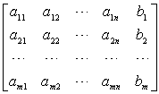
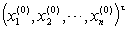

<h3>二、一般情形的线性方程组 </h3>

&nbsp;&nbsp;&nbsp;&nbsp;&nbsp;&nbsp; 含<i>n</i>个未知量<i>m</i>个方程的线性方程组取如下形式

（1）

记

<i>A</i>=

则给定线性方程组的矩阵形式为

<i>A<b>x=b</b></i>&nbsp;&nbsp;&nbsp;&nbsp;&nbsp;&nbsp;&nbsp;&nbsp;&nbsp;&nbsp;&nbsp;&nbsp;&nbsp;&nbsp;&nbsp;&nbsp;&nbsp;&nbsp;&nbsp;&nbsp;&nbsp;&nbsp;&nbsp;&nbsp;&nbsp;&nbsp;&nbsp;&nbsp;&nbsp;&nbsp;&nbsp;&nbsp;&nbsp;&nbsp;&nbsp;&nbsp;&nbsp;&nbsp;&nbsp;&nbsp;&nbsp;&nbsp;&nbsp;&nbsp;  （1）

相应的齐次方程组为

&nbsp;&nbsp;&nbsp;&nbsp;&nbsp;&nbsp;&nbsp;&nbsp;&nbsp;&nbsp;&nbsp;&nbsp;&nbsp;&nbsp;&nbsp;&nbsp;&nbsp;&nbsp;&nbsp;&nbsp;&nbsp;&nbsp;&nbsp;&nbsp;&nbsp;&nbsp;&nbsp;&nbsp;&nbsp;&nbsp;&nbsp;&nbsp;&nbsp;&nbsp; <i>A<b>x=0</b></i>&nbsp;&nbsp;&nbsp;&nbsp;&nbsp;&nbsp;&nbsp;&nbsp;&nbsp;&nbsp;&nbsp;&nbsp;&nbsp;&nbsp;&nbsp;&nbsp;&nbsp;&nbsp;&nbsp;&nbsp;&nbsp;&nbsp;&nbsp;&nbsp;&nbsp;&nbsp;&nbsp;&nbsp;&nbsp;&nbsp;&nbsp;&nbsp;&nbsp;&nbsp;&nbsp;&nbsp;&nbsp;&nbsp;&nbsp;&nbsp;&nbsp;&nbsp;&nbsp;&nbsp;  （2）

&nbsp;&nbsp;&nbsp;&nbsp;&nbsp;&nbsp; <i>A</i>称为方程组（1）的系数矩阵，

<i>C</i>=

称为方程组（1）的增广矩阵.

&nbsp;&nbsp;&nbsp;&nbsp;&nbsp;&nbsp; [线性方程组有解的判别定理] 以<i>r</i>(<i>A</i>),<i>r</i>(<i>C</i>)分别表示系数矩阵<i>A</i>与增广矩阵<i>C</i>的秩，则有

&nbsp;&nbsp;&nbsp;&nbsp;&nbsp;&nbsp; 1° 当<i>m</i>=<i>n</i>且<i>r</i>(<i>A</i>)= <i>r</i>(<i>C</i>)=<i>n</i>（或&ocirc;<i>A</i>&ocirc;<i> </i><i>&sup1; </i>0）时，方程组（1）有唯一解；

2° 当<i>r</i>(<i>A</i>)&lt; <i>r</i>(<i>C</i>)时，方程组（1）无解，这时（1）称为矛盾方程组；

3° 当<i>r</i>(<i>A</i>)= <i>r</i>(<i>C</i>)=<i>r</i>&lt;<i>n</i>（或&ocirc;<i>A</i>&ocirc;<i> </i>=0）时，方程组（1）有无穷多组解；

4° 齐次线性方程组（2）有非零解的充分必要条件是：<i>r</i>(<i>A</i>)&lt;<i>n</i>（）.

[线性方程组的解的结构]

1°当<i>r</i>(<i>A</i>)=<i>r</i>&lt;<i>n</i>时，齐次方程组<i>A<b>x</b></i>=0的任一非零解<b><i>x</i></b>=(<i>x1,x2,...,xn</i>)t都可用它的<i>n</i>?<i>r</i>个线性无关解<b><i>x(i)</i></b>=的线性组合来表示.

这<i>n</i>-<i>r</i>个线性无关解称为方程组的基础解系，它不是唯一的.

2 设<b><i>x(0)</i></b>=是线性方程组<i>A<b>x=b</b></i>的一个特解，则它的任一解<b><i>x</i></b>=(<i>x1,x2,...,xn</i>)t 都可以表示为

<b><i>x=x(0)+</i></b><b><i>h </i></b>

式中h
<i>=</i>是它相应的齐次方程组<i>A<b>x</b></i>=0的一个解.

