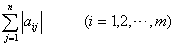
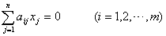
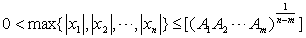

<h3>三、整系数线性齐次方程组的整数解 </h3>

&nbsp;&nbsp;&nbsp;&nbsp;&nbsp;&nbsp; 假设(<i>aij</i>)<i>m</i><i>&acute; n</i>是<i>m</i><i>&acute; n</i>整数矩阵，<i>m</i>&lt;<i>n</i>.令

<i>Ai</i>=

那末整系数线性齐次方程组

的整数解<i>x1,x2,...,xn</i>满足

式中[ ]表示整数部分.

