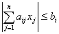

<h3>四、一类线性不等式组的解（克莱姆法则） </h3>

&nbsp;&nbsp;&nbsp;&nbsp;&nbsp;&nbsp; 假设

<i>A</i>=(<i>aij</i>)

为<i>n</i><i>&acute; n</i>非奇异矩阵，那末线性不等式组

<i>bi</i>≥0 (<i>i</i>=1,2,...,<i>n</i>)

的解为

式中<i>Aij</i>为矩阵<i>A</i>的第<i>i</i>行第<i>j</i>列元素的代数余子式.

