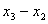
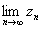

2．序列极限存在的判别法

[柯西准则] 序列{<i>xn</i>}的极限存在的充分必要条件是：对任意给定的<i>ε</i>&gt;0，都存在正整数<i>N</i>=<i>N</i>(<i>ε</i>)，使得当<i>n</i>&gt;<i>N</i>时，不等式

||&lt;<i>ε</i>

对一切正整数<i>p</i>&gt;0都成立.

[上下极限相等] 序列{<i>xn</i>}的极限（有穷或无穷）存在的充分必要条件是：

=

[单调有界] 单调有界序列必有极限.

若{<i>xn</i>}为递增序列，且<i>xn</i>≤<i>M</i>(<i>n</i>=1,2,…)，则存在而且不超过<i>M</i>.

若{<i>xn</i>}为递减序列，且<i>xn</i>≥<i>M</i>(<i>n</i>=1,2,…)，则存在而且不小于<i>M</i>.

[有有界变差]* 有有界变差序列(即存在正数<i>c</i>，使得||+||+

|&lt;<i>c</i>,<i>n</i>=2,3,必有极限.

[序列对比] 若序列{<i>xn</i>}满足条件<i>yn</i>≤<i>xn</i>≤<i>zn</i>，且==<i>c</i>，则

=<i>c</i>

[施笃兹定理] 对序列,若(i)<i>n</i>≥<i>n</i>0(<i>n</i>0为某一自然数)时，<i>yn</i>+1&gt;<i>yn</i>，(ii) =+∞,(iii) =<i>l </i>(有限数或)，则

==<i>l</i>

[加权平均序列] 设<i>wnk</i>≥0(<i>k</i><i> </i>=1,2,<i>n</i>;<i>n</i>=1,2),=1,对固定的<i>k</i>, <i>wnk</i>=0.如果<i>xn</i>=<i>a</i>,则

=<i>a</i>

* 对于函数有有界变差是这样定义的：假定<i>f </i>(<i>x</i>)在[<i>a</i>,<i>b</i>]上有限，在[<i>a</i>,<i>b</i>]上作分点<i>a</i>=<i>x</i>0&lt;<i>x</i>1&lt;…

<i>&lt;xn-</i>1<i>&lt;xn</i>=<i>b,</i>作和,<i>V</i>的上确界叫做<i>f </i>(<i>x</i>)在[<i>a</i>,<i>b</i>]上的全变差，记为.

如果&lt;+,那么称<i>f </i>(<i>x</i>) 在[<i>a</i>,<i>b</i>]上有有界变差.

