

二、&nbsp;&nbsp;&nbsp;&nbsp;&nbsp;&nbsp;&nbsp;
二、&nbsp;&nbsp;&nbsp; 函数的极限

1．&nbsp;&nbsp;&nbsp;&nbsp;&nbsp; 1．&nbsp; 基本概念

[双边极限(函数在某一点的极限)]&nbsp;
若对任意小的<i>ε</i>&gt;0，都存在一个正数<i>δ</i>=<i>δ</i>(<i>ε</i>)，使得对一切满足不等式0&lt;|<i>x</i>-<i>a</i>|≤<i>δ</i>的值<i>x</i>,|<i>A</i>-<i>f</i>(<i>x</i>)|&lt;<i>ε</i>都成立，则称数<i>A</i>为函数<i>f</i>(<i>x</i>)在点<i>a</i>的极限，记作

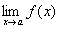=<i>A</i>

[单边极限(左极限与右极限)]若对任意小的<i>ε</i>&gt;0，都存在一个正数，使得对一切满足不等式<i>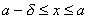 </i>的值<i>x</i>，<i>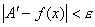</i> 都成立，则称数<i>A</i>′为函数<i>f</i>(<i>x</i>)在点<i>a</i>的左极限，记作

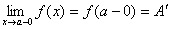

若对任意小的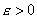，都存在一个正数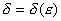，使得对一切满足不等式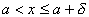的值<i>x</i>,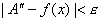都成立，则称数<i>A</i>″为函数<i>f</i>(<i>x</i>)在点<i>a</i>的右极限，记作

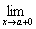<i>f</i>(<i>x</i>)=<i>f</i>(<i>a</i>+0)=<i>A</i>″

[无穷极限]&nbsp; 若对任意大的正数<i>M</i>,都存在一个正数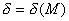，使得对一切满足不等式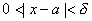的值<i>x</i>,恒有

|<i>f</i>(<i>x</i>)|&gt;<i>M</i>

则称函数<i>f</i>(<i>x</i>)在点<i>a</i>的极限是∞，记作

=

[局部极限]&nbsp; 若对某序列<i>xn</i>→<i>a</i>有等式

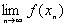=<i>B</i>

则称数<i>B</i>(或符号∞)为函数<i>f</i>(<i>x</i>)在点<i>a</i>的局部极限(有穷的或无穷的).

[上极限与下极限]&nbsp; 局部极限中最小的和最大的分别用

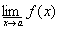和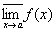

来表示，它们分别称为函数<i>f</i>(<i>x</i>)在点<i>a</i>的下极限和上极限.

