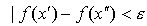
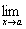

2.函数极限存在的判别法 

[柯西准则] 函数<i>f</i>(<i>x</i>)在点<i>a</i>的极限存在的充分必要条件是：对任意小的，都存在数&gt;0，使满足

和 

的任意两点<i>x</i>′和<i>x</i>″(<i>x</i>′和<i>x</i>″在函数<i>f</i>(<i>x</i>)的定义域内)，都有

[任意收敛序列上的极限] 函数<i>f</i>(<i>x</i>)在点<i>a</i>的极限存在的充分必要条件是：对任意收敛于<i>a</i>的序列{<i>xn</i>}(<i>n</i>=1,)，都有

=<i>A</i>

这时函数<i>f</i>(<i>x</i>)在点<i>a</i>的极限为<i>A</i>.

[左右极限相等·上下极限相等] 函数<i>f</i>(<i>x</i>)在点<i>a</i>的极限存在的充分必要条件是：左极限等于右极限，或者上极限等于下极限，即

<i>f</i>(<i>a</i>+0)=<i>f</i>(0)

或

=

[单调有界] 单调有界函数必有极限.

若<i>f</i>(<i>x</i>)在区间(<i>a</i>,<i>b</i>)内为单调上升函数，且在区间(<i>a</i>,<i>b</i>)内，则<i>f</i>(<i>x</i>)必存在且不超过<i>M</i>.

若<i>f</i>(<i>x</i>)在区间(<i>a</i>,<i>b</i>)内为单调下降函数，且在区间(<i>a</i>,<i>b</i>)内，则<i>f</i>(<i>x</i>)必存在且不小于<i>M</i>.

[函数对比] 若，且<i>f</i>1(<i>x</i>)=
<i>f</i>2(<i>x</i>)=<i>A</i>，则

<i>f</i>(<i>x</i>)=<i>A</i>

　

