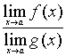

3.函数极限的基本公式 

设<i>f</i>(<i>x</i>), <i>g</i>(<i>x</i>)存在，则

(<i>f</i>(<i>x</i>)<i>g</i>(<i>x</i>))= <i>f</i>(<i>x</i>)<i>g</i>(<i>x</i>)

(<i>f</i>(<i>x</i>)·<i>g</i>(<i>x</i>))= <i>f</i>(<i>x</i>)·<i>g</i>(<i>x</i>)

= （当<i>g</i>(<i>x</i>)≠0时）

　

