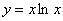
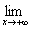
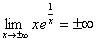

4.一些重要函数的极限

<table class=MsoNormalTable border=1 cellspacing=1 cellpadding=0 width=525
 style='width:393.75pt'>
 <tr>
  <td width="52%" valign=top style='width:52.0%;padding:5.25pt 5.25pt 5.25pt 5.25pt'>
  
函数与图形 

  </td>
  <td width="48%" valign=top style='width:48.0%;padding:5.25pt 5.25pt 5.25pt 5.25pt'>
  
极限与特征 

  </td>
 </tr>
 <tr>
  <td width="52%" valign=top style='width:52.0%;padding:5.25pt 5.25pt 5.25pt 5.25pt'>
  

  </td>
  <td width="48%" valign=top style='width:48.0%;padding:5.25pt 5.25pt 5.25pt 5.25pt'>
  
曲线关于<i>y</i>轴对称

  
极限

  

  
[注] 

  </td>
 </tr>
 <tr>
  <td width="52%" valign=top style='width:52.0%;padding:5.25pt 5.25pt 5.25pt 5.25pt'>
  

  

  </td>
  <td width="48%" valign=top style='width:48.0%;padding:5.25pt 5.25pt 5.25pt 5.25pt'>
  
曲线关于<i>y</i>轴对称

  
极限 

  

  </td>
 </tr>
 <tr>
  <td width="52%" valign=top style='width:52.0%;padding:5.25pt 5.25pt 5.25pt 5.25pt'>
  

  

  </td>
  <td width="48%" valign=top style='width:48.0%;padding:5.25pt 5.25pt 5.25pt 5.25pt'>
  
渐近线
  <i>y=e</i>和<i>x</i>=－1

  
极 限 

  

  

  
[注] 

  </td>
 </tr>
 <tr>
  <td width="52%" valign=top style='width:52.0%;padding:5.25pt 5.25pt 5.25pt 5.25pt'>
  

  

  </td>
  <td width="48%" valign=top style='width:48.0%;padding:5.25pt 5.25pt 5.25pt 5.25pt'>
  
极小点
  

  
极 限 

  
[注] 

  </td>
 </tr>
 <tr>
  <td width="52%" valign=top style='width:52.0%;padding:5.25pt 5.25pt 5.25pt 5.25pt'>
  

  

  </td>
  <td width="48%" valign=top style='width:48.0%;padding:5.25pt 5.25pt 5.25pt 5.25pt'>
  
极大点
  <i>A</i>(<i>e</i>, )

  
拐 点 <i>B</i>(,)

  
渐近线
  <i>y</i>=0和<i>x</i>=0

  
极 限 =0

  

  
[注] 

  </td>
 </tr>
 <tr>
  <td width="52%" valign=top style='width:52.0%;padding:5.25pt 5.25pt 5.25pt 5.25pt'>
  

  

  
　 

  </td>
  <td width="48%" valign=top style='width:48.0%;padding:5.25pt 5.25pt 5.25pt 5.25pt'>
  
渐近线
  <i>y</i>=0和<i>x</i>=－1

  
极 限 

  

  

  </td>
 </tr>
 <tr>
  <td width="52%" valign=top style='width:52.0%;padding:5.25pt 5.25pt 5.25pt 5.25pt'>
  

  

  </td>
  <td width="48%" valign=top style='width:48.0%;padding:5.25pt 5.25pt 5.25pt 5.25pt'>
  
与<i>y</i>轴交点<i>O</i>(0,0),该点切线斜率为1

  
极大点
  <i>A</i>(1,)

  
拐 点 <i>B</i>(2,)

  
渐近线
  <i>y</i>=0

  
极 限 

  

  
[注] 

  
(<i>n</i>&gt;0) 

  </td>
 </tr>
 <tr>
  <td width="52%" valign=top style='width:52.0%;padding:5.25pt 5.25pt 5.25pt 5.25pt'>
  

  

  </td>
  <td width="48%" valign=top style='width:48.0%;padding:5.25pt 5.25pt 5.25pt 5.25pt'>
  
曲线由两支组成

  
不连续点 <i>x</i>=0

  
渐近线
  <i>y</i>=<i>x</i>+1

  
极 限

  

  

  </td>
 </tr>
 <tr>
  <td width="52%" valign=top style='width:52.0%;padding:5.25pt 5.25pt 5.25pt 5.25pt'>
  

  

  </td>
  <td width="48%" valign=top style='width:48.0%;padding:5.25pt 5.25pt 5.25pt 5.25pt'>
  
不连续点 <i>x</i>=0

  
渐近线
  <i>y</i>=1和<i>x</i>=0

  
极 限 

  

  

  </td>
 </tr>
</table>

　

