

<pIndent>5．不定式的定值法—洛比达法则 

<pIndent>洛比达法则是用来计算，，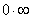，，0，0，等七种不定式的极限的法则*. 

<pIndent>[洛比达第一法则（）]&nbsp; 设(i)函数<i>f</i>(<i>x</i>)和<i>g</i>(<i>x</i>)是在区间(<i>a</i>,<i>b</i>]内定义的，(ii) <i>f</i>(<i>x</i>)=0, <i>g</i>(<i>x</i>)=0,(iii)在区间(<i>a</i>,<i>b</i>]内存在有限导数及，而且≠0，(iv)存在极限(有穷或无穷) 

<pIndent align=center style='text-align:center'>=<i>K</i>

<pIndent>那末

&nbsp;&nbsp;&nbsp;&nbsp;&nbsp;&nbsp;&nbsp;&nbsp;&nbsp;&nbsp;&nbsp;&nbsp;&nbsp;&nbsp;&nbsp;&nbsp;&nbsp;&nbsp;&nbsp;&nbsp;&nbsp;&nbsp;&nbsp;&nbsp;&nbsp;&nbsp;&nbsp;&nbsp;&nbsp;&nbsp;&nbsp;&nbsp;&nbsp;&nbsp;&nbsp;&nbsp;&nbsp;&nbsp;&nbsp;&nbsp;&nbsp;&nbsp;&nbsp;&nbsp;&nbsp;&nbsp;&nbsp;
&nbsp;&nbsp;&nbsp; 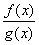==<i>K</i> 

<pIndent>若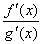又是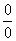型不定式，可再用上法求极限. 

<pIndent>[洛比达第二法则（）]设(i)函数<i>f</i>(<i>x</i>)和<i>g</i>(<i>x</i>)是在区间(<i>a</i>,<i>b</i>]内定义的，(ii)
<i>f</i>(<i>x</i>)=, <i>g</i>(<i>x</i>)=,(iii)在区间(<i>a</i>,<i>b</i>]内存在有限导数及，而且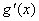≠0，（iv）存在极限（有穷或无穷） 

<pIndent align=center style='text-align:center'>=<i>K</i>

<pIndent>那末

==<i>K</i> 

<pIndent>若又是型不定式，可再用上法求极限。 

<pIndent>[其他类型不定式（，，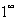，0，0）] 

<pIndent>(1) 对型的不定式，可先把它变成型或型，然后再应用洛比达法则。设 

<pIndent align=center style='text-align:center'><i>f</i>(<i>x</i>)=0, <i>g</i>(<i>x</i>)= 

<pIndent>如果要计算<i>f</i>(<i>x</i>)·<i>g</i>(<i>x</i>),那末可以进行变形 

<i><pIndent align=center style='text-align:center'>f</i>(<i>x</i>)·<i>g</i>(<i>x</i>)=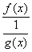=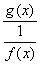 

<pIndent>其中的第二式在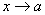时是型不定式，第三式是型不定式. 

<pIndent>(2) 型的不定式也能变成型或型，如果要计算
[<i>f</i>(<i>x</i>)-<i>g</i>(<i>x</i>)],这里 

<pIndent align=center style='text-align:center'><i>f</i>(<i>x</i>)=+, <i>g</i>(<i>x</i>)=+ 

<pIndent>那末可以进行下面的变形，把它变成型不定式： 

<i><pIndent align=center style='text-align:center'>f</i>(<i>x</i>)-<i>g</i>(<i>x</i>)=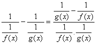 

<pIndent>(3) 对于，0，0型的不定式，可以预先把这些表达式取对数. 

<pIndent>设<i>y</i>=[<i>f</i>(<i>x</i>)]<i>g</i>(<i>x</i>),则<i>y</i>=<i>g</i>(<i>x</i>)<i>f</i>(<i>x</i>). <i>y</i>的极限就是型的不定式.假如用上述任一方法能求出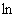<i>y</i>，比如它等于<i>k</i>（或+，或-），那末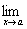<i>y</i>就等于<i>ek</i>(或，或0). 

