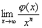

6．函数无穷小和无穷大的阶（符号<i>O</i>*,<i>o</i>,<i>O</i>,～）

若=0,则函数称为当时的无穷小量；若=，则函数称为当时的无穷大量.

符号<i>O</i>*,<i>o</i>,<i>O</i>,～

<table class=MsoNormalTable border=1 cellspacing=1 cellpadding=0 width=548
 style='width:411.0pt'>
 <tr style='height:42.75pt'>
  <td width="24%" style='width:24.0%;padding:5.25pt 5.25pt 5.25pt 5.25pt;
  height:42.75pt'>
  
符 号 

  </td>
  <td width="20%" style='width:20.0%;padding:5.25pt 5.25pt 5.25pt 5.25pt;
  height:42.75pt'>
  
定 义 

  </td>
  <td width="56%" style='width:56.0%;padding:5.25pt 5.25pt 5.25pt 5.25pt;
  height:42.75pt'>
  
意 义 

  </td>
 </tr>
 <tr style='height:42.75pt'>
  <td width="24%" style='width:24.0%;padding:5.25pt 5.25pt 5.25pt 5.25pt;
  height:42.75pt'>
  
当<i>x</i>→<i>a</i>时，=() 

  </td>
  <td width="20%" style='width:20.0%;padding:5.25pt 5.25pt 5.25pt 5.25pt;
  height:42.75pt'>
  
=<i>k</i>

  
(0&lt;&lt;) 

  </td>
  <td width="56%" style='width:56.0%;padding:5.25pt 5.25pt 5.25pt 5.25pt;
  height:42.75pt'>
  
表示函数和在<i>x</i>→<i>a</i>的过程中，按狭义来说，是同阶的无穷小或无穷大. 

  </td>
 </tr>
 <tr style='height:42.75pt'>
  <td width="24%" style='width:24.0%;padding:5.25pt 5.25pt 5.25pt 5.25pt;
  height:42.75pt'>
  
当<i>x</i>→0时，=()

  
(<i>n</i>&gt;0) 

  </td>
  <td width="20%" style='width:20.0%;padding:5.25pt 5.25pt 5.25pt 5.25pt;
  height:42.75pt'>
  
=<i>k</i>

  
(0&lt;&lt;) 

  </td>
  <td width="56%" style='width:56.0%;padding:5.25pt 5.25pt 5.25pt 5.25pt;
  height:42.75pt'>
  
称对于无穷小<i>x</i>是<i>n</i>阶无穷小，例如，当<i>x</i>→0时， 

  </td>
 </tr>
 <tr style='height:42.75pt'>
  <td width="24%" style='width:24.0%;padding:5.25pt 5.25pt 5.25pt 5.25pt;
  height:42.75pt'>
  
当<i>x</i>→∞时, =()

  
(<i>n</i>&gt;0) 

  </td>
  <td width="20%" style='width:20.0%;padding:5.25pt 5.25pt 5.25pt 5.25pt;
  height:42.75pt'>
  
=<i>k</i>

  
(0&lt;&lt;) 

  </td>
  <td width="56%" style='width:56.0%;padding:5.25pt 5.25pt 5.25pt 5.25pt;
  height:42.75pt'>
  
称对于无穷大<i>x</i>是<i>n</i>阶无穷大. 例如，当<i>x</i>→时，

  

  </td>
 </tr>
 <tr style='height:42.75pt'>
  <td width="24%" style='width:24.0%;padding:5.25pt 5.25pt 5.25pt 5.25pt;
  height:42.75pt'>
  
当<i>x</i>→<i>a</i>时，=<i>o</i>() 

  </td>
  <td width="20%" style='width:20.0%;padding:5.25pt 5.25pt 5.25pt 5.25pt;
  height:42.75pt'>
  
=0 

  </td>
  <td width="56%" style='width:56.0%;padding:5.25pt 5.25pt 5.25pt 5.25pt;
  height:42.75pt'>
  
表示当<i>x</i>→<i>a</i>时，函数对于函数是较高阶的无穷小，或函数对于函数是较低阶的无穷大.

  
例如，当<i>x</i>→0时， 

  </td>
 </tr>
 <tr style='height:42.75pt'>
  <td width="24%" style='width:24.0%;padding:5.25pt 5.25pt 5.25pt 5.25pt;
  height:42.75pt'>
  
当<i>x</i>→<i>a</i>时，=<i>O</i>() 

  </td>
  <td width="20%" style='width:20.0%;padding:5.25pt 5.25pt 5.25pt 5.25pt;
  height:42.75pt'>
  
=<i>k</i>

  
(0≤&lt;) 

  </td>
  <td width="56%" style='width:56.0%;padding:5.25pt 5.25pt 5.25pt 5.25pt;
  height:42.75pt'>
  
当<i>x</i>→<i>a</i>时，函数无穷小的阶(在广义的意义上)不低于某正的函数无穷小的阶(或函数无穷大的阶不高于函数无穷大的阶).

  
例如，当<i>x</i>→时， 

  </td>
 </tr>
 <tr style='height:83.25pt'>
  <td width="24%" style='width:24.0%;padding:5.25pt 5.25pt 5.25pt 5.25pt;
  height:83.25pt'>
  
当<i>x</i>→<i>a</i>时，～ 

  </td>
  <td width="20%" style='width:20.0%;padding:5.25pt 5.25pt 5.25pt 5.25pt;
  height:83.25pt'>
  
=1 

  </td>
  <td width="56%" style='width:56.0%;padding:5.25pt 5.25pt 5.25pt 5.25pt;
  height:83.25pt'>
  
称函数和当<i>x</i>→<i>a</i>时为等价的.

  
例如，当<i>x</i>→0时，有～<i>x</i>，

  
tan<i>x</i>～<i>x</i>，～(<i>a</i>&gt;0)，

  
～<i>x</i> 

  </td>
 </tr>
</table>

　

　

