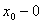
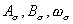
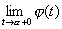
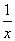

<h3>三、函数的连续性 </h3>

1．单变量函数的连续性

[函数在一点连续] 函数<i>f</i>(<i>x</i>)在点<i>x</i>0的连续性有下面几种定义方法：

定义1 如果<i>f</i>(<i>x</i>)=<i>f</i>(<i>x</i>0)=<i>f</i>(),那末<i>f</i>(<i>x</i>)在点<i>x</i>0连续.

定义2 如果<i>f</i>(<i>x</i>0+0)=<i>f</i>()=<i>f</i>(<i>x</i>0),那末<i>f</i>(<i>x</i>)在点<i>x</i>0连续.

定义3（柯西） 如果对于任意小的<i>ε</i>&gt;0，都存在正数<i>δ</i>&gt;0，使得当||&lt;<i>δ</i>时，恒有

|<i>f</i>(<i>x</i>)-<i>f</i>(<i>x</i>0)|&lt;<i>ε</i>

那末<i>f</i>(<i>x</i>)在点<i>x</i>0连续.

定义4 当自变量的改变量Δ<i>x</i>为无穷小量时，函数的改变量Δ<i>y</i>也是无穷小量，或者写为

=[<i>f</i>(<i>x</i>0+Δ<i>x</i>)(<i>x</i>0)]=0

那末<i>f</i>(<i>x</i>)在点<i>x</i>0连续.

定义5（海涅）如果对任何以<i>x</i>0为极限的序列{<i>xn</i>}恒有

<i>f</i>(<i>xn</i>)=<i>f</i>(<i>x</i>0)

那末<i>f</i>(<i>x</i>)在点<i>x</i>0连续.

定义6（贝尔）设<i>f</i>(<i>x</i>)定义在[<i>a</i>,<i>b</i>]上，<i>x</i>0是[<i>a</i>,<i>b</i>]内一点，记为含有<i>x</i>0的小闭区间(它含于[<i>a</i>,<i>b</i>]内)，分别记<i>f</i>(<i>x</i>)在内的上，下确界为,称为<i>f</i>(<i>x</i>)在上的振幅.当区间无限地收缩为一点时，的极限都存在，分别记为.

如果

=0

那末<i>f</i>(<i>x</i>)在点<i>x</i>0连续.

以上几种定义都是等价的.

[函数在一点单边连续]

若<i>f</i>(<i>x</i>)=<i>f</i>(<i>x</i>0+0)=<i>f</i>(<i>x</i>0),则称<i>f</i>(<i>x</i>)在点<i>x</i>0右连续.

若<i>f</i>(<i>x</i>)=<i>f</i>(<i>x</i>0－0)=<i>f</i>(<i>x</i>0),则称<i>f</i>(<i>x</i>)在点<i>x</i>0左连续.

[函数在一个区间上连续]如果函数<i>f</i>(<i>x</i>)定义在区间[<i>a</i>,<i>b</i>]上，它在这个区间上任一点<i>x</i>都连续，那末称<i>f</i>(<i>x</i>)在区间[<i>a</i>,<i>b</i>]上连续（对开区间(<i>a</i>,<i>b</i>)可用同样定义）.

这里要指出，因为函数<i>f</i>(<i>x</i>)可能在区间[<i>a</i>,<i>b</i>]之外根本不存在，所以函数在端点的连续性应当理解为单边连续：在点<i>a</i>是右连续，在点<i>b</i>是左连续.

[函数的不连续（或间断）点] 由函数在一点连续的定义可知，间断点只能分两类：

1° 两个极限<i>f</i>(<i>a</i><i></i>)及<i>f</i>(<i>a</i>+0)都存在，而等式<i>f</i>(<i>a</i><i></i>)=<i>f</i>(<i>a</i>)=<i>f</i>(<i>a</i>+0)不成立，这种间断点称为第一类间断点.

2° 上面两个极限中至少有一个不存在，这种间断点称为第二类间断点.

[连续函数的运算]

1° 连续函数的代数和是连续函数.

2° 有限个连续函数的积是连续函数.

3° 两个连续函数的商（当分母不等于零时）是连续函数.

4° 复合函数的连续性：如果函数<i>f</i>(<i>x</i>)在区间[<i>a</i>,<i>b</i>]上连续，又函数(<i>y</i>)也在某一个区间上连续，而该区间包含着函数<i>y</i>=<i>f</i>(<i>x</i>)在区间[<i>a</i>,<i>b</i>]上所取的一切值，那末复合函数[<i>f</i>(<i>x</i>)]也在区间[<i>a</i>,<i>b</i>]上连续.

[连续函数的性质]

1° 如果函数<i>f</i>(<i>x</i>)在点<i>x=a</i>连续，并且<i>f</i>(<i>a</i>)&gt;0(或<i>f</i>(<i>a</i>)&lt;0)，那末<i>f</i>(<i>x</i>)在点<i>a</i>的某一个邻域（即开区间(<i>a</i>-,<i>a</i>+),&gt;0任意小）内的一切点都有<i>f</i>(<i>x</i>)&gt;0(或<i>f</i>(<i>x</i>)&lt;0).

2° 函数的有界性定理 在闭区间[<i>a</i>,<i>b</i>]上连续的函数<i>f</i>(<i>x</i>)一定在该区间上有界.

3° 最大最小值定理 如果函数<i>f</i>(<i>x</i>)在闭区间[<i>a</i>,<i>b</i>]上连续，那末在这个区间上至少存在一点<i>x</i>,使得对应的<i>f</i>(<i>x</i>)值最大，并且也至少有一点<i>x</i>，使得<i>f</i>(<i>x</i>)的值最小.

4° 中间值定理 如果函数<i>f</i>(<i>x</i>)在闭区间[<i>a</i>,<i>b</i>]上连续，<i>f</i>(<i>a</i>)=<i>A</i>，<i>f</i>(<i>b</i>)=<i>B</i>，并设<i>K</i>是<i>A</i>，<i>B</i>之间的任意一个值，那末在这个区间上至少存在一点<i>x</i>，使得<i>f</i>(<i>x</i>)的值等于<i>K.</i>特别是，若<i>A</i>,<i>B</i>不同号，则在这个区间内，至少有一点<i>x</i>,使得<i>f</i>(<i>x</i>)的值等于零.

5° 反函数的连续性 如果函数<i>y</i>=<i>f</i>(<i>x</i>)在区间[<i>a</i>,<i>b</i>]上递增而且连续，又<i>f</i>(<i>a</i>)=，<i>f</i>(<i>b</i>)=，那末反函数<i>x</i>=(<i>y</i>)在区间[,]上也连续.

6° 以参数表出的函数的连续性 如果函数(<i>t</i>)和(<i>t</i>)在区间(,)内定义并连续，且函数(<i>t</i>)在此区间内是严格单调的，那末方程组

<i>x</i>=(<i>t</i>),<i>y</i>=(<i>t</i>)

在区间(<i>a</i>,<i>b</i>)内把<i>y</i>定义成<i>x</i>的 单值连续函数：

<i>y</i>=[-1(<i>x</i>)]

其中<i>a</i>=及<i>b</i>=.

[初等函数的连续性] 一般地说，基本初等函数,,,,,,

,,以及由它们经过有限次的算术运算和复合函数运算后所得的函数，在一切使它们有意义的点都连续.

[实数集合的确界]

1° 有界集合 设有某一个实数集合<i>E</i>，若有一个数<i>M</i>，使得集合<i>E</i>的一切数，则称集合<i>E</i>是有上界的.类似地，若有一个数<i>m</i>,使得集合<i>E</i>的一切数，则称这个集合是有下界的.既有上界又有下界的集合称为有界集合.

2° 实数集合的上确界和下确界

定义1 若有一个数，使得实数集合<i>E</i>中没有大于的数，但是无论&gt;0多么小，<i>E</i>中总有大于-的数，则称为集合<i>E</i>的上确界，记作sup<i>E</i>.若有一个数，使得集合

<i>E</i>中没有小于的数，但是无论&gt;0多么小，<i>E</i>中总有小于+<i>ε</i>的数，则<i>α</i>称为集合<i>E</i>的下确界，记作inf<i>E</i>.

定义2 实数集合的最小的上界称为它的上确界，最大的下界称为它的下确界.

以上两个定义是等价的.

3° 确界存在定理 有上界的集合必有唯一的上确界，有下界的集合必有唯一的下确界.

[函数的一致连续性]

1° 函数的一致连续性定义 设函数<i>f</i>(<i>x</i>)定义在某一区间<i>X</i>(闭的或不闭的，有穷的或无穷的）上，若对任意给定的<i>ε</i>&gt;0，都存在一个只与有关的<i>δ</i>=<i>δ</i>(<i>ε</i>)&gt;0，使得对区间<i>X</i>上的任意两点<i>x</i>1和<i>x</i>2，只要

|<i>x</i>2-<i>x</i>1|&lt;<i>δ</i>

就有不等式

|<i>f</i>(<i>x</i>2)(<i>x</i>1)|&lt;<i>ε</i>

成立，则称函数<i>f</i>(<i>x</i>)在区间<i>X</i>上一致连续.

注意,函数在区间上每一点连续并不能必然地推出它在这个区间上的一致连续性.

例 函数<i>f</i>(<i>x</i>)=在开区间(0,1)内每一点都连续，但在(0,1)内并不一致连续.事实上，对于任意小的<i>δ</i><i></i>0，令<i>x</i>1=<i>δ</i>，<i>x</i>2=2<i>δ</i>，则|<i>x</i>2-<i>x</i>1|=<i>δ</i>，而|<i>f</i>(<i>x</i>2)-<i>f</i>(<i>x</i>1)|=.这时，|<i>x</i>2-<i>x</i>1|可以任意小，但|<i>f</i>(<i>x</i>2)-<i>f</i>(<i>x</i>1)|可以任意大，所以不一致连续.

值得注意的是，在闭区间[<i>a</i>,b]上已不再有与此类似的情况，这就是下面的

2° 康托定理 若函数<i>f</i>(<i>x</i>)在闭区间[<i>a</i>,<i>b</i>]上连续，则它在这区间上也是一致连续的.

3° 设

=sup|<i>f</i>(<i>x</i>1)-<i>f</i>(<i>x</i>2)|

式中<i>x</i>1和<i>x</i>2为(<i>a</i>,<i>b</i>)内适合|<i>x</i>2-<i>x</i>1|的任意两点，函数<i>ω</i><i>f</i>称为函数<i>f</i>(<i>x</i>)的连续模数.

函数<i>f</i>(<i>x</i>)在区间(<i>a</i>,<i>b</i>)内一致连续的充分必要条件是

