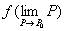

2．多变量函数的连续性

[多变量函数的极限]&nbsp; 设函数<i>u</i>=<i>f</i>(<i>P</i>)=<i>f</i>(<i>x</i>1,<i></i>,<i>xn</i>)定义在区域<i>D</i>内,<i>P</i>0()为<i>D</i>内一点.若对任意小的<i>ε</i>&gt;0，都存在<i>δ</i>=<i>δ</i>(<i>ε</i>,<i>P</i>0)&gt;0，使得只要<i>P</i><i>D</i>及0&lt;<i>ρ</i>(<i>P</i>,<i>P</i>0)&lt;<i>δ</i>（其中<i>ρ</i>(<i>P</i>,<i>P</i>0)为<i>P</i>和<i>P</i>0两点间的距离），都有

|<i>f</i>(<i>P</i>)-<i>A</i>|&lt;<i>ε</i>

则称数<i>A</i>为函数<i>f</i>(<i>P</i>)在<i>P</i>0点的极限，记作

或

&nbsp;&nbsp;&nbsp;
[<i>n</i>重极限与累极限]&nbsp;
上述函数<i>f</i>(<i>x</i>1,,<i>xn</i>)的极限，是当函数的一切自变量同时趋向于各自的极限时所得出的，称为<i>n</i>重极限（在<i>n</i>=2,时分别称为二重极限，三重极限,等等）.此外，还有一种极限，它是由各个自变量依某种次序相继地各自趋向于极限所得出的，称为累极限.例如对二元函数<i>f</i>(<i>x</i>,<i>y</i>)来说，二重极限为，两个累极限为（先让自变量<i>x</i>趋于<i>a</i>，再让自变量<i>y</i>趋于<i>b</i>）和（先让自变量<i>y</i>趋于<i>b</i>,再让自变量<i>x</i>趋于<i>a</i>），三者不一定相等.

定理&nbsp; 若（i）二重极限

<i>A</i>=

存在（有穷或无穷），（ii）对于<i>D</i>内的任一<i>y</i>，关于<i>x</i>的（有限的）单重极限

=

存在，则累极限

=

必存在，而且就等于二重极限.

&nbsp;&nbsp;&nbsp;
对于第二种累极限有类似结论.

[多变量函数的连续性]

定义1&nbsp; 如果==，那末在点<i>P</i>0连续.

定义2&nbsp; 如果对任意小的<i>ε</i>&gt;0，都存在正数<i>δ</i>&gt;0，使得当0&lt;<i>ρ</i>(<i>P</i>,<i>P</i>0)&lt;<i>δ</i>时，恒有

|<i>f</i>(<i>P</i>)-<i>f</i>()|&lt;<i>ε</i>

那末在点<i>P</i>0连续.

定义3&nbsp; 当自变量的改变量Δ<i>xi</i>(<i>i</i>=1,2,…,<i>n</i>)为无穷小量时，函数的改变量<i></i>也是无穷小量，或者写为

式中，那末<i>f</i>(<i>x</i>1,<i>x</i>2,…,<i>xn</i>)在点()连续.

&nbsp;&nbsp;&nbsp; 若函数在区域<i>D</i>上每点都连续，则称函数在区域<i>D</i>上连续.

[多变量函数的一致连续性]&nbsp; 设函数定义在某一区域<i>D</i>（有限的或无限的）上，若对任意给定的<i>ε</i>&gt;0，都存在一个只与<i>ε</i>有关的<i>δ</i>=<i>δ</i>(<i>ε</i>)&gt;0，使得对区域<i>D</i>上任意两点<i>P</i>1和<i>P</i><i></i>，只要

<i>ρ</i>()&lt;<i>δ</i>

就有不等式

|<i>f</i>()-<i>f</i>()|&lt;<i>ε</i>

成立，则称函数在区域<i>D</i>上一致连续.

[多变量连续函数的性质]

1°&nbsp; 在有界闭区域<i>D</i>上连续的函数必在<i>D</i>上有界.

2°&nbsp; 在有界闭区域<i>D</i>上连续的函数必在<i>D</i>上达到一个最大值与一个最小值.

3°&nbsp; 在有界闭区域<i>D</i>上每点都连续的函数必在<i>D</i>上一致连续.

