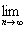
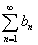

<h2 align=center style='text-align:center'>§2 级数的收敛与运算</h2>
<h3>一、数项级数收敛的判别法 </h3>

1．基本概念与基本性质

[级数的基本概念]设 ,,是一个无穷序列,符号

称为无穷级数,简称级数,记作.<i>an</i>称为级数的一般项.

<i>An</i>= <i>a</i>1+<i>a</i>2+&nbsp;&nbsp;&nbsp;&nbsp;&nbsp;&nbsp;&nbsp;&nbsp;&nbsp;&nbsp;&nbsp;&nbsp;&nbsp; (<i>n</i>=1,)

称为级数的第<i>n</i>个部分和.若当<i>n</i>∞时，部分和序列{<i>An</i>}具有有穷或无穷（但有确定的正号或负号的）极限<i>A</i>：

<i>A</i>=<i>An</i>=

则称<i>A</i>为级数的和，并写成

<i>A</i>= <i>a</i>1+<i>a</i>2+

若级数具有有穷和，则称级数为收敛的，否则，即级数和等于±∞，或不存在，则称级数为发散的.

[级数的基本性质]

(1) 弃去级数前面的有限项或在级数前面加进有限项，并不影响级数的收敛与发散的性质.

(2) 若级数收敛，则它的第<i>m</i>项后的余项的和数

<i>am</i>=<i>am</i>+1+<i>am</i>+2+

当<i>m</i>∞时趋于零.

(3) 若级数收敛，<i>c</i>是任一常数，则级数也收敛，并有

=<i>c</i>

(4) 若与都收敛，则也收敛，并有

[柯西准则] 级数收敛的充分必要条件是：对任意的<i>ε</i>&gt;0，都存在正整数<i>N</i>=<i>N</i>(<i>ε</i>),使得当<i>n</i><i>N</i>时，对一切正整数<i>p</i>，下列不等式成立：

[级数收敛的必要条件] 级数收敛的一个必要条件是：一般项<i>an</i>趋于零，即<i>an</i>=0.

