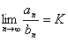
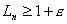

2. 同号级数收敛判别法

&nbsp;&nbsp;&nbsp; 设 

<pre align=left>&nbsp;&nbsp;&nbsp;&nbsp;&nbsp;&nbsp;&nbsp;&nbsp;&nbsp;&nbsp;&nbsp;&nbsp;&nbsp;&nbsp; &nbsp;&nbsp;&nbsp;&nbsp;&nbsp;&nbsp;&nbsp;&nbsp;&nbsp;&nbsp;&nbsp;&nbsp;&nbsp;(1)</pre><pre
align=center>&nbsp;&nbsp;&nbsp;&nbsp;&nbsp;&nbsp;&nbsp;&nbsp;&nbsp;&nbsp;&nbsp;&nbsp;&nbsp;&nbsp;&nbsp;&nbsp; &nbsp;&nbsp;&nbsp;&nbsp;&nbsp;&nbsp;&nbsp;&nbsp;&nbsp;&nbsp;&nbsp;&nbsp;(2)&nbsp;&nbsp;&nbsp;&nbsp;&nbsp;&nbsp;&nbsp;&nbsp;&nbsp;&nbsp;&nbsp;&nbsp;&nbsp;&nbsp;&nbsp;&nbsp;&nbsp;&nbsp; &nbsp;&nbsp;&nbsp;&nbsp;&nbsp;&nbsp;&nbsp;&nbsp;&nbsp;&nbsp;&nbsp;&nbsp;&nbsp;&nbsp;&nbsp;&nbsp;&nbsp;&nbsp;&nbsp;&nbsp;&nbsp;&nbsp;&nbsp;&nbsp;&nbsp;&nbsp;&nbsp; </pre>

&nbsp;&nbsp;&nbsp;&nbsp;&nbsp;&nbsp;&nbsp;&nbsp;&nbsp;&nbsp;&nbsp;&nbsp;&nbsp;&nbsp;&nbsp;&nbsp;&nbsp;&nbsp;&nbsp;&nbsp;&nbsp;&nbsp;&nbsp;&nbsp;&nbsp;&nbsp;&nbsp;&nbsp;&nbsp;&nbsp;&nbsp;

为两个同号级数（即每一项符号相同的级数，当都是正号时，称为正项级数），这类级数的收敛判别法见下表.

<table class=MsoNormalTable border=1 cellspacing=0 cellpadding=0>
 <tr>
  <td width=153 colspan=2 rowspan=2 style='width:114.75pt;padding:0mm 0mm 0mm 0mm'>
  
名&nbsp; 称

  </td>
  <td width=137 rowspan=2 style='width:102.75pt;padding:0mm 0mm 0mm 0mm'>
  
条&nbsp; 件

  </td>
  <td width=289 colspan=2 style='width:216.75pt;padding:0mm 0mm 0mm 0mm'>
  
级数的收敛性

  </td>
 </tr>
 <tr>
  <td width=141 style='width:105.75pt;padding:0mm 0mm 0mm 0mm'>
  
收&nbsp; 敛

  </td>
  <td width=147 style='width:110.25pt;padding:0mm 0mm 0mm 0mm'>
  
发&nbsp;&nbsp; 散

  </td>
 </tr>
 <tr>
  <td width=81 rowspan=5 style='width:60.75pt;padding:0mm 0mm 0mm 0mm'>
  
比较判别法

  </td>
  <td width=71 style='width:53.25pt;padding:0mm 0mm 0mm 0mm'>
  
I

  </td>
  <td width=137 style='width:102.75pt;padding:0mm 0mm 0mm 0mm'>
  
当<i>n</i>&gt;<i>N</i>时，

  
0≤<i>a</i><i>&shy;n</i>≤<i>b&shy;&shy;n</i>

  </td>
  <td width=141 style='width:105.75pt;padding:0mm 0mm 0mm 0mm'>
  
若级数(2)收敛，则级数(1)收敛

  </td>
  <td width=147 style='width:110.25pt;padding:0mm 0mm 0mm 0mm'>
  
若级数(1)发散，则级数(2)发散

  </td>
 </tr>
 <tr>
  <td width=71 style='width:53.25pt;padding:0mm 0mm 0mm 0mm'>
  
II

  </td>
  <td width=137 style='width:102.75pt;padding:0mm 0mm 0mm 0mm'>
  

  
(0≤<i>K</i>≤+∞)

  
(<i>bn</i><i>≠</i>0)

  </td>
  <td width=141 style='width:105.75pt;padding:0mm 0mm 0mm 0mm'>
  
当<i>K</i>&lt;+时，若级数(2)收敛，则级数(1)收敛

  </td>
  <td width=147 style='width:110.25pt;padding:0mm 0mm 0mm 0mm'>
  
当<i>K</i>&gt;0时，若级数(2)发散，则级数(1)发散

  </td>
 </tr>
 <tr>
  <td width=71 style='width:53.25pt;padding:0mm 0mm 0mm 0mm'>
  
III

  </td>
  <td width=137 style='width:102.75pt;padding:0mm 0mm 0mm 0mm'>
  
当<i>n</i>&gt;<i>N</i>时，

  
≤

  
(<i>an&shy;</i><i>≠</i>0,<i>bn</i><i>≠</i>0)

  </td>
  <td width=141 style='width:105.75pt;padding:0mm 0mm 0mm 0mm'>
  
若级数(2)收敛，则级数(1)收敛

  </td>
  <td width=147 style='width:110.25pt;padding:0mm 0mm 0mm 0mm'>
  
若级数(1)发散，则级数(2)发散

  </td>
 </tr>
 <tr>
  <td width=71 style='width:53.25pt;padding:0mm 0mm 0mm 0mm'>
  
IV

  </td>
  <td width=137 style='width:102.75pt;padding:0mm 0mm 0mm 0mm'>
  
当<i>n</i>→∞时，

  
<i>&nbsp; an&shy;</i>～<i>bn</i>

  </td>
  <td width=141 style='width:105.75pt;padding:0mm 0mm 0mm 0mm'>
  
级数(1)和(2)同时收敛

  </td>
  <td width=147 style='width:110.25pt;padding:0mm 0mm 0mm 0mm'>
  
级数(1)和(2)同时发散

  </td>
 </tr>
 <tr>
  <td width=71 style='width:53.25pt;padding:0mm 0mm 0mm 0mm'>
  
V

  </td>
  <td width=137 style='width:102.75pt;padding:0mm 0mm 0mm 0mm'>
  
<i>an&shy;=O</i>*()

  </td>
  <td width=141 style='width:105.75pt;padding:0mm 0mm 0mm 0mm'>
  
当<i>p</i>&gt;1时

  </td>
  <td width=147 style='width:110.25pt;padding:0mm 0mm 0mm 0mm'>
  
当<i>p</i>≤1时

  </td>
 </tr>
 <tr>
  <td width=153 colspan=2 style='width:114.75pt;padding:0mm 0mm 0mm 0mm'>
  
达兰贝尔判别法

  </td>
  <td width=137 style='width:102.75pt;padding:0mm 0mm 0mm 0mm'>
  
<i>an</i>&gt;0(<i>n</i>=1,2,…)=<i>q</i>

  </td>
  <td width=141 style='width:105.75pt;padding:0mm 0mm 0mm 0mm'>
  
当<i>q</i>&lt;1时

  </td>
  <td width=147 style='width:110.25pt;padding:0mm 0mm 0mm 0mm'>
  
当<i>q</i>&gt;1时

  </td>
 </tr>
 <tr>
  <td width=153 colspan=2 style='width:114.75pt;padding:0mm 0mm 0mm 0mm'>
  
柯西判别法

  </td>
  <td width=137 style='width:102.75pt;padding:0mm 0mm 0mm 0mm'>
  
<i>an&shy;</i>≥0(<i>n</i>=1,2,…)

  

  </td>
  <td width=141 style='width:105.75pt;padding:0mm 0mm 0mm 0mm'>
  
当<i>q</i>&lt;1时

  </td>
  <td width=147 style='width:110.25pt;padding:0mm 0mm 0mm 0mm'>
  
当<i>q</i>&gt;1时

  </td>
 </tr>
 <tr>
  <td width=153 colspan=2 style='width:114.75pt;padding:0mm 0mm 0mm 0mm'>
  
拉阿伯判别法

  </td>
  <td width=137 style='width:102.75pt;padding:0mm 0mm 0mm 0mm'>
  
<i>an</i>&gt;0(<i>n</i>=1,2,…)

  
=<i>p</i>

  </td>
  <td width=141 style='width:105.75pt;padding:0mm 0mm 0mm 0mm'>
  
当<i>p</i>&gt;1时

  </td>
  <td width=147 style='width:110.25pt;padding:0mm 0mm 0mm 0mm'>
  
当<i>p</i>&lt;1时

  </td>
 </tr>
 <tr>
  <td width=153 colspan=2 style='width:114.75pt;padding:0mm 0mm 0mm 0mm'>
  
高斯判别法

  </td>
  <td width=137 style='width:102.75pt;padding:0mm 0mm 0mm 0mm'>
  
<i>an</i>&gt;0(<i>n</i>=1,2,…)

  
其中有界：

  
≤<i>L</i>,&gt;0

  </td>
  <td width=141 style='width:105.75pt;padding:0mm 0mm 0mm 0mm'>
  
当<i>λ</i>&gt;1时，或者当<i>λ</i>=1，而μ&gt;1时

  </td>
  <td width=147 style='width:110.25pt;padding:0mm 0mm 0mm 0mm'>
  
当<i>λ</i>&lt;1时，或者当<i>λ</i>=1，而<i>μ</i>≤1时

  </td>
 </tr>
 <tr>
  <td width=153 colspan=2 style='width:114.75pt;padding:0mm 0mm 0mm 0mm'>
  
柯西积分判别法

  </td>
  <td width=137 style='width:102.75pt;padding:0mm 0mm 0mm 0mm'>
  
<i>f</i>(<i>x</i>)
  (<i>x</i>≥1)

  
为非负不增函数

  </td>
  <td width=141 style='width:105.75pt;padding:0mm 0mm 0mm 0mm'>
  
与

  
同时收敛

  </td>
  <td width=147 style='width:110.25pt;padding:0mm 0mm 0mm 0mm'>
  
与

  
同时发散

  </td>
 </tr>
 <tr>
  <td width=153 colspan=2 style='width:114.75pt;padding:0mm 0mm 0mm 0mm'>
  
&nbsp;对数判别法

  </td>
  <td width=137 style='width:102.75pt;padding:0mm 0mm 0mm 0mm'>
  
<i>an</i>&gt;0(<i>n</i>=1,2,…)

  
设

  </td>
  <td width=141 style='width:105.75pt;padding:0mm 0mm 0mm 0mm'>
  
当<i>n</i>&gt;<i>N</i>()，

  
&gt;0时，

  

  </td>
  <td width=147 style='width:110.25pt;padding:0mm 0mm 0mm 0mm'>
  
当<i>n</i>≥<i>N</i>()，

  
&gt;0时，

  

  </td>
 </tr>
</table>

&nbsp;

