

3. 变号级数收敛判别法

[级数的绝对收敛性] 若级数

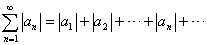&nbsp;&nbsp;&nbsp;&nbsp;&nbsp;&nbsp;&nbsp;&nbsp; (3)

收敛，则变号级数（即正负项可以任意出现的级数）

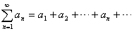&nbsp;&nbsp;&nbsp;&nbsp;&nbsp;&nbsp;&nbsp;&nbsp;&nbsp;&nbsp; (4)

也收敛，并称级数（4）为绝对收敛.

若级数（4）收敛，而级数（3）发散，则称（4）为条件收敛（非绝对收敛）.

要确定级数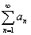的绝对收敛性，只须把上面关于同号级数的收敛判别法应用到正项级数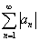上去.但对发散性判别法必须当心，虽然级数是发散的，级数也仍然可以收敛（非绝对收敛），仅仅柯西判别法与达兰贝尔判别法是例外.

绝对收敛级数的和等于级数的所有正项组成的级数的和减去级数所有负项的绝对值组成的级数的和.

[黎曼定理] 设为条件收敛级数，若适当的变更项的次序，则可收敛于任一给定的数（有限或无限）.

[达兰贝尔判别法] 若变号级数满足条件

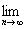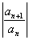=<i>l</i>

则当<i>l</i>&lt;1时，绝对收敛；当<i>l </i>&gt;1时，发散.

[莱布尼茨判别法] 若交错级数

<i>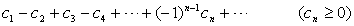</i>

满足条件：（i）<i>cn</i>≥<i>cn</i>+1(<i>n</i>=1,2,…),(ii) <i>cn</i>=0,则该级数收敛（一般说来，非绝对收敛）.对于级数的余项

<i>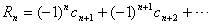</i>

有以下估计：

<i>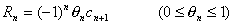</i>

而且余项的符号与其第一项的符号相同，其绝对值比第一项绝对值小.

[狄利克莱判别法] 若部分和<i>An</i>=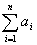有界，且当<i>n</i>时，<i>bn</i>单调地趋于零，则级数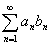收敛.

[阿贝耳判别法] 若级数收敛，且数<i>bn</i>(<i>n</i>=1,2,…)构成一单调有界序列：

|<i>bn</i>|≤<i>K</i> (<i>n</i>=1,2,…)

则级数收敛.

