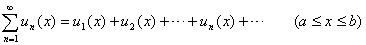

<h3>二、函数项级数收敛的判别法 </h3>

1. 收敛与一致收敛

[收敛与收敛区域] 设<i>un</i>(<i>x</i>)(<i>n</i>=)都是定义在某区间[<i>a</i>,<i>b</i>]上的函数，则称

为定义在[<i>a</i>,<i>b</i>]上的函数项级数.若对区间[<i>a</i>,<i>b</i>]上的每点的部分和

<i>Sn</i>(<i>x</i>)= 

当<i>n</i>→∞时，都有极限<i>S</i>(<i>x</i>)，即

<i>Sn</i>(<i>x</i>)= =<i>S</i>(<i>x</i>)

则称函数项级数在区间[<i>a</i>,<i>b</i>]上是收敛的，函数<i>S</i>(<i>x</i>)是它的和，区间[<i>a</i>,<i>b</i>]是收敛区域.函数

<i>rn</i>(<i>x</i>)=

称为余项.显然在收敛区域上的每点<i>x</i>，都有

<i>rn</i>(<i>x</i>)=0

也就是说，对任意给定的<i>ε</i>&gt;0与收敛区域[<i>a</i>,<i>b</i>]上的每点<i>x</i>，都存在一个自然数<i>N</i>(<i>ε</i>,<i>x</i>)(<i>N</i>的大小不但与给定的正数<i>ε</i>有关，而且与<i>x</i>的数值有关)，使得当<i>n</i>≥<i>N</i>时，都有

|<i>rn</i>(<i>x</i>)|&lt;<i>ε</i>或||&lt;<i>ε</i>

[一致收敛] 设函数项级数

对区间[<i>a</i>,<i>b</i>]上每点都收敛，它的和是<i>S</i>(<i>x</i>).

若对给定的<i>ε</i><i></i>0，都存在一个只与<i>ε</i>有关而与<i>x</i>的数值无关的自然数<i>N</i>(<i>ε</i>),使得当<i>n</i>≥<i>N</i>时，不等式

|<i>rn</i>(<i>x</i>)|&lt;<i>ε</i>或||&lt;<i>ε</i>

对于[<i>a</i>,<i>b</i>]上的一切<i>x</i>都成立，则称函数项级数在区间[<i>a</i>,<i>b</i>]上一致收敛，即部分和<i>Sn</i>(<i>x</i>)一致收敛于级数的和<i>S</i>(<i>x</i>).

由一致收敛的定义可知函数项级数在某区间[<i>a</i>,<i>b</i>]上一致收敛比在[<i>a</i>,<i>b</i>]上点点收敛的要求高.在某区间[<i>a</i>,<i>b</i>]上一致收敛的一个函数项级数在[<i>a</i>,<i>b</i>]上一定点点收敛，但在区间[<i>a</i>,<i>b</i>]上点点收敛的函数项级数在[<i>a</i>,<i>b</i>]上不一定一致收敛.

