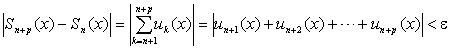
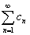
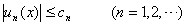
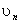
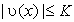
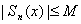

2. 一致收敛判别法

[柯西准则] 级数在区间[<i>a</i>,<i>b</i>]上一致收敛的充分必要条件是：

对任意给定的<i>ε</i>&gt;0，都存在一个只与<i>ε</i>有关而与<i>x</i>无关的自然数<i>N</i>=<i>N</i>(<i>ε</i>)，使得当<i>n</i><i>N</i>时，不等式

对一切自然数<i>p</i>以及区间[<i>a</i>,<i>b</i>]上一切点<i>x</i>,都成立.

[外尔斯特拉斯判别法] 对于级数，若有收敛的数项级数存在，使得对区间[<i>a</i>,<i>b</i>]上一切点<i>x</i>，不等式

成立，则级数在区间[<i>a</i>,<i>b</i>]上绝对且一致收敛

[阿贝耳判别法] 若级数在区间[<i>a</i>,<i>b</i>]上一致收敛，函数序列{(<i>x</i>)}对每个<i>x</i>是单调序列，而且对任意的<i>x</i>与<i>n</i>都是有界的：

则级数

(<i>x</i>)

在区间[<i>a</i>,<i>b</i>]上一致收敛.

[狄利克莱判别法] 若级数的部分和对任意的<i>x</i>与<i>n</i>都是有界的：

函数序列{<i>vn</i>(<i>x</i>)}（对每个<i>x</i>）是在区间[<i>a</i>,<i>b</i>]上一致趋向于零的单调序列.则级数

(<i>x</i>)

在区间[<i>a</i>,<i>b</i>]上一致收敛.

