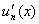

3．函数级数的运算及其条件

<table class=MsoNormalTable border=1 cellspacing=1 cellpadding=0 width=616
 style='width:462.0pt'>
 <tr style='height:30.0pt'>
  <td width="16%" style='width:16.0%;padding:5.25pt 5.25pt 5.25pt 5.25pt;
  height:30.0pt'>
  
运 算 

  </td>
  <td width="39%" style='width:39.0%;padding:5.25pt 5.25pt 5.25pt 5.25pt;
  height:30.0pt'>
  
表 达 式 

  </td>
  <td width="44%" style='width:44.0%;padding:5.25pt 5.25pt 5.25pt 5.25pt;
  height:30.0pt'>
  
条 件 

  </td>
 </tr>
 <tr style='height:29.25pt'>
  <td width="16%" style='width:16.0%;padding:5.25pt 5.25pt 5.25pt 5.25pt;
  height:29.25pt'>
  
级数和的连续性 

  </td>
  <td width="39%" style='width:39.0%;padding:5.25pt 5.25pt 5.25pt 5.25pt;
  height:29.25pt'>
  
在[<i>a</i>,<i>b</i>]上连续 

  </td>
  <td width="44%" style='width:44.0%;padding:5.25pt 5.25pt 5.25pt 5.25pt;
  height:29.25pt'>
  
(i)在[<i>a,b</i>]上连续，

  
(ii)在[<i>a,b</i>]上一致收敛 

  </td>
 </tr>
 <tr style='height:29.25pt'>
  <td width="16%" style='width:16.0%;padding:5.25pt 5.25pt 5.25pt 5.25pt;
  height:29.25pt'>
  
逐项相加减 

  </td>
  <td width="39%" style='width:39.0%;padding:5.25pt 5.25pt 5.25pt 5.25pt;
  height:29.25pt'>
  

  
=

  
(<i>a</i>≤<i>x</i>≤<i>b</i>) 

  </td>
  <td width="44%" style='width:44.0%;padding:5.25pt 5.25pt 5.25pt 5.25pt;
  height:29.25pt'>
  
，在[<i>a,b</i>]上都收敛 

  </td>
 </tr>
 <tr style='height:29.25pt'>
  <td width="16%" style='width:16.0%;padding:5.25pt 5.25pt 5.25pt 5.25pt;
  height:29.25pt'>
  
相乘 

  </td>
  <td width="39%" style='width:39.0%;padding:5.25pt 5.25pt 5.25pt 5.25pt;
  height:29.25pt'>
  

  
=

  
其中

  

  

  

  
(<i>a</i>≤<i>x</i>≤<i>b</i>) 

  </td>
  <td width="44%" style='width:44.0%;padding:5.25pt 5.25pt 5.25pt 5.25pt;
  height:29.25pt'>
  
,在[<i>a,b</i>]上都收敛，并且至少有一个绝对收敛 

  </td>
 </tr>
 <tr style='height:29.25pt'>
  <td width="16%" style='width:16.0%;padding:5.25pt 5.25pt 5.25pt 5.25pt;
  height:29.25pt'>
  
逐项取极限 

  </td>
  <td width="39%" style='width:39.0%;padding:5.25pt 5.25pt 5.25pt 5.25pt;
  height:29.25pt'>
  

  
=

  
(<i>a</i>≤≤<i>b</i>) 

  </td>
  <td width="44%" style='width:44.0%;padding:5.25pt 5.25pt 5.25pt 5.25pt;
  height:29.25pt'>
  
(i)(<i>n</i>=1,)，

  
为有限值，

  
(ii)
  在[<i>a</i>,<i>b</i>]上一致收敛 

  </td>
 </tr>
 <tr style='height:29.25pt'>
  <td width="16%" style='width:16.0%;padding:5.25pt 5.25pt 5.25pt 5.25pt;
  height:29.25pt'>
  
逐项微分 

  </td>
  <td width="39%" style='width:39.0%;padding:5.25pt 5.25pt 5.25pt 5.25pt;
  height:29.25pt'>
  

  
(<i>a</i>≤<i>x</i>≤<i>b</i>) 

  </td>
  <td width="44%" style='width:44.0%;padding:5.25pt 5.25pt 5.25pt 5.25pt;
  height:29.25pt'>
  
(i)定义在[<i>a</i>,<i>b</i>]上，

  
而且有连续的导数，

  
(ii)
  在[<i>a</i>,<i>b</i>]上收敛，

  
(iii)在[<i>a</i>,<i>b</i>]上一致收敛 

  </td>
 </tr>
 <tr style='height:29.25pt'>
  <td width="16%" style='width:16.0%;padding:5.25pt 5.25pt 5.25pt 5.25pt;
  height:29.25pt'>
  
逐项积分 

  </td>
  <td width="39%" style='width:39.0%;padding:5.25pt 5.25pt 5.25pt 5.25pt;
  height:29.25pt'>
  

  
=，

  

  
=

  
对于[<i>a</i>,<i>b</i>]上的一切点<i>x</i>一致成立 

  </td>
  <td width="44%" style='width:44.0%;padding:5.25pt 5.25pt 5.25pt 5.25pt;
  height:29.25pt'>
  
(i)
  在[<i>a</i>,<i>b</i>]上连续(或可积)，

  
(ii)
  在[<i>a</i>,<i>b</i>]上一致收敛 

  </td>
 </tr>
</table>

　

