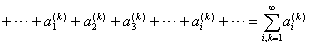

<h3>三、二重级数 </h3>

[二重级数] 已知由两个自然数附标决定的无穷数集

&nbsp;&nbsp;&nbsp;&nbsp;&nbsp;&nbsp;&nbsp;&nbsp;&nbsp;&nbsp; &nbsp;

把它们排列成无穷矩阵的形状：

这种矩阵称为带两个附标的元素的无穷矩阵.

称为二重级数.

限于前<i>m</i>行与前<i>n</i>列，考虑有穷和数

这和数称为二重级数的部分和.

如果存在二重极限

<i>A</i>=

这极限是有穷的或无穷的（但有确定的正号或负号），那末称这极限为二重级数的和，记作

<i>A</i>=

若级数具有有限和，则称它是收敛的，否则，称它是发散的.

二重级数收敛的一个必要条件是一般项趋于零，即

=0

[累级数] 如果在无穷矩阵中把每一行单独地相加起来，就得到行级数

再把所有行级数相加起来（先按列后按行相加），即

它称为累级数.如果先按行后按列把给定的无穷矩阵的项相加，就得到第二种累级数

若累极限

=

存在，则称累级数收敛，具有和.若累极限

=

存在，则称累级数收敛，具有和.

[二重级数与累级数的关系] 如果(i)二重级数收敛，(ii)行级数收敛，那末累级数收敛，并且有与二重级数相同的和

=<i>A</i>=

对于第二种累级数有类似结论（参考§1，三，2）.

[正项级数]

(1) 设，则级数收敛的充分必要条件是它的部分和有界.

(2) 设，如果三个级数

，，

中的一个级数收敛，那末其余两个级数也收敛，并且具有相同的和.

(3) 设，二重级数与简单级数由相同的项组成.在这种情形下，从一个级数的收敛性可推出另一个级数的收敛性，并且二者的和相等.

[绝对收敛级数]

(1) 如果由级数的项的绝对值所组成的级数收敛，那末级数也收敛.

如果级数收敛，那末级数称为绝对收敛级数.如果级数收敛，而级数发散，那末级数称为条件收敛级数.

(2) 若级数绝对收敛，则行（或列）级数都绝对收敛.此外，由行（或列）级数的和所组成的级数也绝对收敛，并且与二重级数有相同的和.

(3) 如果由同样的项组成二重级数与简单级数，那末从它们中一个级数的绝对收敛性可推出另一个级数的绝对收敛性，并且二者的和相等.

(4) 绝对收敛的二重级数具有可交换性，即任意改变它的求和次序后级数仍然收敛，并与原级数有相同的和.

(5) 如果累级数的绝对值级数是收敛级数，那末不仅累级数本身收敛，而且累级数也收敛，并且二者的和相等.

(6) 如果简单级数绝对收敛，把它的项任意排列成带两个附标的元素的无穷矩阵的形状后，就可以用累级数或来代替级数.

二重级数的基本概念及性质可推广到多重级数上去.

