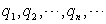

<h3>四、无穷乘积 </h3>

[基本概念] 设

是一个给定的无穷序列,则记号

=,&nbsp;&nbsp;&nbsp; <i>qn</i>≠0 (<i>n</i>=1,)

称为无穷乘积.

<i></i>

称为部分乘积.如果当<i>n</i>→∞时部分乘积序列{<i>Pn</i>}具有有穷的或无穷的（但有确定的正号或负号）极限

<i>Pn</i>=<i>P</i>

则<i>P</i>称为无穷乘积的值，记作

<i>P</i>==,&nbsp; <i>qn</i>≠0(<i>n</i>=1,)

若无穷乘积具有非零有穷值<i>P</i>,则称为收敛的，否则称为发散的.若<i>P</i>=0，则称为发散于零.

为使无穷乘积的值等于零，只要乘积的因子中有一个是零就够了，在后面的讨论中，总是假定<i>qn</i>≠0(<i>n</i>=1,
).

称为无穷乘积的余乘积.

[无穷乘积收敛判别法]

(1) 无穷乘积收敛的一个必要条件是：

<i>πm</i>=1或<i>qn</i>=1

式中<i>π</i><i>m</i>=.

(2) 无穷乘积收敛的充分必要条件是：级数收敛.设<i>L</i>是前面级数的和，则<i>P</i>=<i>eL</i>.

(3) 设<i>qn</i>=1+<i>an</i>(<i>n</i>=1,2,…)，对充分大的<i>n</i>，若有<i>an</i>&gt;0(或<i>an</i>&lt;0)，则=收敛的充分必要条件是：级数收敛.

(4) 若级数与级数同时收敛，则=收敛.

(5) 无穷乘积或具有零值的充分必要条件是：级数或的和为.

特别，如果<i>an</i>&lt;0且级数发散，或级数收敛而级数发散，那末无穷乘积具有零值.

(6) 无穷乘积绝对收敛的充分必要条件是：级数绝对收敛.

[函数项无穷乘积的一致收敛] 如果函数序列

<i>Pm</i>(<i>x</i>)=&nbsp;&nbsp;&nbsp;&nbsp;&nbsp;&nbsp;&nbsp;&nbsp; (<i>m</i>=1,)

一致收敛，并且极限不恒为零，那末称函数项无穷乘积

一致收敛.

如果在某一区间上一致收敛，且,那末无穷乘积也在该区间上一致收敛.

[无穷乘积展开式]

&nbsp;&nbsp;&nbsp;&nbsp; (| <i>x</i><i>| </i>&lt;1)

(其中<i>γ</i>为欧拉常数)

（其中<i>p</i>跑遍一切素数，<i>ξ</i>(<i>x</i>)称为黎曼<i>ξ</i>函数.）

　

